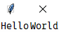
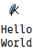
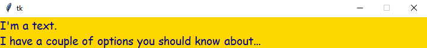
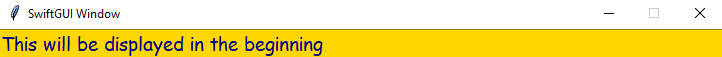
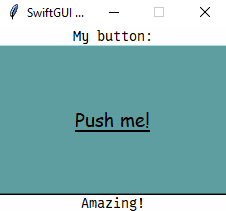
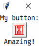
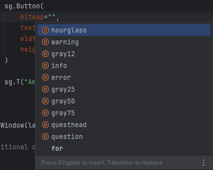

# Getting started
This tutorial will teach you how to create simple, yet powerful user-interfaces using SwiftGUI.

If you haven't already, install SwiftGUI using pip:
```bash
pip install swiftGUI
```

You'll notice, that your GUIs might look different to than the ones on images in this tutorial.
These tutorials were written in older versions.
The visuals have improved a lot since.

Functionally, the tutorials will stay up to date, I promise!

One of SwiftGUI's purpose is to make PySimpleGUI obsolete.
That's why it can be used almost exactly like PySimpleGUI, but has a lot of additional functionality.

It's very easy to switch from PySimpleGUI to SwiftGUI.

# Basic template
For every GUI, you should use this template, until you are familiar with the basic functionality:
```py
import SwiftGUI as sg

### Global options ###


### Layout ###
layout:list[list[sg.BaseElement]] = [
    
]

w = sg.Window(layout)

### Additional configurations/actions ###


### Main loop ###
for e,v in w:
    ...

### After window was closed ###

```
You can always find that template here: [`Examples/Beginner-friendly/_template.py`](https://github.com/CheesecakeTV/SwiftGUI/blob/c23cdca4618a702af09bb4391a5e798ee12aaf59/Examples/Beginner-friendly/_template.py) (GitHub-Repo).

# Layout
The layout contains all elements to be shown inside the GUI.
As you might see, the typehint expects a "double-list", or "lists inside a list".

Every "inner" list represents a row of elements.

E.g. two text-elements inside the same row:
```py
layout:list[list[sg.BaseElement]] = [
    [
        sg.Text("Hello"),
        sg.Text("World")
    ]
]
```


Two text-elements in different rows:
```py
layout:list[list[sg.BaseElement]] = [
    [
        sg.Text("Hello"),
    ],[ # End of row, beginning of the next one
        sg.Text("World"),
    ]
]
```


Notice how every list inside the layout-list is its own row.

# Making the layout look good
The normal "theme" doesn't look good, I know.

To make it look better, simply apply one of the 46 (SwiftGUI version 0.10.2) pre-made themes, like this:
```py
import SwiftGUI as sg
sg.Themes.FourColors.Emerald()
```
Just leave that on the top of your script and forget about it.

Themes are explained in-depth in the next tutorial, but applying them is as easy as that.

My personal favorites are:
```
sg.Themes.FourColors.FourColors.Emerald
sg.Themes.FourColors.FourColors.DarkTeal
sg.Themes.FourColors.FourColors.DarkCoffee
sg.Themes.FourColors.FourColors.SinCity
sg.Themes.FourColors.FourColors.Jungle
sg.Themes.FourColors.FourColors.DarkGold
```

Preview all available themes by calling `sg.Examples.preview_all_themes()`.

# Basic elements
There are a lot of elements you can use in your gui.

Most of them have a ton of options to customize the element, but we'll only focus on the basic ones in this tutorial.

Pro-tipp: Preview all available elements by calling `sg.Examples.preview_all_elements()`.

## Text
This element allows you to display some text inside your GUI (Who would have guessed...).
`sg.Text` is the actual class, but I would use its alias `sg.T` instead.

Like most elements, `sg.Text` has many options for customization.

Consider this example:
```py
layout:list[list[sg.BaseElement]] = [
    [
        sg.T(   # sg.T is the same as sg.Text
            # \n is the newline-character and will add a line-break
            "I'm a text.\nI have a couple of options you should know about...",
            width=60,   # Reserve space for 60 characters, no matter how long the text actually is
            background_color=sg.Color.gold,    # Background-color
            text_color=sg.Color.navy,  # Text/font-color

            fonttype=sg.font_windows.Comic_Sans_MS, # Who doesn't like comic-sans?
            fontsize=14,    # Size of the text
        )
    ]
]
```
It will generate this window:\
\
As you can see, SwiftGUI provides pre-made colors and fonts (only for windows atm, version 0.3.0). 

Preview all colors by calling `sg.Examples.preview_all_colors()`.\
You can also use custom colors, by either entering a hex-code (e.g.: `#FF0020`), or by using the rgb-function (e.g.: `sg.rgb(255, 0, 32)`).

## Input
An `sg.Input` allow the user to enter a single row of text.
You may use the alias `sg.In`, or `sg.Entry` instead of `sg.Input`, same thing.

You can reuse most of the options from `sg.Text`, since both elements display a text:
```py
layout:list[list[sg.BaseElement]] = [
    [
        sg.In(
            "This will be displayed in the beginning",
            width=60,   # Reserve space for 60 characters, no matter how long the text actually is
            background_color=sg.Color.gold,    # Background-color
            text_color=sg.Color.navy,  # Text/font-color

            fonttype=sg.font_windows.Comic_Sans_MS, # Who doesn't like comic-sans?
            fontsize=14,    # Size of the text
        )
    ]
]
```



How to actually read/use what the user writes will be explained later.

It is possible to make this element "readonly", doing exactly what you think it would.
The user will still be able select and copy (Ctrl + C) the text inside, but can't change it.

That's pretty useful if you only want to display a value, looking better than `sg.Text`.

## Button
`sg.Button` creates a button the user can press to trigger an "event".
Events will be explained later.

Many options for `sg.Button` are the same as for `sg.Text`, because buttons (usually) display a text:
```py
### Layout ###
layout:list[list[sg.BaseElement]] = [
    [
        sg.T("My button:")
    ],[
        sg.Button(
            "Push me!", # Button-text
            fonttype=sg.font_windows.Comic_Sans_MS, # I still like comic-sans
            fontsize=14,    # Bigger text
            font_underline=True,    # Underline the text
            width=20,   # Width in characters
            height=5,   # Height in rows
            background_color=sg.Color.cadet_blue,   # Usual color of the button
            background_color_active=sg.Color.gold,  # While pressing the button, it turns "golden"
        )
    ],[
        sg.T("Amazing!")
    ]
]
```



Buttons have a ton of additional options.
Like setting a bitmap (image) instead of a button-text:
```py
### Layout ###
layout:list[list[sg.BaseElement]] = [
    [
        sg.T("My button:")
    ],[
        sg.Button(
            bitmap="hourglass", # Display the bitmap of a hourglass instead of text
            text_color=sg.Color.red,    # Color the bitmap red
            width=25,   # Size of the button (in pixels)
            height=25,
        )
    ],[
        sg.T("Amazing!")
    ]
]
```


It really pays off to read the element-tutorials (once I am done writing them...).

Available bitmaps are proposed by the autocomplete-feature of your IDE (tested it in PyCharm), usually by pressing `Ctrl + Space` at the right place (between "" in this case):\


# Breaking out of the loop (events)
Recall this part of the template:
```py
### Main loop ###
for e,v in w:
    ...
```
The script gets stuck there.
Even if you put some code into the for-loop, it won't execute.

That's because the loop waits for an "event".
You need to "throw" an event each time you want to go through the loop.

There are a couple of ways to set up events:
- Using buttons
- Enabling the default-events for interactive elements like `sg.Input`, `sg.Table`, `sg.Checkbox`, etc.
- Binding custom events
- Throwing events manually from a different thread
- Using observers
- Setting a timeout

(In this tutorial, we'll not cover all of them)

All of these ways have something essential in common: **You need to define a key to throw an event to the event-loop!**

A key is basically the identifier of an element.
Think of it like its name.\
When an element throws an event, its key will usually be the "name" of that event too.

Whenever an event gets thrown to the loop, `e` ("event") will be set to the corresponding key (See the examples below).
The loop will then execute once.

## Using buttons, or default events
Buttons already come with builtin events.\
Just define a key and the button-press-event is activated:
```py
import SwiftGUI as sg

### Global options ###


### Layout ###
layout:list[list[sg.BaseElement]] = [
    [
        sg.Button(
            "Button 1",
            key="B1",   # <-- Here
            fontsize=14,
        ),
        sg.Button(
            "Button 2",
            key="B2",   # <-- Here
            fontsize=14,
        )
    ]
]

w = sg.Window(layout)

### Additional configurations/actions ###


### Main loop ###
for e,v in w:
    print("Event:", e)

    if e == "B1":   # If the name of the event is "B1"
        print("Button 1 was pressed!")

    if e == "B2":
        print("Button 2 was pressed!")

### After window was closed ###
```
This functionality is the basic idea behind SwiftGUI (and PySimpleGUI, to be fair).

However, **buttons are the only type of (builtin) element that has an event enabled by default!**.
For every other element, you'll have to specifically ask for it, by setting `default_event = True`.

**Remember to define a key,** or no event will be thrown to the event-loop.
```py
import SwiftGUI as sg

### Global options ###


### Layout ###
layout:list[list[sg.BaseElement]] = [
    [
        sg.In(
            fontsize=20,
            default_event=True, # Tell the input to throw an event
            key="Input" # "Name" of the element and the event
        )
    ]
]

w = sg.Window(layout)

### Additional configurations/actions ###


### Main loop ###
for e,v in w:
    print("Event:",e)

    if e == "Input":    # Check if the input caused the event
        print("The sg.Input was changed!")

### After window was closed ###
```
What precisely causes the default event for an element is pretty obvious in my opinion.

Examples:
- For `sg.Input`, it's caused by changing the input.
- For `sg.Checkbox`, it's caused by checking/unchecking the box
- For `sg.Scale`, it's caused by moving the slider

How to actually read what was written into the `sg.Input` will be explained later.

## Timeout
(Since version 0.10.8)

A timeout occurs if no event triggeres for some time (default 1 second, if enabled).

Especially beginners like to utilize this feature, but **I recommend to not use it at all!**\
For most cases, threading is the better alternative.

But I'll let you choose, even if I probably won't like the result.

To activate the timeout, initialize it and set a key:
```py
w = sg.Window(layout).init_timeout(key= "Timeout")

### Additional configurations/actions ###


### Main loop ###
for e,v in w:
    ... # Some hidden code
    
    if e == "Timeout":
        print("Timeout occured!")
```
Now, if no event triggers for one second, the event `"Timeout"` is thrown.

Pass `seconds` to specify how long it takes for a timeout to occur:
```py
w = sg.Window(layout).init_timeout(key= "Timeout", seconds= 3.5)
```
Tipp: You shouldn't set this to less than `0.5`, it's really starting to show then.
Also, the timing might not be precise, so don't use it as a timer.

The timeout can be activated/deactivated by setting `w.timeout_active` to `True`/`False`:
```py
    if e == "Timeout":
        print("Timeout occured!")
        w.timeout_active = False    # No timeout will occur until this is set to True again
```

## Binding other events
For more advanced layouts, it would be nice to have more control over what causes an event.\
Maybe you want to create an input-field that only throws an event when pressing `enter`.
This can't be done using only the default events.

If you like, you can skip this part for now.

SwiftGUI is based on `tkinter`, a builtin Python-package.
`tkinter` offers a lot of events you can throw: [TKinter reference](https://anzeljg.github.io/rin2/book2/2405/docs/tkinter/event-types.html).
You don't need to know most of these of the top of your head, but it can be useful to know what's possible.

"Binding" events is done via the corresponding event-string, some of which are listed in the above linked tkinter-reference.

To make your life easier, SwiftGUI offers the class `Event`, which provides common event-strings.

Bind an event by calling `.bind_event` on the element-instance.
To make your life even easier, `.bind_event` returns the instance itself, so you can "stack calls":
```py
### Layout ###
layout:list[list[sg.BaseElement]] = [
    [
        sg.In(
            fontsize=20,
            default_event=True, # Doesn't need to be enabled for bind_event to work
            key="Input"
        ).bind_event(
            sg.Event.ClickAny   # Any mouse-button was pressed
        ).bind_event(
            sg.Event.MouseEnter # The mouse "hovered" onto the element
        )
    ]
]
```
Now, the `sg.Input`-element will not only throw an event once its text changed (`default_event = True`), but also when any mouse-button is clicked on it (`.bind_event(sg.Event.ClickAny)`), or the mouse simply enters the element (`.bind_event(sg.Event.MouseEnter)`).

Unfortunately, all of these events will throw the same key: `"Input"`, because that's what the element is "called".\
To keep the events apart, you can use `key_extention`, or `key`, when calling `bind_event`:
```py
yourElement.bind_event(sg.Event.ClickAny, key_extention="_Click").bind_event(sg.Event.MouseEnter, key="MouseEnter")
```
`key_extention` will be appended to the normal key, so the `ClickAny`-event will throw `Input_Click`.\
`key` replaces the key all together, so the `MouseEnter`-event will throw `MouseEnter`.

# Reading and changing values
In SwiftGUI, you can read and write element-values either through the element directly, or through the value-dict:

Reading: `w[key].value`, or `v[key]`\
Writing: `w[key].value = new_value`, or `w[key].set_value(new_value)`, or `v[key] = new_value`\
(`w` is a reference to the window-object, `v` is the value-dict)

What exactly you are reading/writing depends on the type of element.
For `sg.Input`-Elements, `v[key]` refers to the text inside the input-element.
Its type is `str`.

In most cases, the type of the value is obvious.
But I am adding a lot of typehints, to make it as easy as possible.

Universal rule for any element: Reading and writing values always relates to the same thing.
If reading returns the text inside the element, writing it will change that text.\
E.g.: Reading the value of a `sg.Listbox` returns the text inside the selected row.
Changing the value, overwrites the text in that list-row.

Note that for `w[key]` and `v[key]` to work, the element needs a key.\
If you don't define a key, that element can't be accessed this way.
If two elements share the same key (which you shouldn't do, but who am I to judge), only one of these elements will be accessible through `w`.

The sole purpose of `w[key]` is to return the element you put into the layout, so you could just save it in a variable before putting it in:
```py
### Layout ###
my_text = sg.T("Hello World")
layout:list[list[sg.BaseElement]] = [
    [
        my_text
    ]
]

w = sg.Window(layout)

### Additional configurations/actions ###
my_text.value = "Hello GitHub"
```

For better readability, I recommend using the "walrus-operator" (That's its actual name).
This code does exactly the same as before:
```py
### Layout ###
layout:list[list[sg.BaseElement]] = [
    [
        my_text := sg.T("Hello World")
    ]
]

w = sg.Window(layout)

### Additional configurations/actions ###
my_text.value = "Hello GitHub"
```

To make life easier for users transitioning from PySimpleGUI, all "keyed" values are accessible through `v` (`for e, v in w`), as stated before.
`v` is simmilar to a dictionary, but linked to the actual elements.

`v[key]` is the same as `w[key].value`, so `v[key] = new_value` does the same as `w[key].value = new_value`.

You can `print(v)`, which prints `v` like a dictionary.
However, this costs more cpu time than you'd expect, so only do it for debugging.

Note that, `print(v)` might not contain the correct values for elements that just got updated via `w[key].value = ...`.
**`v[key]` on the other hand is very reliable and always returns the correct value.**

(Unnecessary side-rant about PySimpleGUI) In PySimpleGUI, `v` (or `value`) is a normal dictionary that is updated only in the beginning of each loop.
That means, in PySimpleGUI, changing the value of elements won't update `v`.
This turned out to be so annoying that I spent like 4 hours to implement the value-dict class.

# Updating the layout
You can change most of the options (configurations) of elements not only when creating the window, but afterwards too.
This way, you could e.g. make buttons change color, disable Input-elements, make text jump from one side to the other, etc.

To update an option, get the reference to the element (you could use `w[key]`) and call `.update` on it.
`.update` accepts most of the parameters the element itself accepts and if not, Python will tell you gladly...

**Examples:**

Change the background-color of an `sg.Input`-Element from a previous example:
```py
w["Input"].update(background_color = sg.Color.red)
```

Disable a button (button can't be clicked anymore):
```py
w["ButtonKey"].update(disabled = True)
```
You get the idea...

## Reading/getting element-options
The "opposite" of `.update(option= ...)` is `.get_option(option)`.

`.get_option` returns whatever value you set that option to earlier.

Why you would use that, if you know what you put in `.update`?\
Well, `.get_option` also returns values that are set by default.

E.g.: Not sure of the standard background-color?
Just use `.get_option`.

(If you know tkinter)\
`.get_option` also returns options from the underlying tkinter-widget, if the option wasn't set by SwiftGUI.

E.g.: The option for background-color is called `background_color` in SwiftGUI, but `bg` in Tkinter.
That means, `.get_option("bg")` will return that configuration directly from the tkinter-widget using `tk_widget.cget("bg")`.

# Where to now?
This library offers A LOT, while still being (relatively) easy to use.

I highly recommend reading every single basic tutorial.
You will be able to use the package pretty well just from these.\
However, the later ones might require a better understanding of Python.
Still, read them and find out what SwiftGUI has to offer.

Elements have a lot of options, but most of them are only related to its appearance.
However, a lot of elements have some unexpected features you should know about.
So just read over the element-tutorials, you'll definetly find some features you didn't know existed.

The advanced tutorials are not necessarely more difficult, but explain more advanced functionality.
"Specific" might be a more fitting expression than "advanced".
Again, just see what's possible, maybe you'll find something you like.

**If you have any questions, feel free to ask them in the GitHub Forum**.\
I like to say "There definetly are stupid questions, but everyone needs to begin somewhere".\
This is not StackOverflow.
I'm happy about everyone who uses SwiftGUI and won't tear you apart for stupid questions.

Have fun!
