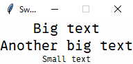
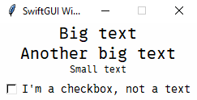
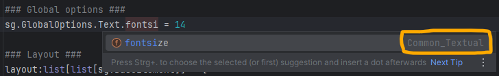
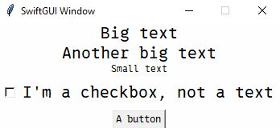
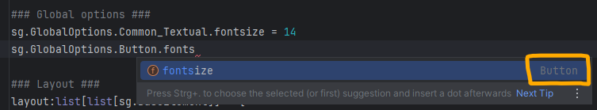
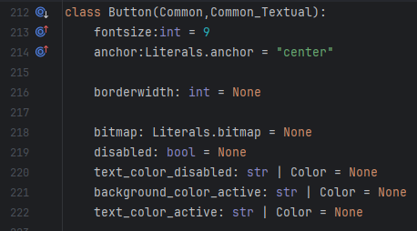
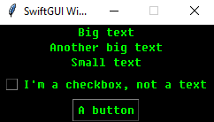
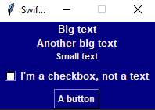

# Global options
(Themes are explained below)

Sometimes, you need to define the same option (configuration) of many elements at once.

E.g.: The default fontsize is quite small and might be hard to read for some users.

You could adjust it in every single element manually, but there is a better way: Changing the global option.

**If you don't specify an option when creating an element**, the corresponding "Global option" will be applied instead, if available.

## Changing global options for a single element-type
Every type of Element has its own global-option-class.
That class is ALWAYS called exactly like the Element (no aliases atm).

To change a global option, just change the fitting attribute of said class:
```py
import SwiftGUI as sg

### Global options ###
sg.GlobalOptions.Text.fontsize = 14

### Layout ###
layout:list[list[sg.BaseElement]] = [
    [
        sg.T("Big text"),
    ],[
        sg.T("Another big text"),
    ],[
        sg.T("Small text", fontsize=8)  # fontsize is defined, so global option won't be applied
    ]
]

w = sg.Window(layout)

### Additional configurations/actions ###


### Main loop ###
for e,v in w:
    ...
```



The class-attribute is ALWAYS called the same as the corresponding option you pass to the element.

There is a downside to this: If we add an element with a different type, like `sg.Checkbox`, it won't be affected by the change:

```py
### Global options ###
sg.GlobalOptions.Text.fontsize = 14

### Layout ###
layout:list[list[sg.BaseElement]] = [
    [
        sg.T("Big text"),
    ],[
        sg.T("Another big text"),
    ],[
        sg.T("Small text", fontsize=8)  # fontsize is written, so global option won't be applied
    ],[
        sg.Check("I'm a checkbox, not a text")
    ]
]
```



Of course, you could go ahead and change the fontsize for every used element-type separately, but that defies the whole purpose of global options:
```py
### Global options ###
sg.GlobalOptions.Text.fontsize = 14
sg.GlobalOptions.Checkbox.fontsize = 14
```
This is where this feature gets to show off its true power:
Global-option-hierarchy.

## Global-option-hierarchy
When accessing an attribute of any class in PyCharm, PyCharm will not only suggest the attribute, but also display what class it actually "comes from":\


Even though you are changing an attribute of `GlobalOptions.Text`, PyCharm recognizes this attribute actually belonging to `GlobalOptions.Common_Textual`.
Strange.

Note that `GlobalOptions` will be shortened to `go` from now on.

Here is how it works:

Global-option-classes can "inherit" attributes from other global-option-classes.
In this case, `go.Text` inherits `fontsize` from its parent, `go.Common_Textual`.

If a child-class like `go.Text` doesn't have a certain attribute, the parent-class will supply it.
By setting `go.Text.fontsize`, `go.Common_Textual` won't be used for that option anymore.

Pseudo-Algorithm for this specific case:
```
sg.Text supplies fontsize.

    fontsize not available?

go.Text supplies fontsize.

    fontsize not available?

go.Common_Textual supplies fontsize.

    fontsize not available?

DEFAULT_OPTIONS_CLASS (Parent of all go-classes) supplies fontsize.

    fontsize not available?

Leave it None and let tkinter figure it out.
```

Finally, let's change the fontsize for `sg.Text` and `sg.Checkbox` together.

Both `go.Text` and `go.Checkbox` inherit from `go.Common_Textual`, so we can change both options at once:
```py
### Global options ###
sg.GlobalOptions.Common_Textual.fontsize = 14
```

## Removing global options
Let's add a button:
```py
### Global options ###
sg.GlobalOptions.Common_Textual.fontsize = 14

### Layout ###
layout:list[list[sg.BaseElement]] = [
    [
        sg.T("Big text"),
    ],[
        sg.T("Another big text"),
    ],[
        sg.T("Small text", fontsize=8)  # fontsize is written, so global option won't be applied
    ],[
        sg.Check("I'm a checkbox, not a text")
    ],[
        sg.Button("A button")
    ]
]
```
Strange, the button did not change its textsize:\


That's because the button overwrites the fontsize too:\
\
The class still derives from `go.Common_Textual`.

This is the actual go-button-class:\
\
From the little blue dots on the left, you can see that fontsize is already defined in a parent-class (`Common_Textual`) and overwritten by the button.

That's because the default fontsize makes the button as tall as Input-elements with default fontsize (10).
It just looks better if buttons have a smaller fontsize than inputs.

To make the button apply `go.Common_Textual`'s attribute, we need to remove it from `go.Button`, or set it to None:
```py
### Global options ###
sg.GlobalOptions.Common_Textual.fontsize = 14
sg.GlobalOptions.Button.fontsize = None
# del sg.GlobalOptions.Button.fontsize  # Does the same
```
The resulting window looks like this:\


## Additional tipps
If you want to change the global options of a certain type, you can always return the fitting class with `sg.Element.defaults`:
```py
### Global options ###
sg.T.defaults.fontsize = 14
```

The window has its own global option called `GlobalOptions.Window`.

Elements that look like their background was invisible (like `sg.Text`, `sg.Checkbox`, but not `sg.Input`) mostly derive `background_color` from `Common_Background`.
Most excluded elements derive from `Common_Field_Background`.

Go-classes do not act like you'd expect classes to act.
There is a very complicated set of coding-magic running in the background.\
Therefore, you should really not read the value of an attribute by calling `.attributeName`.
It usually returns nonsense.\
Use `.single("attributeName")` instead.\
This has performance-reasons.

# Themes
Themes are a way to apply pre-made sets of global options.

In SwiftGUI version 0.10.2, there are 46 pre-made themes.

To apply a theme, simple "call" it:
```py
### Global options ###
sg.Themes.Hacker()
```


See all available themes by calling `sg.Examples.preview_all_themes()`:\


## Creating custom themes
It's very easy to create your own theme, so feel free to do so.
I'd love to see what you came up with, feel free to post it in the [GitHub-discussions](https://github.com/CheesecakeTV/SwiftGUI/discussions/26#discussion-8779746).

Let's take a look at the `Hacker`-theme (In its current state):
```py
import SwiftGUI
from SwiftGUI import GlobalOptions as go

class Hacker(sg.Themes.BaseTheme):

    def apply(self) -> None:
        go.Common_Textual.fonttype = font_windows.Fixedsys
        go.Common_Textual.text_color = "lime"

        go.Input.text_color = "black"
        go.Input.background_color = "lime"
        go.Input.background_color_readonly = Color.orange_red
        go.Input.selectbackground_color = Color.royal_blue
        go.Input.select_text_color = "black"

        go.Button.background_color_active = "lime"
        go.Button.text_color_active = "black"

        go.Checkbox.background_color_active = "lime"
        go.Checkbox.check_background_color = "black"

        go.Common_Background.background_color = "black"
        go.Common.background_color = "black"

        go.Listbox.highlightbackground_color = "lime"
        go.Listbox.highlightcolor = "lime"
        go.Listbox.text_color_selected = "black"
        go.Listbox.background_color_selected = "lime"

        go.Table.background_color_headings = "black"
        go.Table.text_color_headings = "lime"

        go.TextField.highlightbackground_color = "lime"

        go.Separator.color = "red"
```
As you can see, you only need to derive the class from `BaseTheme` and make all of your changes in `apply`.

As an example, let's create a simple theme and apply it:
```py
import SwiftGUI as sg

class Marine(sg.Themes.BaseTheme):
    def apply(self) -> None:
        sg.GlobalOptions.Common_Textual.fonttype = sg.font_windows.Arial
        sg.GlobalOptions.Common_Textual.font_bold = True
        sg.GlobalOptions.Common_Textual.text_color = sg.Color.linen

        sg.GlobalOptions.Window.background_color = sg.Color.navy
        sg.GlobalOptions.Common_Field_Background.background_color = sg.Color.navy

### Global options ###
Marine()    # Apply the custom theme
```


Something you might want to do is to "buffer" the go-class that is currently being modified.
Might save some time and energy:
```py
class Marine(sg.Themes.BaseTheme):
    def apply(self) -> None:
        temp = sg.GlobalOptions.Common_Textual
        temp.fonttype = sg.font_windows.Arial
        temp.font_bold = True
        temp.text_color = sg.Color.linen

        temp = sg.GlobalOptions.Window
        temp.background_color = sg.Color.navy
        
        temp = sg.GlobalOptions.Common_Field_Background
        temp.background_color = sg.Color.navy
```


## FourColors themes
You find many abstract color-maps online.\
These color-maps consist of different colors that look well together.

I got the ones used in SwiftGUI from [here](https://colorhunt.co).

SwiftGUI has a theme-template for themes that only change 4 different colors.
There are also a lot of pre-made themes from that template.

Apply a four-colors-theme like this:
```py
sg.Themes.FourColors.ThemeName()
```

To create your own four-colors-theme, inherit from `sg.Themes.FourColors.BaseFourColors` and change `col1`-`col4`:
```py
class Jungle(sg.Themes.FourColors.BaseFourColors):
    col1 = "191A19" # Color-codes (hex) without the #
    col2 = "1E5128"
    col3 = "4E9F3D"
    col4 = "D8E9A8"
    
Jungle()    # Apply theme
```
You can't enter color-names like `"blue"`, only color-codes.
Also, don't add `#` in front of the color-code.

### Well looking color-combinations
Not all good looking color-combination also work well for GUIs.
In fact, most of them don't.

Follow these guidelines when chosing the colors to maximize your chance of creating something good-looking:
- col3 and col4 should both have a good contrast to col1 and col2. Text colored col3 or col4 should be readable on both, col1 and col2.
- col3 should really stand out from the rest.
- col1 and col2 should look somewhat simmilar. This is not as important as the other points, but helps a lot.

