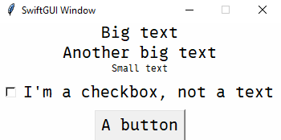

# Themes
Themes are the easiest way to change the appearance of your layout.

In SwiftGUI version 0.10.2, there were 46 pre-made themes.

To apply a theme, simple "call" it:
```py
### Global options ###
sg.Themes.Hacker()
```


See all available themes by calling `sg.Examples.preview_all_themes()`:\


You can create your own themes, which is explained in an advanced tutorial.

Note that themes work by applying global options, which are explained below.
Just keep in mind that applying a theme after modifying global options might overwrite your changes.

# Global options
Sometimes, you need to define the same option (configuration) of a lot of elements at once.

E.g.: The default fontsize is quite small and might be hard to read for some users.

You could adjust it in every single element manually, but there is a better way: Changing the global option.

**If you don't specify an option when creating an element**, the corresponding "Global option" will be applied instead, if available.

## Changing global options for a single element-type
Every type of Element has its own global-option-class.
That class is ALWAYS called exactly like the Element (no aliases atm).

To change a global option, just change the fitting attribute of said global-option-class:
```py
import SwiftGUI as sg

### Global options ###
sg.GlobalOptions.Text.fontsize = 14

### Layout ###
layout:list[list[sg.BaseElement]] = [
    [
        sg.T("Big text"),
    ],[
        sg.T("Another big text"),
    ],[
        sg.T("Small text", fontsize=8)  # fontsize is defined, so global option won't apply
    ]
]

w = sg.Window(layout)

### Additional configurations/actions ###


### Main loop ###
for e,v in w:
    ...
```


The class-attribute is ALWAYS called the same as the corresponding option you pass to the element.

There is a downside to this: If we add an element with a different type, like `sg.Checkbox`, it won't be affected by the change:

```py
### Global options ###
sg.GlobalOptions.Text.fontsize = 14

### Layout ###
layout:list[list[sg.BaseElement]] = [
    [
        sg.T("Big text"),
    ],[
        sg.T("Another big text"),
    ],[
        sg.T("Small text", fontsize=8)  # fontsize is written, so global option won't be applied
    ],[
        sg.Check("I'm a checkbox, not a text")
    ]
]
```


Of course, you could go ahead and change the fontsize for every used element-type separately, but that defies the whole purpose of global options:
```py
### Global options ###
sg.GlobalOptions.Text.fontsize = 14
sg.GlobalOptions.Checkbox.fontsize = 14
```
This is where this feature gets to show off its true power:
Global-option-hierarchy.

## Global-option-hierarchy
When accessing an attribute of any class in PyCharm, PyCharm will not only suggest the attribute, but also display what class it actually "comes from":\


Even though you are changing an attribute of `GlobalOptions.Text`, PyCharm recognizes this attribute actually belonging to `GlobalOptions.Common_Textual`.
Strange.

Note that `GlobalOptions` will be shortened to `go` from now on.

Here is how it works:

Global-option-classes can "inherit" attributes from other global-option-classes.
In this case, `go.Text` inherits `fontsize` from its parent, `go.Common_Textual`.

If a child-class like `go.Text` doesn't have a certain attribute, the parent-class will supply it.
By setting `go.Text.fontsize`, `go.Common_Textual` won't be used for that option anymore.

Pseudo-Algorithm for this specific case:
```
sg.Text supplies fontsize.

    fontsize not available?

go.Text supplies fontsize.

    fontsize not available?

go.Common_Textual supplies fontsize.

    fontsize not available?

DEFAULT_OPTIONS_CLASS (Parent of all go-classes) supplies fontsize.

    fontsize not available?

Leave it None and let tkinter figure it out.
```

Finally, let's change the fontsize for `sg.Text` and `sg.Checkbox` together.

Both `go.Text` and `go.Checkbox` inherit from `go.Common_Textual`, so we can change both options at once:
```py
### Global options ###
sg.GlobalOptions.Common_Textual.fontsize = 14
```

## Removing global options
Let's add a button:
```py
### Global options ###
sg.GlobalOptions.Common_Textual.fontsize = 14

### Layout ###
layout:list[list[sg.BaseElement]] = [
    [
        sg.T("Big text"),
    ],[
        sg.T("Another big text"),
    ],[
        sg.T("Small text", fontsize=8)  # fontsize is written, so global option won't be applied
    ],[
        sg.Check("I'm a checkbox, not a text")
    ],[
        sg.Button("A button")
    ]
]
```
Strange, the button did not change its textsize:\


That's because the button overwrites the fontsize too:\
\
The class still derives from `go.Common_Textual`.

This is the actual go-button-class:\
\
From the little blue dots on the left, you can see that fontsize is already defined in a parent-class (`Common_Textual`) and overwritten by the button.

That's because the default fontsize makes the button as tall as Input-elements with default fontsize (10).
It just looks better if buttons have a smaller fontsize than inputs.

To make the button apply `go.Common_Textual`'s attribute, we need to remove it from `go.Button`, or set it to None:
```py
### Global options ###
sg.GlobalOptions.Common_Textual.fontsize = 14
sg.GlobalOptions.Button.fontsize = None
# del sg.GlobalOptions.Button.fontsize  # Does the same
```
The resulting window looks like this:\


## Additional tipps
If you want to change the global options of a certain type, you can always return the fitting class with `sg.Element.defaults`:
```py
### Global options ###
sg.T.defaults.fontsize = 14
```

The window has its own global option called `GlobalOptions.Window`.

Elements that look like their background was invisible (like `sg.Text`, `sg.Checkbox`, but not `sg.Input`) mostly derive `background_color` from `Common_Background`.
Most excluded elements derive from `Common_Field_Background`.

Go-classes do not act like you'd expect classes to act.
There is a very complicated set of coding-magic running in the background.\
Therefore, you should really not read the value of an attribute by calling `.attributeName`.
It usually returns nonsense.\
Use `.single("attributeName")` instead.\
This has performance-reasons.
