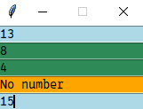

# Key-functions (motivation)
This is one of the most useful feature of `SwiftGUI` I really missed in `PySimpleGUI`.

It's actually the feature which first inspired me to create SwiftGUI.

Don't get me wrong, the event-loop-system is great for smaller windows, but for bigger ones, you don't want to set and handle each and every tiniest tiny action by running through the whole loop.
Every event needs its own entry inside the single, giant event-loop, so everything gets real messy real quick.

Example: You'd like to create an input-field with a small button on the side that clears the input.
The only purpose of the button is to clear the input, yet it enlarges the event-loop.\
It also needs its own unique key, which makes things complicated when you want to copy that part of the layout.

The solution: Define the action (function) to do when creating the element, using key-functions.

# Basic concept
When creating elements, or binding events, you don't actually need to specify a key to throw events.

If you define a "key-function", that function will be called when the event occurs.

You do not need to define a key if you define at least one key-function.

Example: Let's create a button that prints "hello world" when pressed:
```py
import SwiftGUI as sg

def hello_world():
    print("Hello World")

### Global options ###

### Layout ###
layout:list[list[sg.BaseElement]] = [
    [
        sg.Button(
            "Print hello World!",
            key_function= hello_world
        )
    ]
]

w = sg.Window(layout)

### Additional configurations/actions ###

### Main loop ###
for e,v in w:
    ...

### After window was closed ###
```
That's all you need.\
The main loop is empty, yet the `hello_world` is called when the button is pressed.

No "occupied" key, no enlarging the event-loop, perfect.

For a small functionality like this you might want to use a lambda-function instead:
```py
layout:list[list[sg.BaseElement]] = [
    [
        sg.Button(
            "Print hello World!",
            key_function=lambda :print("Hello World")
        )
    ]
]
```

You can also add more than one key-function by putting them inside a list/tuple.
All of them are called when the event occurs:
```py
sg.Button(
    "Print hello World!",
    key_function=[
        lambda: print("Hello World"),
        lambda: print("Another key-function!"),
    ]
)
```

**You may add key-functions to custom events calling `.bind_event(..., key_function= ...)` on the element.** (Remember this, it's important)

# Parameters
This feature looks pretty basic so far.
The key-functions only seem to be able to handle the most basic, unchanging operations.

Here's where the best part about key-functions comes in:\
You can "request" certain information about the GUI by using parameters.

If you create parameters with the following names, they will be passed accordingly:
- `w`     - Window (the window, usually called `w`)
- `e`     - Event (Event-key, if you did define it. Same as `e` in the for-loop)
- `v`     - Value-"dict" (Same as `v` in the for-loop)
- `val`   - Value (Value of the event-throwing-element, same as `w[e].value`)
- `elem`  - Element (Element that caused the event, same as `w[key]`)
- `args` - The tkinter-event-arguments (if you don't know what this is, ignore it.), its type is always `tuple`.

Example: Let's create an input-element that prints its value to the console when being changed:
```py
### Layout ###
layout:list[list[sg.BaseElement]] = [
    [
        sg.In(
            default_event=True,
            key_function=lambda val:print("New value:",val),
        )
    ]
]
```
Because the parameter of the lambda-function is called `val`, the current value (`element.value`) is passed and can be printed.

Another example: Let's change the inputs background-color depending on weather an input number is odd or even:
```py
### Global options ###
def change_if_value_is_even(val, elem):
    try:
        if int(val) % 2 == 0:   # Even
            elem.update(background_color = sg.Color.sea_green)
        else:   # Odd
            elem.update(background_color=sg.Color.light_blue)
    except ValueError: # Not a number
        elem.update(background_color=sg.Color.orange)


### Layout ###
layout:list[list[sg.BaseElement]] = [
    [
        sg.In(
            default_event=True,
            key_function=change_if_value_is_even,
        )
    ]
]
```
Try it yourself, it works perfectly.

The best part is, we can simply duplicate the input-element while preserving its functionality:
```py
### Layout ###
layout:list[list[sg.BaseElement]] = [
    [sg.In(default_event=True, key_function=change_if_value_is_even)],
    [sg.In(default_event=True, key_function=change_if_value_is_even)],
    [sg.In(default_event=True, key_function=change_if_value_is_even)],
    [sg.In(default_event=True, key_function=change_if_value_is_even)],
    [sg.In(default_event=True, key_function=change_if_value_is_even)],
]
```



Keep in mind that the actual event-loop is still empty and we did not use up any keys so far.

# Pre-made KeyFunctions

Some key-functions are pretty common (at least for me).
You will likely write them over and over again for different projects.

That's why `SwiftGUI` includes a bunch of common key-functions and "key-function-templates".

Every one of them has its own docstring, you can find them [here](https://github.com/CheesecakeTV/SwiftGUI/blob/c573a78ee0fa9ea5565a76556aeba9d930dc98f4/src/SwiftGUI/KeyFunctions.py).

Example: We can use a pre-made key-function to implement the example mentioned at the beginning of this tutorial.
Let's create an input-element that can be cleared by pressing a button:
```py
### Layout ###
layout:list[list[sg.BaseElement]] = [
    [
        sg.In(
            key="Input"
        ),
        sg.Button(
            "Clear",
            key_function=sg.KeyFunctions.set_value_to(elem_key="Input")
        )
    ]
]
```
If we look at `sg.KeyFunctions.set_value_to`, we can see that it is a function returning another function.\
The returned function is the actual key-function and looks like this:
```py
def temp(v):
    v[elem_key] = new_value
```
Simple, yet elegant and very useful.

Get used to using key-functions, it makes things sooo much easier.

# Chaining key-functions
Instead of a single key-function, you may pass a list (or any iterable) of multiple functions, as mentioned above.
These functions will be called one after the other.

**There is a nasty trap to this:** `val` will only be refreshed, after all key-functions of an element are executed (for performance reasons).

So, if your first key-function multiplies `val` by 2 and the next one divides it by 10, the division uses the same "starting-value" as the multiplication.
That means, the multiplication has no effect.

**This can only occur when a single element has multiple key-functions.**

But there's hope! If a key_function returns anything but `None`, the value will be refreshed before the next key-function is executed.

# Decorating functions to turn them into a key-functions
Thanks to [yunlo](https://github.com/yunluo) for this idea!

I tried really hard to find any advantage of this method over standard key-functions, but couldn't.
It's just a different way to structure your code, which you might like better.

Using a certain decorator, you can assign key-functions to a key in the event-loop.
When the event-loop receives that key in an event, the key function will be called **instead of running through the loop**:
```py
import SwiftGUI as sg

@sg.attach_function_to_key("Button1")
def do_something():
    print("Button 1 was pressed")

@sg.attach_function_to_key("Button2")
def do_something_else(v):
    print("Button 2 was pressed.")
    v["Button2"] = "Pressed"

layout = [
    [
        sg.Button(" 1 ", key="Button1"),
        sg.Button(" 2 ", key="Button2"),
        sg.Button(" 3 ", key="Button3"),
    ]
]

w = sg.Window(layout)

for e,v in w:
    print("Loop:",e, v)
```
Best to copy the code and try yourself:
- When b1 is pressed, `do_something` is called.
The loop does not run.
- When b2 is pressed, `do_something_else` is called and the value-dict is passed to `v`.
The loop does not run here either.
- The key of b3 isn't used in any of the decorators, so the event-loop runs normally.

Other than actual key-functions, these "decorated functions" should only take `e`, `v`, or `w` as parameters.
**`elem` and `val` will always be `None`.**

It is also possible to attach multiple keys:
```py
@sg.attach_function_to_key("Button1", "Button2")
def do_something(e):
    print(f"{e} was pressed")
    v[e] = "Pressed"
```

Some things to keep in mind when using this feature though:
- All "decorations" must be done before creating the window (`w = sg.Window(layout)`)
- The decorator only applies to the main event-loop.
Since SwiftGUI version 0.8.0, it is possible to create separated event-loops.
Keys for these loops are not "captured" by the decorator.
- If you create multiple windows using `sg.SubWindow`, the decorator only works for the main window.
- Don't decorate multiple functions with the same key. Only the last declared function will be called.


