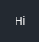
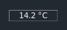
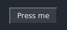
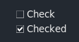
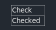

# Elements overview
Tipp: Preview every element by calling `sg.Examples.preview_all_elements()`.

This tutorial gives you a brief overview over all the available SwiftGUI-elements.

Most of these elements can do much more than I show in this tutorial, so it pays off to read the corresponding element-tutorials.

SwiftGUI-elements are categorized into 3 groups:
- Widget elements: Elements containing only a single tkinter-widget that is used as tkinter intends to
- Extended elements: Elements containing only a single tkinter-widget that is used significantly different to tkinters intention
- Combined elements: (Exclusive to SwiftGUI) Elements containing multiple tkinter-widgets

All screenshots in this tutorial use the theme `sg.Themes.FourColors.Emerald`.

# Widget-elements
Tkinter, the package behind SwiftGUI already offers a lot of elements (called widgets).

Widget-elements are basically just a raw tkinter-widget, maybe with some custom, higher-level functionality.

These elements should be simmilar for most GUI-libraries based on tkinter.

## Text
Aliases: T, Label

Displays a text. Nothing more, nothing less:\


Something I like to do is to set the relief to `groove`, so it looks like a value-display:\

```py
    sg.T("14.2 °C", relief= "groove", width= 10, anchor= "center")
```

## Button
A button that can be clicked:\


The only element with its default-event enabled without specifying.

There is a little known functionality:
Setting `repeatdelay` and `repeatinterval`, the button will repeat its press when the user holds it down.

Try this out:
```py
import SwiftGUI as sg
import time

sg.Themes.FourColors.Emerald()

layout = [
    [
        sg.Button(
            "Press me",
            key= "Button",
            repeatdelay= 400,
            repeatinterval= 200,
        )
    ]
]

w = sg.Window(layout, padx=30, pady=30)

for e, v in w:
    print(e, v)
```
If you hold down the button, it will start to repeat after 400 ms and simulate a press each 200 ms.

## Checkbox
Aliases: Check, Checkbutton

Something the user can "check" and "uncheck" by clicking on it:\


You can also make it look like a button setting `check_type = "button"`:\

```py
layout = [
    [
        sg.Checkbox("Check", check_type= "button", width= 8)
    ],[
        sg.Checkbox("Checked", default_value= True, check_type= "button", width= 8)
    ]
]
```

It's a bit hard to see, but the lower button looks like it is held down, because it is "checked".

## Frame
Aliases: Column

The frame can combine multiple elements into one.

It's crucial for building well-looking GUIs and explained in-depth in basic tutorial 06 (bigger layouts).

## Input
Aliases: In, Entry


## Separators (HorizontalSeparator, VerticalSeparator)
Aliases: HSep, VSep


## Spacer
Aliases: S

To be exact, this is an extended element, but it's so basic, let's keep it here.

## Listbox


## TKContainer
Aliases: TKWidget


## TextField
Aliases: Multiline


## Treeview (WIP)


## Table
A table with one or more columns.\
Probably the best element of them all.

Also actually an extended Element, but it fits better in this category in my opinion.


I do have to admit that PySimpleGUI's Table has a lower startup-time when adding a lot of rows, but SwiftGUI's Table easily has the better performance at runtime.

You should really check out the detailed documentation on Tables, this element is incredibly useful.

## Notebook
Aliases: TabGroup

## Image
Simple widget to display an image.

## ImageButton
Button with an image instead of a text.

# Elements with extended functionality
SwiftGUI offers a couple of elements that contain a single tkinter-widget, but change/extend its functionality drastically.

The definition is up to interpretation.
E.g. sg.Table is actually made from a ttk.Treeview but modified to something completely different, so it should be categorized as extended.
It's still closer to a widget-element in my opinion.

## FileBrowseButton
A button that opens a file-dialogue when clicked.


## ColorChooserButton
A button that opens a color-chooser-menu when clicked.


# Combined elements
SwiftGUI offeres a couple of "combined" elements that consist of multiple SwiftGUI-elements.

## Form (WIP)

