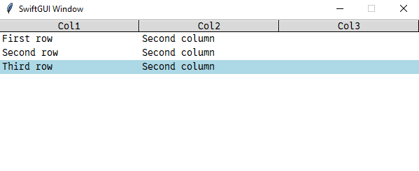

# WIP

Still working on this tutorial.

Best to ignore it for now.

Preview every element by calling `sg.Examples.preview_all_elements()`.

# Elements overview

This tutorial gives you an overview over all the available SwiftGUI-elements.

Most of these elements can do much more than I show in this tutorial, so it pays off to read the corresponding element-tutorials.

# Widget-elements
This chapter covers all "non-combined" elements, which contain only a single tkinter-widget.

## Text
Aliases: T, Label

Displays a text. Nothing more, nothing less.

**Elements that have any text in them usually contain all options of this element**, so they are explained a bit more detailed.

## Button

## Checkbox
Aliases: Check, Checkbutton

## Frame
Aliases: Column

## Input
Aliases: In, Entry

## Separators (HorizontalSeparator, VerticalSeparator)
Aliases: HSep, VSep

## Spacer
Aliases: S

To be exact, this is an extended element, but it's so basic, let's keep it here.

## Listbox

## TKContainer
Aliases: TKWidget

## TextField
Aliases: Multiline

## Treeview (WIP)

## Table
A table with one or more columns.\
Probably the best element of them all.

Also actually an extended Element, but it fits better in this category in my opinion.

I do have to admit that PySimpleGUI's Table has a lower startup-time when adding a lot of rows, but SwiftGUI's Table easily has the better performance at runtime.

You should really check out the detailed documentation on Tables, this element is incredibly useful.

## Notebook
Aliases: TabGroup

## Image
Simple widget to display an image.

## ImageButton
Button with an image instead of a text.

# Elements with extended functionality
SwiftGUI offers a couple of elements that contain a single tkinter-widget, but change/extend its functionality drastically.

The definition is up to interpretation.
E.g. sg.Table is actually made from a ttk.Treeview but modified to something completely different, so it should be categorized as extended.
It's still closer to a widget-element in my opinion.

## FileBrowseButton
A button that opens a file-dialogue when clicked.

## ColorChooserButton
A button that opens a color-chooser-menu when clicked.

# Combined elements
SwiftGUI offeres a couple of "combined" elements that consist of multiple SwiftGUI-elements.

## Form (WIP)

