# Images
This tutorial explains how to include images and image-buttons into your SwiftGUI user interface.
It also explains how to change the window-icon (top left corner of the window).

You'll also learn, how to include images into the layout, without carrying the image-file everywhere the script goes.
That is very useful when converting the script to an executable file (`.exe`).

# "Pure" image-element
To add an image to the layout, use the `sg.Image`-element 
(the file `python-logo.png` is placed in the same folder as the script):

```py
import SwiftGUI as sg

### Global options ###


### Layout ###
layout:list[list[sg.BaseElement]] = [
    [
        sg.Image(
            "python-logo.png"
        )
    ]
]

w = sg.Window(layout)

### Additional configurations/actions ###


### Main loop ###
for e,v in w:
    ...

### After window was closed ###
```
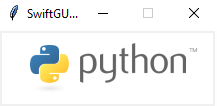

As you can see, you can choose an image by its name/path.

SwiftGUI supports any format `pillow` (the underlying package for image-handling) can.
This includes most certainly any format you'll ever use, **except `.svg`** (sadly).

## Other ways to add images
There are a couple of other ways to provide an image to your layout.

Like most things in Python, this is another instance of "if it might fit, it probably does".

### As a "normal" file
Open the image as a file in binary mode (`rb`):
```py
    sg.Image(
        open("python-logo.png", "rb")
    )
```

### As a pillow (PIL) - image
The pillow library is used by SwiftGUI for handling images, so it should have been installed with SwiftGUI already.

Pillow is great and popular for manipulating images, so SwiftGUI lets you integrate their image format seamlessly:
```py
from PIL import Image

img = Image.open("python-logo.png")

layout:list[list[sg.BaseElement]] = [
    [
        sg.Image(
            img
        )
    ]
]
```

## Integrating an image without keeping its file
When converting the program to an executable (`.exe` on windows), all referenced files must be present, including image-files.

That means, instead of just one `.exe`-file, you suddenly need an additional file for every single image and window-logo. Annoying.

To solve that issue, you may include images into your python-file (`.py`) directly.

Don't do this with larger images without resizing, or the scripts will become too big.

Use [this tool](https://github.com/CheesecakeTV/SwiftGUI/blob/10e396237bd5640b110e0368558653aae9c4e324/Tools/Image_To_Base64.py) to encode images base64.
I won't go into detail on, how this actually works, I'll only tell you how to use it.

When executing the tool-script, this window will open:
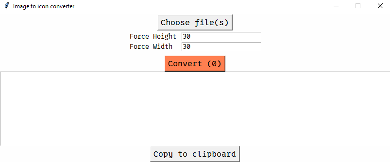

The layout is pretty straight-forward.
Just click on `Choose file(s)` and select all the images you'd like to convert.

Click `Convert` and the base64-strings are output to the text-field:\
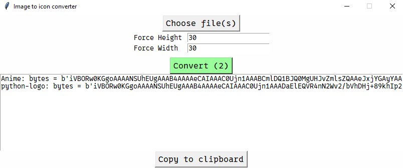

Copy all of the text and paste it into your python-script.
You might need to adjust the variable-names though.

**Note that the images got resized to 30x30 pixels**. To not resize, just leave the two inputs empty:\
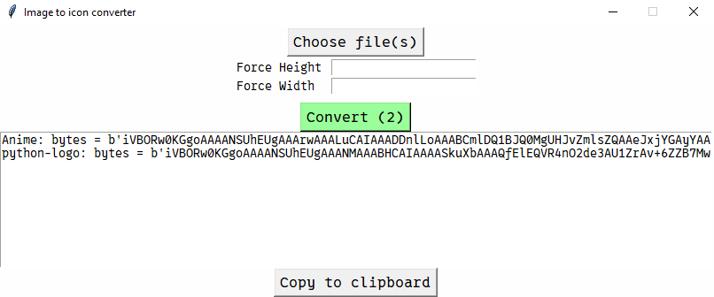

To use these byte-strings, you'll need to convert them to something like an open file.
Use the function `sg.file_from_b64` to do so:
```py
python_logo: bytes = b'iVBORw0KGgoAAAANSUhEUgAAANMAAABHCAIAAAASkuXbAAAQfElEQVR4nO2de3AU1ZrAv+6ZZB7Mwzgz5DF5AIkEEG6AvbkmlBDeKZeiVAqvuKw81NraP7SW0rIKa+uu/6y1pVW6sn9psfFyiaaiINGLLAY0Bm8uYEiAvCCMCXkQ8s48Mo/Mo7vPVveZ9PS8kiCZzCT0ryCcmemenJn88p3vfOf0QCCEQERkziHn/luKiIjmicQN0TyR+CCaJxIfRPNE4oNonkh8EM0TiQ+ieSLxQTRPJD5I4/R9RQIghEZGRpqamm7cuLF//36j0QiPAKJ58cfn833wwQc2mw0AaJqGR4O4mTc+4WvsMjf1WLpH7AOWCavLY3N6ACGSAI1ColUkpWoVSxeri5en/j5vsVSywLMC+pERLp7mIYAz9ffKajutLg9iEHB/AXF/ADEMY3VQVru7Z9hWbxo49XfT6uzH//THP2Tp1XPfVZHYEYdYUtM29N/n25/M1Jz6t40n/rU4L03NaccAMOxXv4L+BkMzzV3Db5XVjo5PwDyHYRi73R7vXjyq5jEInb3eRzPM6zvzjSnK/AztyxuXBYTDCgpvcgr2Do//5cdWmLc4HI5Lly599NFHn332Gcxzurq6vv/++8uXLzc1NZ0/fx4APB7PV199lejm+ShmyDYBiLE6vfgeK5fesYOwXzu+HYh8AOhvrb0wb2lsbPz888/v3Lnj8/lgnrN06dKcnJw1a9bo9Xq73e5yudrb2+VyeaLneQwCr48ChN6ranp54zKH2/fnGlMk7YLbgEZtrjnuqsi0LFmyBP86LVq0CObB3JbVCfWO2t87c3NSr0BsC9Yu4J+PeuRmf4mPRqPp7u5euXLlb8hf5948xO2/D83k+NgmUDCgHfK3RRKClStXAoBazVYbVqxYAQA5OTmJbh5BEMYURZJEaNhkA9C402OxT0TWbrbN83g8ZrPZ4XC4XC65XK5Wqw0GQ1JSUrTjEUKjo6MajUYmk8FcwTCMx+ORSCTJyckzOX5iYmJkZMRqtSKE8CvCfswEt9ttNpttNpvX65VKpTqdTq/XS6WxMiTm5iEEbh/tFYyV/7lvfcQDAeBUnel/LzQLwyEbIHk1GRcMHwXa6feS1INqK2h2AvEAr8Lr9ba1tdXX13d2djocDj7ll0qler1+27ZtTz/9dPjbXVtbe/369e7u7qNHj2ZkZER85sHBwWPHjuFgcOTIEaVSCQBVVVX19fVutxsfc/fu3XfeeQe39+3bV1BQEE3xpqamtra2gYEBiqIIgjAYDBs2bCgqKoqmwtjY2IULF27evGmz2XBdmiAIlUqVn59fWlqak5NDEETEE91u982bNxsbG7u7u51OJ/+GJCUlpaambt26tbi4OBb+xdA8hKC1z/rlle7b963jLm+EYTQotrEneH2+SNpNjsKAgLIBbWfbDAPIDBMm8HTA4tdnMklHCN26devMmTP37t1DCJEkqeEgSdJisYyPjw8ODn7xxRcmk+nw4cMhwa+iomLai/QoihodHcWrYQzD4DsnJiZsNht/k6IovEoG3GHhTzI+Pl5ZWXnlypWJCbZ+SRAE/r5Wq7Wjo6O5ufm1114Lj39tbW0nTpywWq0AkJycrNVqCYJwOp12u72hoaG1tXX37t3bt28nyaB3iaKo+vr68+fPDw0N4aQtIyNDIpE4nc6xsTGfz9fX11deXt7e3n7o0KEpRoPEMg8hOPm3u2U/dfhoml2lCKuSTDuZDdUO/+BZ5wQzEsSA9SIoCkFdPG2XfvjhhzNnzlAUpVAoiouLCwsLs7Ky8NDpcrmuXr369ddfe73ea9eu6XS6PXv2RAsSD8SuXbs2b97c0NBw9uxZnA8dPnwYP5SSkhJ+/PHjx10ul0KheOqpp9auXavT6ZxOZ21tbXNzM0Loxo0b33zzzQsvvCDsm8lk+uSTT9xut1Qq3bhxY0lJSVpaGkmSo6Ojly5dqqmpcbvdp0+fRgiVlpbyZ1kslvLy8tZWtkq6bNmy0tLS/Px8HKcZhunq6qqsrOzu7kYIXbt2LTs7W3huQptX3dx/vOZXmmECWVqQQ1NOZjnpQk9h21xVxn8MM9mmwVw1E/Oqq6spigKAQ4cOrV8fNOIrlcqtW7cSBFFRUQEAP/74Y2FhYXZ29sO/D9pJ8E2ZTBZtsMa43e6ioqLdu3cvXrzYfxeXxZeVlTU0NOBxf8eOHby1DoejrKzM7XYTBLF37178KvBDBoNh79696enp5eXlNE1XVVXl5ubm5eXhR00mU0tLCwAYjca33npLGNJIkszNzX3jjTfef//94eFhhFBdXd2smxeTSrLbRx+vMdE0/QDaoRDtmDDt8PFUsHbcsOu6BZR52l7xQ55KpYp4wMaNG9PT0/E4ePHiRYgHBw8efOWVV4Ta4Rx0z549eJD1+Xy3b9/mH6qurjab2deen59fUlISHqeLi4txNknT9OnTp/k3gSc5OVkikYT3RKPRbNmyBbfxcDwPzGvqsQxaJgJxK+AQXpwNXygL3D+pndBL9qZWKQNqzD+9EGqHENAeVr6HRiqVrlu3Drfb2trissaamZkZcZTX6XSZmZm4jfM5nERevXoVtyNOjHAA27FjB37Ozs7Onp6emXcmNzcXN2LxQRQxMa+l10LzSkWIbVHLeFyMDFHTHx3zjDpw1LGqhWjH/qHBdWdWer5s2TLcsNvtAwMDkDCQJMkP2Tw9PT3YQoIg8vPzo51rNBr50RmPsDPkN6yJxdm82/ct000gomgXXknm2iRJvFyiB+t3gaHWrx3jd3Gia1Z6bjAY+HZfXx8kEkRYLOzt9a9lq9VqhUIR7US5XM6/Lv6UuBMT87pH7MGThrB2sHYcIYmgQDuCeP0fs4pTytmSinCoDbQZ8AzPSs/x5A5jsVggsbFP5gNyuTykYiKEIAh+XZWv9sWdmMxth9ndKNOvjClkklSNVEIG708RqCmXkSszJC/83p4jqwCvLdI4O3mT8cxKz4XrE3z5dyFBs9M+tGDN8/noCDNTgXaZukVv75atz2iWon42SwuRieEXLWiCdrJWURHTO2H8m5130+v1TjG6JRqSyTnptDLxB8hksogz2QVinkxKeHwRtWMtWbvE8NHLE0rfaaB9Ac+CrIpuWLQ7JaHZ92/D4wnEzmjFl8RBp9Phhs1moygq2jIDQogfl3U6XYL8RsUkz0vVysPqKX7tMlIWvX/AqPT9FVB07cInEKFecvcL75QvmZWeDw8H8sXU1FRIbHImd4h4vd4pSm4ej4fPWZcuXQqJQUzMy9arQncXT46J/7z1SS15GZA3aH4QMCnKBIL1L4qX+PnVv5uVnnd0dOCGVCpdsiSCzePj45AwpHHg9q1bUSuaZrMZm0eS5Jo1a2ABm/dkZkpouZhL71Qy6YaVGeDrnbQnxLAp7ow0wvLxkpCD9g8P322fz9fY2Ijbubm5wgqLRqPBjc7Ozof5FuFLCA9DcnJycbF/2fCXX34RpgpCrly5gr/v6tWrhS9qAZq3Oudxks0lQhdkVXKpRikDhgpMC/jBNBDJZqZdYNhFkLIJpA+Q5/X29oYbgBC6cOHC4OAgjg07d+4U1in4CnNtbW3EcY2m6Smk5Au5Y2Njs1vU2Lx5M5ZpYGCgpqYmfKrR19dXV1eHdz0999xzCZLkxcq83+Xo9WpZxAVZTkiBdqFT1IiJXTTtuDaRDOn/9EDdO3Xq1IcfftjQ0GCz2dhCIsOYzeaqqqrvvvsOH1BUVLR69WrhKTt37sT5u9Vq/fjjj+vr6x0OB65D2my269evHzt2DO82iEhOTg7eoWm1Wi9fvjyLdQ2lUnngwAGZTIYQOnv2bE1NDR/5GIYxmUyffvqpw+EgSfL555/PysqChCE2c9skyUub8v/nr43C+rB/GRcTZFJ4YhetdBI2IwESjAdBxW7InjkajebXX381mUwqlUqj0WB7XC7/FUYFBQX79u0LKczm5eW9+OKLp06d8ng8o6Ojx48f12q1uDw7Pj7udDoRQgqFAm+qC0er1T777LOVlZUURVVUVNy4cSM3N7ewsDBkZ8BvY8WKFa+++urJkycdDseXX35ZW1trNBolEsnQ0ND9+/cpipLJZLt27dq+fTskErHaJfV8Ud7NzsGfW3u5TxAQLFFwv4xRAhgCQgESdVCwDNT2BIsf7JEkyIxg2AW6bQ/at4MHD9rt9p9++un+/fv9/f34TpIkH3vssS1btmzbti1ieaKkpCQ9Pf3bb7/t6ury+Xw2DqlUKpfL8/Pz165dW1BQgPcbSySS8BWFTZs2abXac+fO9ff3t7a2trS0GAwGbB5BEAqFAicAUyxFyGQyvMQS3r1169alp6efO3eutbV1aGgI5wwEQchkslWrVj3zzDP85igeiUSCn22KxVmSJIWLOrOLf8trLPD46KrLd87Vd/QMWTzclY5pjy2q/Pe9CstR8HYHRTI+8qXsAd1L0boKkge+tE7Im2++ictab7/99vLlyxFCw8PD/f39VqtVLpfr9frs7Oxpr7FACA0NDQ0PD3s8HpVKpVardTodXjN1Op1HjhzB5Zh33303or4Mw4yOjlosFoZhjEYjnrgghNxuN/5BTLEO5vF4cI6YxBHxGIfDMTAwgLcRqNXqtLQ0vD85/EiKonDZnCTJaPIxDMMv5My6gjHcDS9LkuwrWbWvZFXoA8IRNmRUHfsWzP83OaQGD7XJi+HJk7PYPYIgUjke9CxhLUMI3naKp5zRLlwgSXIxBwQ/5xTr/TwzufJIpVI98cQT0x6Gy0bTXl0R05gXl+ttg4vAQdmeBxi85hvsJTuTeKiANwfw6wQpKSmJM4VMWOJi3gxmFWyQy4LFLwLtgPt/BprbpZLY8Ckj3tgsknjmzXAyu+Q/QLmcPZ6Qw93/AnJGF5zGC4Zh8HUS/MXPIlMTj09ETMqYUQ0FiKAYmezfC56AMAzz888/NzU1AUBWVtYMM61HnHjEPE0p2C8DQ0ffn8L51/EnSHuJvfDiXhn7G5L6LCQeFEX19/dfvHjx2rVrDMMolcr9+/fP5YcQzF/iYZ5yLegOwcgJoCc3kIZrh7gN7nff4+YWSZD1L5DyNCQGCKH29vY+jp6enqGhIfwxABkZGQcOHOCvmhFJwM9JJuDxPaBYAcNfgL2Rm89GKiyzA64UtGsh8xXQ/kNg8P2tGAwGp9M5K2v21dXVbW1tuC2RSDIzMzdt2rRhwwYx2iVEJXlGeAfAfh2crWyE84wA4wZCBkl6kOWAugA060E+1XXRDwRCqKurq6Ghobi4+CFXMOvq6lpaWlJSUoxGY25ubnp6ulhGmW/miTyqxO1/JRAaH83+kEAixpWFxNyZh/Wa+msIWLWQr/gfUcT5zhx8fp5fLGFj8hJbhvvsMj/8wbxSxJSwUxDcEJmHxNa8cNsY9tOlIjd4eLdIkhQ2uL9ksH0sonzzkTmKecKwh1v4X4aD948veZAc2CqSJBmGIUkS4TgXphqWNdYvRGQ+mYfTsZAxlNWKYViNBGJJJBJhpU0Y17CCIfFPjHnznbmoqkyV6kWfZASmFALNwm/EuvMiC6GeJxx5w29GRDixDb8pMn9JgErylD0QJVuoJIB5Io8kC/x/LBZJWETzROKDaJ5IfBDNE4kPonki8UE0TyQ+iOaJxAfRPJH4IJonEh9E80QgLvw/B5+5NAxVye4AAAAASUVORK5CYII='

layout:list[list[sg.BaseElement]] = [
    [
        sg.Image(
            sg.file_from_b64(python_logo)
        )
    ]
]
```

## Resizing images
`sg.Image` and `sg.ImageButton` take `image_width` and `image_height` as options.

If you define neither, the image doesn't get resized.

Defining either `image_width`, or `image_height` (but not both), will resize the image, while keeping its aspect-ratio intact:
```py
layout:list[list[sg.BaseElement]] = [
    [
        sg.Image(
            "python-logo.png",
            image_width=300,
        ),
    ],[
        sg.Image(
            "python-logo.png",
            image_width=200,
        ),
    ],[
        sg.Image(
            "python-logo.png",
            image_width=100,
        ),
    ],[
        sg.Image(
            "python-logo.png",
            image_width=50,
        ),
    ],
]
```
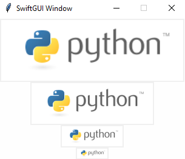

Defining both dimensions might force a different aspect-ratio onto the image, messing up how it looks:
```py
layout:list[list[sg.BaseElement]] = [
    [
        sg.Image(
            "python-logo.png",
            image_width=150,
            image_height=150,
        ),
    ]
]
```
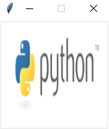

## .update
You can change `image`, `image_width` and `image_height` using `.update(...)` too.

If you change the `image` that way, `image_width` and `image_height` will be reapplied, possibly resizing the image.


# Image-button
`sg.ImageButton` works like a normal button, but displays an image instead of a text:
```py
layout:list[list[sg.BaseElement]] = [
    [
        sg.ImageButton(
            "python-logo.png",
            key= "ImageClicked",
            image_width= 100,
        ),
    ]
]
```
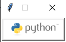

It has pretty much the same options as normal `sg.Button`.

## Adding text to the image-button
(This part was written in SwiftGUI version 0.8.2, much later than the rest of this tutorial.)

You can already do a lot with image-buttons, but displaying only an image is often not enough.
You should also display a text, so the user instantly knows what the button is for.

Of course, you could just put the text into the image, but that is going to take a lot of work.

That's why the image-button has the option `text` that lets you add text next to the image:
```py
sg.Themes.FourColors.CocoaMilk()    # Add a theme so it looks good

layout = [
    [
        sg.ImageButton(
            "Star.png",
            text= "Star!",
        )
    ]
]

w = sg.Window(layout, padx=150, pady=50)    # Add some space around the button
```
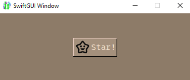

A feature to change the color of monochrome images is planned, but not implemented yet.

Change the location of the image by setting `compound`:
```py
layout = [
    [
        sg.ImageButton("Star.png",text= "right", compound="right"),
        sg.ImageButton("Star.png", text="left", compound="left"),
        sg.ImageButton("Star.png", text="bottom", compound="bottom"),
        sg.ImageButton("Star.png", text="top", compound="top"),
    ]
]
```
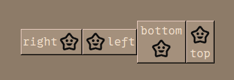

## Changing the button-size
We talked about resizing the image, but what about the actual button around the image?

Usually, `width` is the number of characters in a row and `height` the number of rows.
For image-buttons, both of these values are given in pixels:
```py
layout = [
    [
        sg.ImageButton("Star.png",text= "right", compound="right", width=100, height=50),
        sg.ImageButton("Star.png", text="left", compound="left", width=100, height=50),
        sg.ImageButton("Star.png", text="bottom", compound="bottom", width=100, height=50),
        sg.ImageButton("Star.png", text="top", compound="top", width=100, height=50),
    ]
]
```
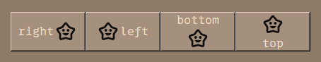

This might feel annoying, but trust me, the alternatives are worse.

## Normal sg.Image as button
You can repurpose `sg.Image` to act simmilar as a button by manually adding its click-event:
```py
layout:list[list[sg.BaseElement]] = [
    [
        sg.Image(
            "python-logo.png",
        ).bind_event(
            sg.Event.ClickLeft,
            key= "ImageClicked",
        ),
    ]
]
```
It looks like a normal image, but throws an event when clicked.

# Window-icon
To set a window-icon, add `icon` as an option to the `sg.Window`:
```py
layout:list[list[sg.BaseElement]] = [
    [
        sg.ImageButton(
            "python-logo.png",
            key= "ImageClicked",
            image_width= 100,
        ),
    ]
]

w = sg.Window(layout, icon="python-logo-small.jpeg")
```
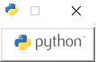

`icon` can be modified using `w.update(icon = ...)` and takes any image-format `sg.Image` does.

