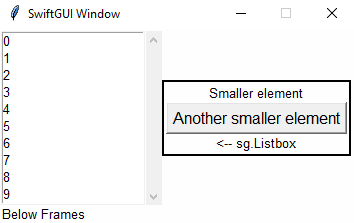

# Bigger / Advanced layouts
There comes a time when a basic "row-layout", as described in tutorial "01 Getting-started", just isn't enough.

Like when you have too many elements.
The GUI gets too crowded and is neither good looking, nor user-friendly.

Or when you want to place multiple smaller elements besides a single bigger one (like `sg.Listbox`):\
\
Since the `sg.Listbox` is only one element in one row, this is not possible without utilizing the functionalities described in this tutorial.
You can't add "multiple rows into a single row" without using frames.

# Frames
The previous example was created using the element `sg.Frame`.

A frame allows you to handle a whole layout like a single element.

The above example consists of two layouts, the "outer"/main one (green) and a smaller "inner" one (red):\

```py
### Layout ###
inner_layout = [
    [sg.T("Smaller element")],  # Notice how this is a full row (List inside the list)
    [sg.Button("Another smaller element")],
    [sg.T("<-- sg.Listbox")]
]

layout:list[list[sg.BaseElement]] = [   # Main layout
    [
        sg.Listbox(
            range(10)
        ),
        sg.Frame(
            inner_layout,   # Pack the inner layout into the frame
            expand_y=True
        )
    ]
]

w = sg.Window(layout)
```
As you can see, we just created a second layout in the same way the first one was created, then packed it into `sg.Frame`.

`expand_y=True` is necessary, so that the frame spans the whole height of the row.
If you set it to `False` (default), the frame will only be as high as necessary, which aligns the elements centered:\
\
This might be intended for some layouts, your decision.

## LabelFrame
There are different kinds of frames (2 since version 0.5.3, 5 since version 0.10.8).

I find `sg.LabelFrame` especially useful for bigger layouts, because it divides seperate parts of the layout visibly:\

```py
layout:list[list[sg.BaseElement]] = [
    [
        sg.Listbox(
            range(10)
        ),
        sg.LabelFrame(  # Not a normal frame
            inner_layout,
            text = "LabelFrame",
        )
    ]
]
```
`sg.LabelFrame` has all the options a normal `sg.Frame` has and some additionl ones that won't be covered by this tutorial.

To not draw sketchy red borders all the time, I'm going to use `sg.LabelFrame` with `no_label=True` going further:\


## GridFrame
If you want to arrange your elements in a grid, use `sg.GridFrame` instead (Added in SwiftGUI version 0.7.6).

Usually, all elements are aligned in rows.
With GridFrames, the elements align in rows AND columns:\


```py
grid_contents = [
    [
        sg.Button("Upper left"),    # First column
        sg.Button("Hi"),            # Second column
        sg.Button("3rd column")     # Third column
    ],[
        sg.Button("Hii"),           # First column
        sg.T(),                     # Placeholder (second column)
        sg.Button("2nd row")        # Third column
    ]
]

layout:list[list[sg.BaseElement]] = [
    [
        sg.GridFrame(grid_contents)
    ]
]
```
Doesn't look much like a grid, does it?

Well, don't think of it as a grid.
Just know that elements are aligned in rows and columns.

As you can see, `Upper left` is centered above `Hii`. 
They form a column.

In row-oriented (normal) layouts, the tallest element specifies the height of its row.
This is also true for grids, but in addition, the broadest element in each column decides the width of its column:

```py
grid_contents = [
    [
        sg.Button("Very Big", width=25, height=10), # Very broad and high
        sg.Button("Hi"),
        sg.Button("3rd column")
    ],[
        sg.Button("Hii"),
        sg.T(), # Placeholder, empty text
        sg.Button("2nd row")
    ]
]
```
The elements are still aligned vertically and horizontally.

## Expanding elements
In SwiftGUI, elements can only "expand" using `expand` and `expand_y`, so far until it needs to resize its "container".
The container is whatever the layout of that element is inside.\
Usually, the main window.
Put the layout in a frame and that frame is its container.

E.g. take a look at the previous example (Scrollbar different due to newer version):\


Theoretically, the LabelFrame could expand further to the top/bottom, because the Listbox makes the row taller.
The surrounding frame (or Window) would not need to resize:\

```py
layout:list[list[sg.BaseElement]] = [
    [
        sg.Listbox(
            range(10)
        ),
        sg.LabelFrame(
            inner_layout,
            text = "LabelFrame",
            expand_y= True, # Make it as tall as possible
        )
    ]
]
```

However, it can not expand further to the left/right, because it would need to resize its container (the main window).

That's why `expand_y` is possible, but `expand` does nothing.

Same with grids.

Consider this example:
```py
grid_contents = [
    [
        sg.Button("Very Big", width=25, height=10),
        sg.Button("Hi"),
        sg.Button("3rd column", expand_y= True) # Expand height
    ],[
        sg.Button("Hii", expand= True), # Expand width
        sg.T(),
        sg.Button("2nd row")
    ]
]

layout:list[list[sg.BaseElement]] = [
    [
        sg.GridFrame(grid_contents)
    ]
]
```


As you can see, the elements can't expand beyond their row/colum, because this would resize the container (`sg.GridFrame`).

## Horizontal alignment
Elements are aligned "center" by default.
To allign them differently, pass the option `alignment` to the container/frame:\
```py
    sg.LabelFrame(
        inner_layout,
        no_label=True,
        alignment= "left",
    )
```


This only applies to that frame, containing frames won't be affected.

You can set the alignment for the main window too:
```py
### Layout ###
inner_layout = [
    [sg.T("Smaller element")],
    [sg.Button("Another smaller element")],
    [sg.T("<-- sg.Listbox")]
]

layout:list[list[sg.BaseElement]] = [
    [
        sg.Listbox(
            range(10)
        ),
        sg.LabelFrame(
            inner_layout,
            no_label=True,
        )
    ],[
        sg.T("Below Frames")
    ]
]

w = sg.Window(layout, alignment="left") # Here
```
\
You don't see a difference, because all elements contained in the window directly are already as left as they can be.

And again, this won't affect containing frames, so elements inside the `sg.LabelFrame` are still aligned centered.

To set the alignment for all frames, including the main window, utilize global-options:
```py
### Global options ###
sg.GlobalOptions.Frame.alignment = "left"   # All frames should align left by default

### Layout ###
inner_layout = [
    [sg.T("Smaller element")],
    [sg.Button("Another smaller element")],
    [sg.T("<-- sg.Listbox")]
]

layout:list[list[sg.BaseElement]] = [
    [
        sg.Listbox(
            range(10)
        ),
        sg.LabelFrame(
            inner_layout,
            no_label=True,
        )
    ],[
        sg.T("Below Frames")
    ]
]

w = sg.Window(layout)
```


## Background color propagation
This part of the tutorial was moved to its own advanced tutorial.

# Notebook (Tabview)
**Notebooks look A LOT better now (version 0.10.3), compared to back when I wrote this tutorial.

The `sg.Notebook`, (`sg.Tabview` in PySimpleGUI) helps to deal with too many elements by not showing all at once:\
\
Other tab:\

```py
### Layout ###
left_tab = sg.Frame([
    [
        sg.Listbox(
            range(10)
        ),
    ]
])

right_tab = sg.Frame([
    [sg.T("Smaller element")],
    [sg.Button("Another smaller element")],
    [sg.T("<-- sg.Listbox")]
])

layout:list[list[sg.BaseElement]] = [
    [
        sg.Notebook(
            left_tab,   # Put the tabs into the notebook
            right_tab,
        )
    ]
]

w = sg.Window(layout)
```
As you can see, `sg.Notebook` takes frames and organizes them in tabs.
The key of that frame becomes the text on the tab.

## TabFrame
The `sg.TabFrame` is a type of frame that makes working with `sg.Notebook` much easier.
You should always use `sg.TabFrame` for notebooks.

An `sg.TabFrame` accepts the option `text`, which will be used as the tab-text, independent of its key:
```py
left_tab = sg.TabFrame([
    [
        sg.Listbox(
            range(10)
        ),
    ]
], key= "left_frame", text= "left") # Specify the text right here in the element

right_tab = sg.Frame([
    [sg.T("Smaller element")],
    [sg.Button("Another smaller element")],
    [sg.T("<-- sg.Listbox")]
], key= "right")

layout:list[list[sg.BaseElement]] = [
    [
        sg.Notebook(
            left_tab,
            right_tab,
        )
    ]
]
```
\
(Told you notebooks looked better now)

It you don't want the tab-frame to register its key, don't define `key`, but `fake_key`.
The notebook won't see a difference, but the element still has no key.

`sg.TabFrame` features more useful functionality when working with notebooks, which won't be covered by this tutorial.

`sg.Notebook` also has an event-system.
It can throw an event when the tab changes, but also throw specific events depending on the selected tab.
You may also change the opened tab manually.

Since this tutorial is ment to be mainly about layouts, you'll find the details in the element-tutorial for `sg.Notebook`.

# Separators
`sg.HorizontalSeparator` and `sg.VerticalSeparator` are basically just horizontal/vertical lines:\

```py
### Layout ###
inner_layout = [
    [sg.T("Smaller element")],
    [sg.HorizontalSeparator()], # <-- here
    [sg.Button("Another smaller element")],
    [sg.T("<-- sg.Listbox")]
]

layout:list[list[sg.BaseElement]] = [
    [
        sg.Listbox(
            range(10),
            scrollbar= False,
        ),
        sg.VerticalSeparator(), # <-- here
        sg.Frame(
            inner_layout,
        )
    ]
]

w = sg.Window(layout)
```
Their names are pretty long, so you might want to use the aliases `sg.HSep` and `sg.VSep` instead.

You can change the `color` and thickness (`weight`) of separators:
```py
### Layout ###
inner_layout = [
    [sg.T("Smaller element")],
    [sg.HSep(weight=5, color= sg.Color.coral)], # <-- here
    [sg.Button("Another smaller element")],
    [sg.T("<-- sg.Listbox")]
]

layout:list[list[sg.BaseElement]] = [
    [
        sg.Listbox(
            range(10),
            scrollbar= False,
        ),
        sg.VSep(color= sg.Color.navy), # <-- here
        sg.Frame(
            inner_layout,
        )
    ]
]
```


Default `weight` is 2.

You may change these options using `.update` too, even though you'll probably never need to do that.

# Spacer
A `sg.Spacer` is a pseudo-invisible element with a certain size.

You can use it to add some space inbetween elements/rows.

At this time (version 0.5.3), it is the only element without its own global-options-class.

Example:
```py
### Layout ###
layout:list[list[sg.BaseElement]] = [
    [
        sg.T("Normal text"),
        sg.Spacer(width=50),
        sg.T("Text far to the right"),
    ],[
        sg.Spacer(height=50)
    ],[
        sg.T("Text far below")
    ]
]

w = sg.Window(layout)
```


## Aligning elements to the bottom of a frame
In the beginning of this tutorial you have learned that you need to set `expand_y` for the elements to align to the top of the row:
```py
### Layout ###
inner_layout = [
    [sg.T("Smaller element")],
    [sg.Button("Another smaller element")],
    [sg.T("<-- sg.Listbox")]
]

layout:list[list[sg.BaseElement]] = [
    [
        sg.Listbox(
            range(10)
        ),
        sg.Frame(
            inner_layout,
            expand_y=True
        )
    ]
]

w = sg.Window(layout)
```


There is no "native" way of aligning elements to the bottom of a frame (yet, version 0.5.3)

However, if there was an invisible element that took as much vertical (y) space as possible, it would push all other elements down.\
You probably already know what I am getting at:
```py
inner_layout = [
    [sg.Spacer(expand_y= True)],    # Take as much vertical space as possible
    [sg.T("Smaller element")],
    [sg.Button("Another smaller element")],
    [sg.T("<-- sg.Listbox")]
]
```


Simmilarely, you can align some elements to the top and some to the bottom:
```py
inner_layout = [
    [sg.T("Smaller element")],
    [sg.Button("Another smaller element")],
    [sg.Spacer(expand_y= True)],
    [sg.T("<-- sg.Listbox")]
]
```


### Aligning to top/bottom in sg.GridFrame
Unfortunately, there is no good way to align `sg.GridFrame`-elements to the top or bottom yet (version 0.7.6).
I promise to implement one in the future.

If you really, really, really need to align elements to top/bottom inside a GridFrame, make every required field its own `sg.Frame` and add a spacer at their bottom (which is an abomination to readability):
```py
grid_contents = [
    [
        sg.Button("Very Big", width=25, height=10),
        sg.Frame([
            [
                sg.Button("Hi")
            ], [
                sg.Spacer(expand_y=True)
            ]],
            expand_y=True,
            padx=0,
            pady=0),
        sg.Frame([
            [
                sg.Button("3rd column")
            ], [
                sg.Spacer(expand_y=True)
            ]],
            expand_y=True,
            padx=0,
            pady=0),
    ],[
        sg.Button("Hii"),
        sg.T(), # Placeholder, empty text
        sg.Button("2nd row")
    ]
]

layout:list[list[sg.BaseElement]] = [
    [
        sg.GridFrame(grid_contents)
    ]
]
```


What a mess.

This is just a proof of concept, don't do that.


