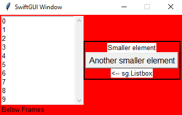
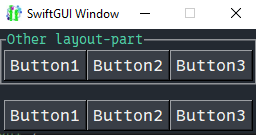
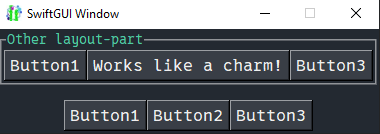

# Bigger / Advanced layouts
There comes a time when a basic "row-layout", as described in tutorial "01 Getting-started", just isn't enough.

E.g. when you have too many elements.
The GUI gets too crowded and is neither good looking, nor user-friendly.

Or when you want to place multiple smaller elements besides a single bigger one (like `sg.Listbox`):\
\
Since the `sg.Listbox` is only one element in one row, this is not possible without utilizing the functionalities described in this tutorial.
You can't add "multiple rows to a single row", without using frames.

# Frames
The previous example was solved using the element `sg.Frame`.

A frame allows you to pack a whole layout into a single element.

The above example consists of two actual layouts, the "outer"/main one (green) and a smaller "inner" one (red):\

```py
### Layout ###
inner_layout = [
    [sg.T("Smaller element")],  # Notice how this is a full row (List in the list)
    [sg.Button("Another smaller element")],
    [sg.T("<-- sg.Listbox")]
]

layout:list[list[sg.BaseElement]] = [
    [
        sg.Listbox(
            range(10)
        ),
        sg.Frame(
            inner_layout,
            expand_y=True
        )
    ]
]

w = sg.Window(layout)
```
As you can see, we just created a second layout in the same way the first one was created, then packed it into `sg.Frame`.

`expand_y=True` is necessary, so that the frame spans the whole height of the row.
If you set it to `False` (default), the frame will only be as high as necessary, which aligns the elements centered:\
\
This might be intended for some layouts, your decision.

## LabelFrame
There are different kinds of frames (2 at the moment, version 0.5.3).

I find `sg.LabelFrame` especially good looking in bigger layouts, because it divides seperate parts of the layout visibly:\

```py
layout:list[list[sg.BaseElement]] = [
    [
        sg.Listbox(
            range(10)
        ),
        sg.LabelFrame(
            inner_layout,
            text = "LabelFrame",
        )
    ]
]
```
`sg.LabelFrame` has all the options a normal `sg.Frame` has and some additionl ones that won't be covered by this tutorial.

To not draw sketchy red borders all the time, I'm going to use `sg.LabelFrame` with `no_label=True` going further:\


## GridFrame
If you want to arrange your elements in a grid, use `sg.GridFrame` (Added in SwiftGUI version 0.7.6).

Normally, all elements in a row are aligned.
With GridFrames, the elements align in rows AND columns:\


```py
grid_contents = [
    [
        sg.Button("Upper left"),
        sg.Button("Hi"),
        sg.Button("3rd column")
    ],[
        sg.Button("Hii"),
        sg.T(), # Placeholder, empty text
        sg.Button("2nd row")
    ]
]

layout:list[list[sg.BaseElement]] = [
    [
        sg.GridFrame(grid_contents)
    ]
]
```
Doesn't look much like a grid, does it?

Well, don't think of it as a grid.
Just know that elements are aligned in rows and columns.

As you can see, `Upper left` is centered above `Hii`. 
They form a column.

In row-oriented (normal) layouts, the tallest element decides the height of the row.
This is also true for grids, but now, in addition, the broadest element decides the width of its column:

```py
grid_contents = [
    [
        sg.Button("Very Big", width=25, height=10),
        sg.Button("Hi"),
        sg.Button("3rd column")
    ],[
        sg.Button("Hii"),
        sg.T(), # Placeholder, empty text
        sg.Button("2nd row")
    ]
]
```
The elements are still centered vertically and horizontally.

## Expanding elements
In SwiftGUI, every element can only "expand" if it doesn't resize its container.

E.g. take a look at the previous example (Scrollbar different due to newer version):\


Theoretically, the LabelFrame could expand to the top/bottom, because the Listbox makes the row taller.
The surrounding frame (or Window) would not need to resize:\

```py
layout:list[list[sg.BaseElement]] = [
    [
        sg.Listbox(
            range(10)
        ),
        sg.LabelFrame(
            inner_layout,
            text = "LabelFrame",
            expand_y= True
        )
    ]
]
```

However, it can not expand further left/right, because it would expand the window itself.

That's why `expand_y` is possible and `expand` does nothing.

Same with grids.

Consider this example:
```py
grid_contents = [
    [
        sg.Button("Very Big", width=25, height=10),
        sg.Button("Hi"),
        sg.Button("3rd column", expand_y= True) # Expand height
    ],[
        sg.Button("Hii", expand= True), # Expand width
        sg.T(),
        sg.Button("2nd row")
    ]
]

layout:list[list[sg.BaseElement]] = [
    [
        sg.GridFrame(grid_contents)
    ]
]
```


As you can see, the elements can expand inside their row/colum.

The Button `Very Big` has a specified width and height, so it is allowed resize the container (`sg.Gridframe`).

## Horizontal alignment
Elements are aligned "center" by default.
To allign them differently, just pass the option `alignment` to the surrounding frame:\

```py
    sg.LabelFrame(
        inner_layout,
        no_label=True,
        alignment= "left",
    )
```
This only applies to that frame though, containing frames won't be affected.

Since the main window also contains an `sg.Frame`, you can set the alignment for it too:
```py
### Layout ###
inner_layout = [
    [sg.T("Smaller element")],
    [sg.Button("Another smaller element")],
    [sg.T("<-- sg.Listbox")]
]

layout:list[list[sg.BaseElement]] = [
    [
        sg.Listbox(
            range(10)
        ),
        sg.LabelFrame(
            inner_layout,
            no_label=True,
        )
    ],[
        sg.T("Below Frames")
    ]
]

w = sg.Window(layout, alignment="left") # Here
```
\
You don't see a difference, because all elements contained in the window directly are already as left as they can be.

And again, this won't affect containing frames, so elements inside the `sg.LabelFrame` are aligned centered by default.

To set the alignment for all frames, including the main window, utilize global-options:
```py
### Global options ###
sg.GlobalOptions.Frame.alignment = "left"

### Layout ###
inner_layout = [
    [sg.T("Smaller element")],
    [sg.Button("Another smaller element")],
    [sg.T("<-- sg.Listbox")]
]

layout:list[list[sg.BaseElement]] = [
    [
        sg.Listbox(
            range(10)
        ),
        sg.LabelFrame(
            inner_layout,
            no_label=True,
        )
    ],[
        sg.T("Below Frames")
    ]
]

w = sg.Window(layout)
```


## Background color propagation
This feature took me 2 very annoying days to properly implement, so please appreciate it.

Every frame has its own background-color, they are not actually transparent - unfortunately.\
This is due to `tkinter`, the main package behind SwiftGUI.

That's why SwiftGUI has a feature called "background color propagation".
It basically applies changes to the background-color of a frame to all containing elements with certain properties.

So when changing the background-color of a frame, that frame will update the background-color of contained elements with these certain properties.

Long story short, seamingly transparent elements will change their background-color so they still look transparent.

Example:
```py
### Layout ###
inner_layout = [
    [sg.T("Smaller element")],
    [sg.Button("Another smaller element")],
    [sg.T("<-- sg.Listbox")]
]

layout:list[list[sg.BaseElement]] = [
    [
        sg.Listbox(
            range(10)
        ),
        sg.LabelFrame(
            inner_layout,
            no_label=True,
        )
    ],[
        sg.T("Below Frames")
    ]
]

w = sg.Window(layout, alignment="left", background_color="red")
```


It might not sound that cool, but remember that elements with "open" texts, like `sg.Text` and `sg.Checkbox` also have their own background-color.

Without background-color-propagation, the GUI looks like this:\


If you set a background-color for specific elements, they automatically disable background-color-propagation for themselves:
```py
layout:list[list[sg.BaseElement]] = [
    [
        sg.Listbox(
            range(10)
        ),
        sg.LabelFrame(
            inner_layout,
            no_label=True,
            background_color="green"
        )
    ],[
        sg.T("Below Frames", background_color="lightblue")
    ]
]

w = sg.Window(layout, alignment="left", background_color="red")
```


However, **when using `.update(background_color = ...)`, the color-propagation won't be disabled**.
The background-color will still change, when a containing frame updates:
```py
layout:list[list[sg.BaseElement]] = [
    [
        sg.Listbox(
            range(10)
        ),
        myFrame := sg.LabelFrame(
            inner_layout,
            no_label=True,
        )
    ],[
        sg.T("Below Frames")
    ]
]

w = sg.Window(layout, alignment="left")
myFrame.update(background_color = "lightblue")  # Frame is blue now
w.update(background_color = "red")  # Frame is red again
```
You can disable that behaviour manually by setting `apply_parent_background_color = False`:
```py
layout:list[list[sg.BaseElement]] = [
    [
        sg.Listbox(
            range(10)
        ),
        myFrame := sg.LabelFrame(
            inner_layout,
            no_label=True,
            apply_parent_background_color= False,
        )
    ],[
        sg.T("Below Frames")
    ]
]

w = sg.Window(layout, alignment="left")
myFrame.update(background_color = "lightblue")  # Frame is blue now
w.update(background_color = "red")  # Frame doesn't change
```
\
(That blue line next to the frame is a very niche, known bug I'm going to fix sooner or later, version 0.5.3 atm.)

For frames, you could also disable changing the color of containing elements by setting `pass_down_background_color= False`:
```py
    myFrame := sg.LabelFrame(
        inner_layout,
        no_label=True,
        pass_down_background_color= False,
    )
```
\
You'll probably never need to do that, but hey, free will and stuff.

# Notebook (Tabview)
**Notebooks look A LOT better now (version 0.10.3), compared to the following images**. 

The `sg.Notebook`, (`sg.Tabview` in PySimpleGUI) helps to deal with too many elements by not showing all at once:\
\
Other tab:\

```py
### Layout ###
left_tab = sg.Frame([
    [
        sg.Listbox(
            range(10)
        ),
    ]
])

right_tab = sg.Frame([
    [sg.T("Smaller element")],
    [sg.Button("Another smaller element")],
    [sg.T("<-- sg.Listbox")]
])

layout:list[list[sg.BaseElement]] = [
    [
        sg.Notebook(
            left_tab,
            right_tab,
        )
    ]
]

w = sg.Window(layout)
```
As you can see, `sg.Notebook` takes frames (Any type of frame, `sg.LabelFrame` works aswell) and organizes them in tabs.

To set proper names for the tabs, the containing frames need keys.
If a key is available, it will be used for the name:
```py
### Layout ###
left_tab = sg.Frame([
    [
        sg.Listbox(
            range(10)
        ),
    ]
], key= "left")

right_tab = sg.Frame([
    [sg.T("Smaller element")],
    [sg.Button("Another smaller element")],
    [sg.T("<-- sg.Listbox")]
], key= "right")

layout:list[list[sg.BaseElement]] = [
    [
        sg.Notebook(
            left_tab,
            right_tab,
        )
    ]
]
```


Since this might be a little "unconfortable", you can overwrite the name.
To do that, pass a dictionary containing which frames to "rename":
```py
    sg.Notebook(
        left_tab,
        right_tab,
        tab_texts= {
            "left": "Fancy left tab-name"
        }
    )
```


There will be a better way to set names, I promise (version 0.5.3).\
1-2 month later: There is a better way now called `sg.TabFrame` (version 0.10.3).

An `sg.TabFrame` takes the option `text`, which will be used as the tab-text, independent of its key:
```py
left_tab = sg.TabFrame([
    [
        sg.Listbox(
            range(10)
        ),
    ]
], key= "left_frame", text= "left")

right_tab = sg.Frame([
    [sg.T("Smaller element")],
    [sg.Button("Another smaller element")],
    [sg.T("<-- sg.Listbox")]
], key= "right")

layout:list[list[sg.BaseElement]] = [
    [
        sg.Notebook(
            left_tab,
            right_tab,
        )
    ]
]
```
\
(Told you notebooks looked better now)

`sg.TabFrame` features more useful functionality when working with notebooks, which won't be covered by this tutorial.

`sg.Notebook` also has an event-system.
It can throw an event when the tab changes, but also throw specific events depending on the selected tab.
You may also change the opened tab manually.

Since this tutorial is ment to be mainly about layouts, this is explained in the element-tutorial for `sg.Notebook`.

# Separators
`sg.HorizontalSeparator` and `sg.VerticalSeparator` are basically just horizontal/vertical lines:\

```py
### Layout ###
inner_layout = [
    [sg.T("Smaller element")],
    [sg.HorizontalSeparator()], # <-- here
    [sg.Button("Another smaller element")],
    [sg.T("<-- sg.Listbox")]
]

layout:list[list[sg.BaseElement]] = [
    [
        sg.Listbox(
            range(10),
            scrollbar= False,
        ),
        sg.VerticalSeparator(), # <-- here
        sg.Frame(
            inner_layout,
        )
    ]
]

w = sg.Window(layout)
```
Their names are pretty long, so you might want to use the aliases `sg.HSep` and `sg.VSep` instead.

You can change the `color` and thickness (`weight`) of separators:
```py
### Layout ###
inner_layout = [
    [sg.T("Smaller element")],
    [sg.HSep(weight=5, color= sg.Color.coral)], # <-- here
    [sg.Button("Another smaller element")],
    [sg.T("<-- sg.Listbox")]
]

layout:list[list[sg.BaseElement]] = [
    [
        sg.Listbox(
            range(10),
            scrollbar= False,
        ),
        sg.VSep(color= sg.Color.navy), # <-- here
        sg.Frame(
            inner_layout,
        )
    ]
]
```


Default `weight` is 2.

You may change these options using `.update` too, even though you'll probably never need to do that.

# Spacer
A `sg.Spacer` is a pseudo-invisible element with a certain size.

You can use it to add some space inbetween elements/rows.

At this time (version 0.5.3), it is the only element without its own global-options-class.

Example:
```py
### Layout ###
layout:list[list[sg.BaseElement]] = [
    [
        sg.T("Normal text"),
        sg.Spacer(width=50),
        sg.T("Text far to the right"),
    ],[
        sg.Spacer(height=50)
    ],[
        sg.T("Text far below")
    ]
]

w = sg.Window(layout)
```


## Aligning elements to the bottom of a frame
In the beginning of this tutorial you have learned that you need to set `expand_y` for the elements to align to the top of the row:
```py
### Layout ###
inner_layout = [
    [sg.T("Smaller element")],
    [sg.Button("Another smaller element")],
    [sg.T("<-- sg.Listbox")]
]

layout:list[list[sg.BaseElement]] = [
    [
        sg.Listbox(
            range(10)
        ),
        sg.Frame(
            inner_layout,
            expand_y=True
        )
    ]
]

w = sg.Window(layout)
```


There is no "native" way of aligning elements to the bottom of a frame (yet, version 0.5.3)

However, if there were an invisible element that took as much vertical (y) space as possible, it would push all other elements down.
You probably already know what I am getting at:
```py
inner_layout = [
    [sg.Spacer(expand_y= True)],    # Take as much vertical space as possible
    [sg.T("Smaller element")],
    [sg.Button("Another smaller element")],
    [sg.T("<-- sg.Listbox")]
]
```


Simmilarely, you can align some elements to the top and some to the bottom:
```py
inner_layout = [
    [sg.T("Smaller element")],
    [sg.Button("Another smaller element")],
    [sg.Spacer(expand_y= True)],
    [sg.T("<-- sg.Listbox")]
]
```


### Aligning to top/bottom in sg.GridFrame
Unfortunately, there is no good way to align `sg.GridFrame`-elements to the top or bottom yet (version 0.7.6).
I promise to implement one in the future.

If you really, really, really need to align elements to top/bottom inside a GridFrame, make every required field its own `sg.Frame` and add a spacer at their bottom (which is an abomination to readability):
```py
grid_contents = [
    [
        sg.Button("Very Big", width=25, height=10),
        sg.Frame([
            [
                sg.Button("Hi")
            ], [
                sg.Spacer(expand_y=True)
            ]],
            expand_y=True,
            padx=0,
            pady=0),
        sg.Frame([
            [
                sg.Button("3rd column")
            ], [
                sg.Spacer(expand_y=True)
            ]],
            expand_y=True,
            padx=0,
            pady=0),
    ],[
        sg.Button("Hii"),
        sg.T(), # Placeholder, empty text
        sg.Button("2nd row")
    ]
]

layout:list[list[sg.BaseElement]] = [
    [
        sg.GridFrame(grid_contents)
    ]
]
```


What a mess.

This is just a proof of concept, don't do that.

# Separate event-loops (Sub-layouts)
GUIs with more elements don't only get crowded visually, but also in their code.

Especially when using a lot of keys, new/unused keys are harder and harder to find.
Your keys will get longer and longer, which kinda defies the purpose of using an event-loop all together.

That's why SwiftGUI offers a way to divide the main layout into sub-layouts (different to frames), which each have their own key-system and event-loop.

This way, you can use the same key multiple times in an application and un-clutter your event-loop.

Pro-tipp: If you want to copy/reuse parts of the layout, the best way to do so is to create a custom combined element.\
This topic has its own tutorial under the advanced topics: [Custom combined elements](https://github.com/CheesecakeTV/SwiftGUI-Docs/blob/0dfa1a40be07e0345a5e8e3817a9d66ecb58168b/03%20Advanced%20tutorials/Custom%20combined%20elements.md)

Other event-loops are not actually a loop, but a function:
```py
def other_loop(e, v):
    ...
```
To assign the loop to some part of your layout, put that part in some type of frame and surround it by an `sg.SubLayout`:
```py
import SwiftGUI as sg

sg.Themes.FourColors.Emerald()

def other_loop(e, v):
    print("Other loop:", e, v)

other_layoutpart = sg.LabelFrame([
    [
        sg.Button("Button1", key="Button1"),
        sg.Button("Button2", key="Button2"),
        sg.Button("Button3", key="Button3"),
    ]
], text= "Other layout-part")

layout = [
    [
        sg.SubLayout(
            other_layoutpart,
            event_loop_function= other_loop,
        )
    ],[
        sg.Spacer(height= 15)
    ],[
        sg.Button("Button1", key="Button1"),    # Same keys as the buttons above
        sg.Button("Button2", key="Button2"),
        sg.Button("Button3", key="Button3"),
    ]
]

w = sg.Window(layout)

for e,v in w:
    print("Loop:", e, v)
```


When pressing buttons in the sub-layout, `other_layout` will be called.
Pressing other buttons, executes the main loop (`for e,v in w`), like you're already used to.

## Accessing elements and values inside sub-layouts
Remember, `w[key]` returns the element with that key.

With sub-layouts, you have to use the sub-layout-element instead of `w`:
```py
        my_sublayout := sg.SubLayout(
            other_layoutpart,
            event_loop_function= other_loop,
        )

...

w = sg.Window(layout)
my_sublayout["Button2"].value = "Works like a charm!"
```


Access the value-dict of the sub-layout by calling `my_sublayout.value`.

If you don't want to use an additional variable for the sub-layout, just set a key for it like with any other element:
```py
        sg.SubLayout(
            other_layoutpart,
            event_loop_function= other_loop,
            key= "Sublayout"
        )

...

w = sg.Window(layout)
w["Sublayout"]["Button2"].value = "Works like a charm!"
```
This way, the main value-dict also contains the value-dict of the sub-layout.

In this example, `v` of the main loop looks like this:\
`{'Button1': 'Button1', 'Sublayout': {'Button1': 'Button1', 'Button3': 'Button3', 'Button2': 'Works like a charm!'}, 'Button3': 'Button3', 'Button2': 'Button2'}`.

Notice that the sub-layout provided its own value-dict as its "value".

## Chaining sub-layouts
As you might have guessed, you can place sub-layouts inside other sub-layouts.

This way, you could utilize a tree-like key structure:
```py
w["sublayout"]["additional_sublayout"]["subsubsublayout"]["Button1"].value = "Why would anyone do that?"
```
Not saying you should, but you could.

## Using a function as the main event-loop
If you like these "event-loop-functions" better than the normal event-loop, you may pass a function to the main window too:
```py
w = sg.Window(layout, event_loop_function= other_loop)
```
Now, the main-loop is disabled and only `other_loop` will be used.

The main-loop still blocks, but won't react to events.
When the window is closed, the loop terminates like usual.

