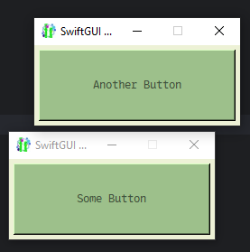
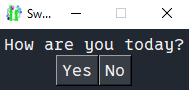
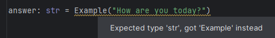
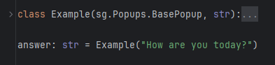

Since SwiftGUI version 0.9.0, it is possible to create and use multiple windows at once.

# Very basic popups and such
(There is another way to create popups which is explained later.)

To not "take a sledgehammer to crack a nut", I'll explain the easiest way to handle additional windows first.

By "easiest", I mean windows for a maximum of a single keyed event.
Sounds useless, but it's perfect for something like a small popup.

Create another window using `sg.SubWindow` instead of `sg.Window`:
```py
import SwiftGUI as sg

sg.Themes.FourColors.Froggy()

main_layout = [
    [
        sg.Button(
            "Some Button",
            width= 30,
            height= 5,
        )
    ]
]

another_layout = [
    [
        sg.Button(
            "Another Button",
            width= 30,
            height= 5,
        )
    ]
]

w = sg.Window(main_layout)
sw = sg.SubWindow(another_layout)

for e,v in w:
    print(e,v)
```


SubWindows have almost all of the same options normal windows have.\
You can set an icon, title, background_color, etc.\
`.update` works the same as with `sg.Window`.

## Single events
Subwindows can't have their own "true" event-loop.
But there is something very simmilar, which I will explain later.

Using key-functions is the best way to handle events.

For smaller popups, I recommend using `loop_close`.
It will wait for a single keyed event, then close the sub-window, returning the event-key and the last state of values:
```py
another_layout = [
    [
        sg.Input(key= "Input"),
        sg.Button("Button 1", key="B1"),
        sg.Button("Button 2", key="B2"),
        sg.Button("Button 3", key="B3"),
    ]
]

w = sg.Window(main_layout)
sw = sg.SubWindow(another_layout)

e,v = sw.loop_close()
print("Button clicked:", e)
print("Input:", v["Input"])
```
`sw.loop_close()` waits for a keyed event.
In this example, the only possible keyed events are button presses.
The `sg.Input` has a key, but no events enabled by default, so it won't cause a keyed event.

Key-function-events don't count, so you may use these for functionality inside the subwindow.

## "Blocking" windows
Executing the above code, you'll notice that it is not possible to click on the button in the main window, while the subwindow is open.
That's because `sg.loop_close()` "blocks" all the other windows.

Blocked windows won't allow (almost) any events, until unblocked.
Disable this behavior by setting `block_others = False`:
```py
e,v = sw.loop_close(block_others= False)
```
Just remember that the event-loop won't run if the code stops at loop_close, before reaching the event-loop.

There are other methods to block other windows:
- `sg.block_others` to block all other windows, `sg.unblock_others` to unblock them again. The methods won't stop the code from executing.
- `sw.block_others_until_closed()` will block other windows, until the calling window is closed. It won't close until it is actually closed by the user or by calling `sw.close()`.

# Popups with a decent event-loop
My lazyness is utilitarian: If the required effort for everyone gets lowered, it's fine for me to put in a little more myself.

That's why SwiftGUI offers a neat way to create functional popups that are very easy to use.

First, create a popup-class using this template:
```py
import SwiftGUI as sg

sg.Themes.FourColors.DarkTeal() # Theme can't be missing

class Example(sg.BasePopup):

    def __init__(self):
        layout = [
            
        ]

        super().__init__(layout)

    def _event_loop(self, e: Hashable, v: sg.ValueDict):
        ...
```
As you might have guessed, `self._event_loop` is the event-loop-function (method).
Just use it like your normal for-loop.

The window-object is saved in `self.w`.

Just build your layout as usually and you are good to go.
The key-system is completely seperate from the main one, so use keys as much as you like.

When you're done, use the popup by "calling" the class:
```py
class Example(sg.BasePopup):

    def __init__(self, question: str, fontsize: int = 12):
        layout = [
            [
                sg.T(question, fontsize=fontsize),
            ],[
                sg.Button("Yes", key="Yes", fontsize=fontsize),
                sg.Button("No", key="No", fontsize=fontsize)
            ]
        ]

        super().__init__(layout)

    def _event_loop(self, e: Hashable, v: sg.ValueDict):
        print(e,v)

Example("How are you today?")
```


When clicking the buttons, `print(e,v)` is executed.

## Return-value
But how do we return an actual value?

Since `return` can't be used as a method-name, the return-method is called `done`:
```py
    def _event_loop(self, e: Hashable, v: sg.ValueDict):
        self.done(e)    # (Just return the event)
```
`self.done(val)` works exactly like `return`, but for the whole popup.

The popup will close and the return-value is returned:
```py
class Example(sg.BasePopup):

    def __init__(self, question: str, fontsize: int = 12):
        layout = [
            [
                sg.T(question, fontsize=fontsize),
            ],[
                sg.Button("Yes", key="Yes", fontsize=fontsize),
                sg.Button("No", key="No", fontsize=fontsize)
            ]
        ]

        super().__init__(layout)

    def _event_loop(self, e: Hashable, v: sg.ValueDict):
        self.done(e)

print("Answer:", Example("How are you today?"))
```
This looks very strange, especially to intermediate Python-programmers.

But yes, `Example(...)` actually returns a string, not an `Example`-object.\
SwiftGUI-magic!

## Typehints
There is one minor, yet annoying downside to this.

Many IDEs, like PyCharm won't recognize that `Example(...)` might return something different, possibly resulting in warnings:\


To counter this, I'm afraid, you'll sadly have to do an atrocity:\


You'll have to inherit from the return-type too.

I found no other way to do this.
Happy about any idea on this.

## Default return
If the user closes the window by himself, `None` is returned.

That can be nasty, if you depend your code on the normal return-type.
If you expect e.g. `list`, `None` could crash your code.

To return something else instead of `None`, pass `default` to `super().init(...)`:
```py
    super().__init__(layout, default= "")
```
Just remember, that `default` will be returned, even if you intentionally try to "return" `None`.

## Some considerations
Popups created this way are still `sg.SubWindow`s.
As with other subwindows, when creating one before creating `sg.Window`, the popup will turn into the main window.

Also, popups created this way will be blocking, meaning they suspend the user-events of all other windows, while open.
Otherwise, that whole return-functionality wouldn't work.

# Full, additional windows
In SwiftGUI, sub-windows can do anything normal windows can (except an event-loop that uses `for`).

## Somewhat-event-loop
You can still have a fully functional event-loop for sub-windows, if you don't loop, but use a function:
```py
import SwiftGUI as sg

sg.Themes.FourColors.Froggy()

main_layout = [
    [
        sg.Button(
            "Some Button",
            width= 30,
            height= 5,
            key= "Main Button",
        )
    ]
]

another_layout = [
    [
        sg.Input(key= "Input"),
        sg.Button("Button 1", key="B1"),
        sg.Button("Button 2", key="B2"),
        sg.Button("Button 3", key="B3"),
    ]
]

def sw_loop(e,v):
    # Some example-loop
    print("Button-press:", e)
    print("Input-value:", v["Input"])
    sw["Input"].value = e

w = sg.Window(main_layout)
sw = sg.SubWindow(another_layout, event_loop_function=sw_loop)

for e,v in w:
    print(e,v)
```
It was already mentioned at the end of the previous tutorial.

## Window-order
You can't have multiple `sg.Window`s at once.
If you try, an error will occur.

However, for a sub-window to exist, it needs an active (non-closed) `sg.Window`.
If the window is closed, all the sub-windows will close too.

Pro-tipp: `sg.main_window()` always returns the currently active window.

Sometimes, you can't be sure if a sub-window is really opened after the main window is created.\
E.g.: If you create a function that opens a popup. 
What if the user wants to open the popup without a window?

For that reason, `sg.SubWindow` **will create an actual window if none is present**.

So, if you are unsure, create a sub-window.

### Important!
This can cause funny problems.

Remember, if the window is closed, all the sub-windows close too.

So, if you open multiple popups at once without a pre-made main window, closing the first popup closes all the others too.

If you are unsure, if all popups and stuff is closed when creating the actual main window, call `sg.close_all_windows()`.


