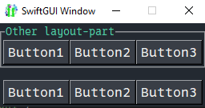
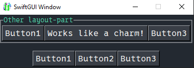

# Separate event-loops (Sub-layouts)
GUIs with many elements don't only get crowded visually, but also in their code.
The prior tutorial talked about "visible tidyness", this one is about "code tidyness".

Especially when using a lot of keys, new/unused keys are harder and harder to find.
Your keys will get longer and longer, which kinda defies the purpose of using an event-loop all together.

That's why SwiftGUI offers ways to divide the main layout into sub-layouts (different to frames), which each have their own key-system and event-loop.

This way, you can use the same key multiple times in an application and effectively un-clutter your event-loop.

Pro-tipp: If you want to copy/reuse parts of the layout, the best way to do so is to create a custom combined element.\
This topic has its own tutorial under the advanced topics: [Custom combined elements](https://github.com/CheesecakeTV/SwiftGUI-Docs/blob/main/03%20Advanced%20tutorials/Custom%20combined%20elements.md)

Other event-loops are not actually a loop, but a function:
```py
def other_loop(e, v):
    ...
```
To assign the loop to some part of your layout, put that part in some type of frame and surround it by an `sg.SubLayout`:
```py
import SwiftGUI as sg

sg.Themes.FourColors.Emerald()

def other_loop(e, v):
    print("Other loop:", e, v)

other_layoutpart = sg.LabelFrame([  # Segregated layout
    [
        sg.Button("Button1", key="Button1"),
        sg.Button("Button2", key="Button2"),
        sg.Button("Button3", key="Button3"),
    ]
], text= "Other layout-part")

layout = [
    [
        sg.SubLayout(
            other_layoutpart,   # Put layout in sub-layout-element
            event_loop_function= other_loop,    # Specify the event-"loop"
        )
    ],[
        sg.Spacer(height= 15)
    ],[
        sg.Button("Button1", key="Button1"),    # Same keys as the buttons above
        sg.Button("Button2", key="Button2"),
        sg.Button("Button3", key="Button3"),
    ]
]

w = sg.Window(layout)

for e,v in w:
    print("Loop:", e, v)
```


When pressing buttons in the sub-layout, `other_layout` will be called.
Pressing other buttons executes the main loop (`for e,v in w`), like you're already used to.

## Accessing elements and values inside sub-layouts
Remember, `w[key]` returns the element with that key.
However, the window doesn't "know" elements from inside the sub-layout.

So access these elements through the sub-layout:
```py
        my_sublayout := sg.SubLayout(
            other_layoutpart,
            event_loop_function= other_loop,
        )

...

w = sg.Window(layout)
my_sublayout["Button2"].value = "Works like a charm!"   # Access the element "Button2" inside the sub-layout
```


Access the value-dict of the sub-layout by calling `my_sublayout.value`.

If you don't want to use an additional variable for the sub-layout, just set a key for it like with any other element:
```py
        sg.SubLayout(
            other_layoutpart,
            event_loop_function= other_loop,
            key= "Sublayout"    # The sub-layout itself has a key now
        )

...

w = sg.Window(layout)
w["Sublayout"]["Button2"].value = "Works like a charm!"
```
This way, the main value-dict also contains the value-dict of the sub-layout.

In this example, `v` of the main loop looks like this:\
`{'Button1': 'Button1', 'Sublayout': {'Button1': 'Button1', 'Button3': 'Button3', 'Button2': 'Works like a charm!'}, 'Button3': 'Button3', 'Button2': 'Button2'}`.

Notice that the sub-layout provided its own value-dict as its "value".

## Chaining sub-layouts
As you might have guessed, you can place sub-layouts inside other sub-layouts.

This way, you could utilize a tree-like key structure:
```py
w["sublayout"]["additional_sublayout"]["subsubsublayout"]["Button1"].value = "Why would anyone do that?"
```
Not saying you should, but you could.

## Using a function as the main event-loop
If you like these "event-loop-functions" better than the normal event-loop, you may pass a function to the main window too:
```py
def other_loop(e, v):
    # Main event-loop
    ...

w = sg.Window(layout, event_loop_function= other_loop)

for e,v in w:
    # This does nothing now
    pass
```
Now, the main-loop is disabled and only `other_loop` will be used.

The main-loop still blocks, but won't react to events.
When the window is closed, the loop terminates like usual.

Instead of a loop you could also call `.loop()`, which blocks like the loop:
```py
def other_loop(e, v):
    # Main event-loop
    ...

w = sg.Window(layout, event_loop_function= other_loop)

w.loop()
```

