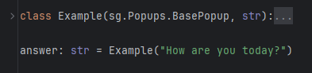

# Very basic popups and such
(There are other ways to create popups which are explained later.)

To not "take a sledgehammer to crack a nut", I'll explain the easiest (to understand) way to handle additional windows first.

It works for windows that allow a maximum of one single key-event.
Sounds useless, but it's perfect for something like a small popup.

Create another window using `sg.SubWindow` instead of `sg.Window`:
```py
import SwiftGUI as sg

sg.Themes.FourColors.Froggy()

main_layout = [
    [
        sg.Button(
            "Some Button",
            width= 30,
            height= 5,
        )
    ]
]

another_layout = [
    [
        sg.Button(
            "Another Button",
            width= 30,
            height= 5,
        )
    ]
]

w = sg.Window(main_layout)  # Main window
sw = sg.SubWindow(another_layout)   # Second window

for e,v in w:
    print(e,v)
```


SubWindows have almost all of the same options normal windows have.\
You can set an icon, title, background_color, etc.\
`.update` works the same as with `sg.Window`.

## Single events
Sub-windows act like sub-layouts, as discussed in basic tutorial 07 (Separate key-systems).

Key-functions work as usual.

For smaller popups, I recommend using `loop_close`, because this doesn't require too much effort.
`loop_close` waits for a single keyed event, then closes the sub-window, returning the event-key and the most recent state of values:
```py
another_layout = [
    [
        sg.Input(key= "Input"),
        sg.Button("Button 1", key="B1"),
        sg.Button("Button 2", key="B2"),
        sg.Button("Button 3", key="B3"),
    ]
]

w = sg.Window(main_layout)
sw = sg.SubWindow(another_layout)

e, v = sw.loop_close()  # Blocks until the first event occurs in the sub-window
print("Button clicked:", e)
print("Input:", v["Input"])
```
`sw.loop_close()` waits for any keyed event.
In this example, the only possible keyed events are button presses.
The `sg.Input` has a key, but no events enabled by default, so it won't cause a keyed event.

Again, key-functions don't count, so you may use these for functionality inside the subwindow.

As soon as a button is pressed (throws a key-event), the sub-window closes and `sw.loop_close()` returns the event and the value-dict.

## "Blocking" windows
Executing above code, you might have noticed that it is not possible to click on the button in the main window, while the subwindow is open.\
That's because `sg.loop_close()` "blocks" all the other windows by default.

Blocked windows won't allow (almost) any events, until unblocked.\
Disable this behavior by setting `block_others = False`:
```py
e,v = sw.loop_close(block_others= False)
```
Just remember that the event-loop won't execute if the code stops at loop_close before actually reaching the event-loop.

There are other methods to block other windows:
- `sg.block_others` to block all other windows, `sg.unblock_others` to unblock them. These methods won't stop the code from executing though.
- `sw.block_others_until_closed()` will block other windows, until the calling window is closed. It blocks until the (sub-)window is actually closed by the user or by calling `sw.close()`. Also blocks code-execution (except function-event-"loops").

# Popups with a decent event-loop
SwiftGUI offers a neat/easy way to create popups with extended functionality.

This way, the popup has an event-loop __and can return things__.

First, create a popup-class using this template:
```py
import SwiftGUI as sg

sg.Themes.FourColors.DarkTeal() # Theme can't be missing

class Example(sg.BasePopup):

    def __init__(self):
        layout = [
            
        ]

        super().__init__(layout)

    def _event_loop(self, e: Hashable, v: sg.ValueDict):
        ...
```
As you might have guessed, `self._event_loop` is the event-loop-function (method).
Just use it like your normal for-loop.

The window-object is accessible through `self.w`.

Just build your layout like you normally would and you are good to go.
The key-system is completely seperate from the main one, so use keys however you like.

When you're done, use the popup by "calling" the class:
```py
class Example(sg.BasePopup):

    def __init__(self, question: str, fontsize: int = 12):
        layout = [
            [
                sg.T(question, fontsize=fontsize),
            ],[
                sg.Button("Yes", key="Yes", fontsize=fontsize),
                sg.Button("No", key="No", fontsize=fontsize)
            ]
        ]

        super().__init__(layout)

    def _event_loop(self, e: Hashable, v: sg.ValueDict):
        print(e,v)

Example("How are you today?")   # Use/open the popup
```


When clicking the buttons, `print(e,v)` is executed.
The popup is not closed.

## Return-value
But how do we return anything?

Since `return` can't be used as a method-name, the return-method is called `done`:
```py
    def _event_loop(self, e: Hashable, v: sg.ValueDict):
        self.done(e)    # "Return" the event-key
```
`self.done(val)` works like `return`, but for the whole popup.

The popup will close and the "return"-value is "returned":
```py
class Example(sg.BasePopup):

    def __init__(self, question: str, fontsize: int = 12):
        layout = [
            [
                sg.T(question, fontsize=fontsize),
            ],[
                sg.Button("Yes", key="Yes", fontsize=fontsize),
                sg.Button("No", key="No", fontsize=fontsize)
            ]
        ]

        super().__init__(layout)

    def _event_loop(self, e: Hashable, v: sg.ValueDict):
        self.done(e)    # "return" which button was clicked

print("Answer:", Example("How are you today?"))
```
This looks very strange, especially to intermediate Python-programmers.

How can the creating of an `Example`-object return a value?

But yes, `Example(...)` actually returns a string, not an `Example`-object.\
SwiftGUI-magic!

## Typehints
There is one minor, yet annoying downside to this.

Many IDEs, like PyCharm won't recognize that `Example(...)` might return anything but an `Example`-object, possibly resulting in warnings:\


To counter this, I'm afraid, you'll have to commit an atrocity:\


You'll have to inherit from the return-type too.

Make sure that `sg.BasePopup` (yes, it's wrong in the image) is on the left, so `super().__init__()...` works as expected.

I found no other way to do this.\
Happy about any ideas.

## Default return
By default, if the user closes the window, `None` is returned.

That can be nasty, especially if your code depends on the usual return-type.
If you expect e.g. `list`, `None` could crash your code.

To return something else instead of `None`, pass `default` to `super().__init__(...)`:
```py
    super().__init__(layout, default= "")
```
Just remember, that `default` will be returned, even if you intentionally try to "return" `None`.

## Some considerations
Popups created this way are still `sg.SubWindow`s.
As with other subwindows, when creating one before creating `sg.Window`, the popup will turn into the main window.

Also, popups created this way will be blocking, meaning they'll suspend the user-events of all other windows, while open.
Otherwise, that whole return-functionality wouldn't work.

Oh, and by the way, `super().__init__(...)` passes all defined arguments to the underlying sub-window.
This way, you could remove the titlebar, set an icon, etc.

# Full, additional windows
In SwiftGUI, sub-windows can do anything normal windows can (except an event-loop that uses `for`).

## Somewhat-event-loop
You can still have a fully functional event-loop for sub-windows, if you don't loop, but use a function instead:
```py
import SwiftGUI as sg

sg.Themes.FourColors.Froggy()

main_layout = [
    [
        sg.Button(
            "Some Button",
            width= 30,
            height= 5,
            key= "Main Button",
        )
    ]
]

another_layout = [
    [
        sg.Input(key= "Input"),
        sg.Button("Button 1", key="B1"),
        sg.Button("Button 2", key="B2"),
        sg.Button("Button 3", key="B3"),
    ]
]

def sw_loop(e,v):   # "loop" only for the sub-window
    # Some example-loop
    print("Button-press:", e)
    print("Input-value:", v["Input"])
    sw["Input"].value = e

w = sg.Window(main_layout)
sw = sg.SubWindow(another_layout, event_loop_function=sw_loop)

for e,v in w:   # main loop
    print(e,v)
```
It was already mentioned at the end of the previous tutorial.

## Window-order
You can't have multiple `sg.Window`s at once.
If you try, an error will occur.

However, for a sub-window to exist, it needs an active (non-closed) `sg.Window`.
If the window is closed, all the sub-windows will close too.

Pro-tipp: `sg.main_window()` always returns the currently active window.

Sometimes, you can't be sure if a sub-window is really opened after the main window is created.\
E.g.: Popups.
What if the user wants to open a popup before creating a window?

For that reason, `sg.SubWindow` **will turn into an actual window if none is present**.

So, if you are unsure, create a sub-window.

### Very important!
This can cause funny problems.

Remember, if the window is closed, all sub-windows close too.

So, if you open multiple popups at once without a pre-made main window, closing the first popup, closes all the others too.

If you are unsure, if no window/subwindow is active when creating the actual main window, call `sg.close_all_windows()` before.


