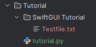

# The GUI isn't everything
There is more to a good program than its user-interface.

Most programs have program files to save data.
Especially inexperienced programmers like to just throw these files into the same folder the program was executed from.
This is even more annoying when the python-script was converted to an exe file.

Fortunately, SwiftGUI provides an easy solution which is explained in this tutorial.

# Root-folder
SwiftGUI offers an easy way of creating and maintaining a "root-directory".
That's the directory you'll throw in all of your intern program-files without annoying the user.

Use `sg.Files.set_root(name)` to define this directory:
```py
import SwiftGUI as sg

sg.Files.set_root("SwiftGUI Tutorial")
```
Strange, after running the script, no folder was created:\


That's because by default, the folder will be created inside the "home-folder".
Where exactly this is is dependant on your operating system.\
Under Windows, it's usually `C:\Users\<username>`.

To find out where the new folder was created, print `root_path`:
```py
import SwiftGUI as sg

sg.Files.set_root("SwiftGUI Tutorial")
print(sg.Files.root_path()) # C:\Users\chees\SwiftGUI Tutorial
```
You don't actually need to know where it is.
Just know that it is in a good location and works for pretty much all operating-systems.

## Working with the root-path
To create paths inside your root-directory, just pass the relative path to `.root_path(...)`:
```py
import SwiftGUI as sg

sg.Files.set_root("SwiftGUI Tutorial") # Usually it's the application name

print(sg.Files.root_path("Testfile.txt")) # C:\Users\chees\SwiftGUI Tutorial\Testfile.txt
print(sg.Files.root_path("assets/image.png")) # C:\Users\chees\SwiftGUI Tutorial\assets\image.png
print(sg.Files.root_path("assets/hello.world")) # C:\Users\chees\SwiftGUI Tutorial\assets\hello.world
```
You might notice, that I listed a subfolder called `assets`.
A cool thing about `root_path` is that it creates all missing subfolders automatically:
```bash
C:\Users\chees\SwiftGUI Tutorial>tree /f
C:.
└───assets
```
And of course, you can avoid this behavior by setting `create_subfolders = False` when calling `root_path`.

The function returns a `Path`-object from the builtin package `pathlib`.
If you don't know that package, you really should.
It's great.

Just know that you can use that object like a normal path-string:
```py
import SwiftGUI as sg

sg.Files.set_root("SwiftGUI Tutorial")

filepath = sg.Files.root_path("assets/More assets/Testfile.txt")

with open(filepath, "w") as f:  # This should be well known for you
    f.write("Hello World")
```

```bash
C:\Users\chees\SwiftGUI Tutorial>tree /f
C:.
└───assets
    └───More assets
            Testfile.txt
```

## Simplifying the imports
Small sidenote:
When working with files a lot, you'll use `root_path` a lot.

That's why, going forward, it's imported directly:
```py
import SwiftGUI as sg
from SwiftGUI.Files import root_path

sg.Files.set_root("SwiftGUI Tutorial")

with open(root_path("Testfile.txt"), "w") as f:
    f.write("Hello World")
```

## Root-folder outside the home-folder
For debug reasons, I like to save program-files in the current directory.
However, when the program is done, it should be saved in the actual root.

To do that, set `ignore_parent = True` in `set_root(...)`:
```py
import SwiftGUI as sg
from SwiftGUI.Files import root_path

sg.Files.set_root("SwiftGUI Tutorial", ignore_parent=True)

with open(root_path("Testfile.txt"), "w") as f:
    f.write("Hello World")
```
Now, `set_root` doesn't modify the passed path:\
\
(`root_path("Testfile.txt")` returns the path `SwiftGUI Tutorial/Testfile.txt`)

You can "automate" `ignore_parent` using different program-entry-points.
There will be an application-note on this topic.
Once it's done, I'll link it here.

