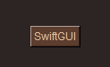
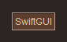
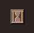
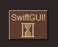
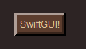
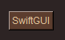
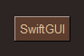

# sg.Button
A button that can be clicked:\


```py
import SwiftGUI as sg

sg.Themes.FourColors.Chocolate()

layout = [
    [
        sg.Button(
            "SwiftGUI"
        )
    ]
]

w = sg.Window(layout, padx= 50, pady= 50)

for e,v in w:
    print(e,v)
```

# Events on buttons
Unlike other elements, buttons have their default event enabled by default.
You can still disable it by setting `default_event = False`.

The default event triggers when the button is clicked (shocker).

# Value
The value of a button is its text.

# Options
## disabled, text_color_disabled
Set `disabled = True` to make the button unresponsive to the user.

While being disabled, the text color is `text_color_disabled`, not the normal `text_color`.

Manually bound events (`.bind_event`) still trigger.

## background_color_active, text_color_active
In this case, "active" means being held down by the user.

Through these options, you can make the button change color while held down.

## relief, overrelief
Reliefs are generally explained in the element-tutorial of `sg.Text`.

`relief` correspondents to the normal relief that is visible by default:\

```py
    sg.Button(
        "SwiftGUI",
        relief= "ridge",
    )
```

`overrelief` is the type of relif while the mouse **hovers over** the button, not when it's pressed.

Unfortunately, there is no decent way of changing the relief when the button is pressed.
Tkinter doesn't support it, which makes absolutely no sense at all.

## width, height
Width in characters, height in rows of the button(-text).

## padx, pady
`padx` defines the padding left/right of the text, `pady` above and below.
The border (relief) is enlarged too.

A more detailed explanation of padding is given in the element-tutorial `sg.Text`, I have no idea why buttons have two options for padding and text only has one.
Tkinter is a mystery.

## repeatdelay, repeatinterval
By default, when pressing and holding the button, only one event occurs.

Using these options, you can make the button "spam" events as long as the button is held down.

`repeatdelay` specifies how long the button must be held down for spamming to start.\
`repeatinterval` specifies how long to wait between events.\
Important: Both options are given in milliseconds, so seconds multiplied by 1000.

## bitmap, bitmap_position
Instead of text, buttons can display a bitmap by setting `bitmap = ...`:\


Available bitmaps can be found [here](https://anzeljg.github.io/rin2/book2/2405/docs/tkinter/bitmaps.html).

If you'd like to display the bitmap in addition to the text, set `bitmap_position` to the desired position of the bitmap:\

```py
    sg.Button(
        "SwiftGUI!",
        bitmap= "hourglass",
        bitmap_position= "bottom",
    ),
```

There is one minor hickup to keep in mind:
Whenever a bitmap is shown, `width` and `height` are given in pixels, not in characters/rows.

## borderwidth
The width of the relief-border:\
\
(`borderwidth = 5`)

## Options of sg.Text
Many of the options work exactly the same as with `sg.Text`, because get this, the button displays a text.

To be precise, these options are explained in the element-tutorial of `sg.Text`:
- `width`
- `cursor`
- `takefocus`
- `underline`
- `anchor`
- `justify`
- `background_color`
- `text_color`
- `fonttype`
- `fontsize`
- `font_bold`
- `font_italic`
- `font_underline`
- `font_overstrike`
- `expand`
- `expand_y`


# Methods
## .flash()
Flashes the button.

Flashing means, the button changes color with its active color and back a couple of times.

## .push_once()
Simulates a button-press, throwing the default event as if the user pressed the button.


# Button as a pure "value-display"
While pressing/holding down the button, it looks like you'd push it down.
If you like the look of buttons and only want to use it to display some text, this functionality might be annoying.

I can think of 2 ways to avoid it:

Disable the button by setting `disabled = True`:

```py
sg.Themes.FourColors.Chocolate()

layout = [
    [
        sg.Button(
            "SwiftGUI",
            disabled= True,
            text_color_disabled= "#E0C097",
        )
    ]
]
```
However, as you can see, you'll need to specify `text_color_disabled` (for most themes).

The alternative: Use a text and make it look like a button:\

```py
sg.Themes.FourColors.Chocolate()

layout = [
    [
        sg.Text(
            "SwiftGUI",
            relief= "raised",
            padding= 5,
            background_color= "#5C3D2E"
        )
    ]
]
```
But in this case, you'll need to specify `background_color` manually (for most themes)...

There is an application-note on how to display values planned.


