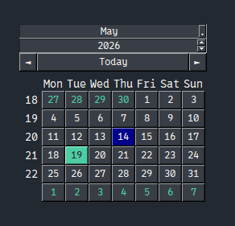

Written in SwiftGUI version 0.11.17.

# sg.Calendar
Lets the user choose a date from a comprehensive calendar.



The current date (dark blue in the image) and the selected day (light blue) are marked.

Using the elements above the "day-buttons", the user can navigate to different months in different years.
Clicking "today" jumps to the current month/year.
The two arrow-buttons on the side are used to jump to the next/previous month.

# Popup
Like every combined element, this element can be opened as a popup:
```py
print("Selected date:", sg.Calendar().popup())
```
When a day is selected, the popup closes and returns the selection.

# Value
The value of `sg.Calendar` is of type `datetime.date`: https://docs.python.org/3/library/datetime.html#date-objects

If no date is selected, the value is `None`.
Vice-versa, you can clear the selection by setting the value to `None`.

Since `datetime.date` is incompatible with json, `to_json` returns the selected date as a string.

# Accessing the visible month
The month is saved as an `int` from 1-12 representing each month.

There are a couple of methods to select the currently open month:
- `see_month(month: int, year: int)`: Select the month directly. Leave month/year empty to leave it be.
- `see_next_month()`: Same as clicking the "next-month-button"
- `see_prior_month()`: Same as clicking the "prior-month-button"
- `see_today()`: Same as clicking the "today-button"
- `see_selected_day()`: Jump to the month with the selected day. Does nothing if nothing is selected

There are also two attributes (properties, both of type `int`) that can be read or set:
- `visible_month`
- `visible_year`

# default event
The default event triggers when the user changes the selected day.

If the selected day-button is clicked again, nothing happens.

# Options

## default_month, default_year
The month/year visible in the beginning.

## disabled
`True` to ignore all day-selections.

Days can still be selected by changing the element-value, but the user can't.

## allow_month_selection
`False` to disable all elements the user could use to change the month.

This is useful if you only want to allow selection in a certain month.

## monthnames, daynames
You may pass a list (or any iterable) that replace the default (english) day- and monthnames.

Make sure to pass all names, not just some.

Day-names need to start at monday, no matter if your week starts at sunday or not.

## week_starts_on_sunday
`True`, if the week should start at sunday instead of monday.

## Colors
You may customize the following colors:
- `today_background_color`: Background-color of the day-button corresponding to the current day
- `background_color_active`: Background-color of the selected day-button
- `text_color_active`: Text-color of the selected day-button

# Global options
The global-options-class linked to `sg.Calendar` is called `sg.GlobalOptions.Calendar`.

It derives from `sg.GlobalOptions.Button`.


