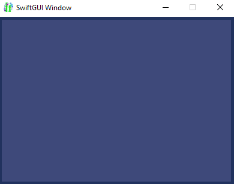

# sg.Canvas
The canvas is a very unique element added in SwiftGUI version 0.10.0.

You can place "canvas elements" onto it freely.
You can also bind events to these canvas-elements, so interactions are easily possible.

The canvas-space can be scrolled.
This way, you can have a big canvas showing only a part of it at once.

## Creating the canvas
Create the canvas like any other element:
```py
import SwiftGUI as sg
import SwiftGUI.Canvas_Elements as sgc

sg.Themes.FourColors.RoyalBlue()

layout = [
    [
        sg.Canvas(
            
        )
    ]
]

w = sg.Window(layout)

for e,v in w:
    print(e, v)
```


The height and width of the canvas can be defined using `height` and `width` options.

## Coordinates
The canvas has an underlying coordinate-grid.

By default, the upper left corner equals `(x, y) = (0, 0)`.\
Going to the right, `x` increases, going down, `y` increases.

# Canvas-elements
The chapter you are looking for now has its own element-tutorial called "Canvas-elements".

# Functionality
## Keys and events on sgc.Elements
You may bind events to `sgc.Elements` using `.bind_event` just like with any other sg-element:
```py
import SwiftGUI as sg
import SwiftGUI.Canvas_Elements as sgc

sg.Themes.FourColors.RoyalBlue()

canv = sg.Canvas(
    sgc.Text(
        (50, 50),
        "Click me!",
        key= "Text",
    ).bind_event(
        sg.Event.ClickLeft,
    ),
)

layout = [
    [
        canv
    ]
]

w = sg.Window(layout)

for e,v in w:
    print(e) # Text
```
As you can see, the key ("Text") is used as the event-key, as expected.

However, the key-system is a bit different for canvas-elements.

The keys are actually "registered" inside the canvas, not the window.
That means, `w["Text"]` and `v["Text"]` will raise a `KeyError`.

However, `canv["Text"]` returns the `sgc.Text`-Object.

This is strange, because keys usually register to where they are causing events.
Not in this case.

HOWEVER, sg-elements in an `sgc.Element`-element ignore the canvas and register as usual.

## Updating sgc-elements
Update an sgc-element like you'd update any sg-element:
```py
canv = sg.Canvas(
    sgc.Text(
        (50, 50),
        "Hello World",
        color = "red",
        key= "Text"
    )
)

...

canv["Text"].update(color= "blue")
```
The counterpart `.get_option` is also available.

## Moving sgc-elements
Set the position of an sgc-element by using `.move_to(x, y)` on it:
```py
canv = sg.Canvas(
    sgc.Text(
        (50, 50),
        "SwiftGUI!!!",
        key= "Text",
    )
)

...

canv["Text"].move_to(100, 100)
```
The coordinate-system of the canvas usually starts at `(0, 0)` in the upper left corner.
However, this can change depending on the options you provided.

If you want to move an element relative to its position, use `.move` instead:
```py
canv = sg.Canvas(
    sgc.Text(
        (50, 50),
        "SwiftGUI!!!",
        key= "Text",
        anchor="center"
    ),
)

layout = [
    [
        canv
    ],[
        sg.Button("Move!", key="Move")
    ]
]

w = sg.Window(layout)

for e,v in w:
    print(e) # Text
    canv["Text"].move(10, 10)   # Moves diagonally down with every event
```

There is also `.move_to_center` which centers the element at the new position.

## Modifying the shape of objects
sgc-elements like `sgc.Line`, `sgc.Polygon` and `sgc.Rectangle` all take a couple of coordinates to define the object's shape.

Update these coordinates by calling `.update_coords` on the element:
```py
canv = sg.Canvas(
    my_line := sgc.Line(
        (10, 10),
        (15, 20),
        (20, 10),
    )
)

...

my_line.update_coords(
    (10, 20),
    (15, 10),
    (20, 20),
)
```
Use `.get_coords` to find out the current coordinates.
They are always returned as a tuple of tuples, no matter the type of sgc-element.

# Coordinates on the canvas
The canvas has its own coordinate-system that is independent of the global coordinates.

E.g.: The canvas-"plane" can move without the canvas actually moving.
When it does, it drags all canvas-elements along.
This is why it's possible to add a scrollbar to the canvas.

## Mouse-position
`.get_mouse_position()` always returns the current mouse position relative to the canvas.

That's pretty useful for manipulating sgc-elements.

Example: Let's create an sgc-element that follows the mouse around:
```py
import SwiftGUI as sg
import SwiftGUI.Canvas_Elements as sgc

sg.Themes.FourColors.RoyalBlue()

layout = [
    [
        canv := sg.Canvas(
            oval := sgc.Oval(
                (0, 0),
                (10, 10),
            )
        ).bind_event(   # Cause an event when the mouse moves over the canvas
            sg.Event.MouseMove,
            key="Move",
        ),
    ],
]

w = sg.Window(layout, padx=50, pady=50)

for e,v in w:
    if e == "Move":
        oval.move_to_center(*canv.get_mouse_position()) # Move to mouse position
```


