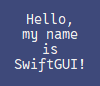

# sg.Canvas
The canvas is a very unique element added in SwiftGUI version 0.10.0.

You can place "canvas elements" onto it freely.
You can also bind events to these canvas-elements, so interactions are easily possible.

The canvas-space can be scrolled.
This way, you can have a big canvas showing only a part of it at once.

## Creating the canvas
Create the canvas like any other element:
```py
import SwiftGUI as sg
import SwiftGUI.Canvas_Elements as sgc

sg.Themes.FourColors.RoyalBlue()

layout = [
    [
        sg.Canvas(
            
        )
    ]
]

w = sg.Window(layout)

for e,v in w:
    print(e, v)
```


The height and width of the canvas can be defined using `height` and `width` options.

## Coordinates
The canvas has an underlying coordinate-grid.

By default, the upper left corner equals `(x, y) = (0, 0)`.\
Going to the right, `x` increases, going down, `y` increases.

# Canvas-elements
Instead of the normal import of SwiftGUI, it's intended to import the canvas-elements too:
```py
import SwiftGUI as sg
import SwiftGUI.Canvas_Elements as sgc
```
Add sgc-elements directly when creating the canvas, or later:
```py
import SwiftGUI as sg
import SwiftGUI.Canvas_Elements as sgc

sg.Themes.FourColors.RoyalBlue()

layout = [
    [
        canv := sg.Canvas(
            sgc.Line(   # Add an element directly
                (10, 10),
                (50, 30),
            )
        )
    ]
]

# Add one or more elements later
canv.add_canvas_element(
    sgc.Text(
        (50, 50),
        "Hello World",
    )
)

w = sg.Window(layout)

# Create an element, then add it to the canvas later
canv_element = sgc.Oval(
    (10, 50),
    (20, 60),
)

canv_element.attach_to_canvas(canv)

for e,v in w:
    print(e, v)
```


You can use all of those variants before and after creating the window.

## Element-states
Most sgc-elements have 3 different states: "normal", "hidden" and "disabled".

The normal mode is pretty self-explanitory.

In "disabled" state, the element does not respond to events.

In "hidden" state, the element is hidden and unresponsive.

## Normal - active- disabled
When the mouse is over a canvas-element, that element is considered "active".
Setting its state to "disabled", will prevent it from being "active".

Some options can have different values for when the element is active or disabled.
These options will automatically change accordingly.

E.g.: `sgc.Line` can take the options `width`, `width_active` and `width_disabled`.

Setting `width_active` differently than `width`, will make the line have a different width while the mouse is over it.

### Closeenough
Especially when dealing with smaller sgc-elements, it might be hard for the user to hover directly over an element.

`closeenough` defines how close the mouse has to be to an element for it to turn "active".
Default is 1.

It is defined for all sgc-elements inside the canvas:
```py
canv = sg.Canvas(
    closeenough= 5,
)
```

## Global options of canvas elements
Every canvas-element has its own global-options-class, just like any normal element.

All of these derive from `sg.GlobalOptions.Common_Canvas_Element`.
Every element that has some kind of line also derives from `sg.GlobalOptions.Common_Canvas_Line`.

The name of the class always starts with `Canvas_`, followed by the name of the sgc-class.\
E.g.: `sgc.Line` has the go-class `sg.GlobalOptions.Canvas_Line`.


## sgc.Line
An `sgc.Line` connects two or more points together:
```py
canv = sg.Canvas(
    sgc.Line(  # Add an element directly
        (10, 10),
        (50, 30),
        (50, 10),
        (70, 30)
    )
)
```


You can configure `width` and `color` to your liking:
```py
canv = sg.Canvas(
    sgc.Line(  # Add an element directly
        (10, 10),
        (50, 30),
        (50, 10),
        (70, 30),
        width= 5,
        color= "red",
    )
)
```


### Capstyle and joinstyle
The style of the line-endings can be changed setting `capstyle` to either "butt" (default), "projecting", or "round".

You may also change the style of the edges (joins) by setting `joinstyle` to "round" (default), "bevel", or "miter".

A great comparison between all those styles can be found here: https://anzeljg.github.io/rin2/book2/2405/docs/tkinter/cap-join-styles.html

### Spline
Turn the line into a spline by smoothing it:
```py
canv = sg.Canvas(
    sgc.Line(  # Add an element directly
        (10, 10),
        (50, 30),
        (50, 10),
        (70, 30),
        width= 3,
        smooth= True,
    )
)
```


If this doesn't look good, try increasing `splinesteps` (default is 12).

### Arrow
Turn the line into an arrow by setting `arrow` to either `first`, `last`, or `both`:
```py
canv = sg.Canvas(
    sgc.Line(  # Add an element directly
        (10, 10),
        (50, 30),
        (50, 10),
        (70, 30),
        arrow= "last",
    )
)
```


If you set it to `both`, both ends of the line have an arrowhead:\


Change the shape of the arrowhead itself by adjusting `arrowshape`:
```py
canv = sg.Canvas(
    sgc.Line(  # Add an element directly
        (20, 20),
        (50, 20),
        arrow= "last",
        arrowshape=(-5, -10, 5),
    )
)
```


The exact meaning of the 3 values is explained excellently here: https://anzeljg.github.io/rin2/book2/2405/docs/tkinter/create_line.html

### Dash
There are a couple of pre-made dash-patterns to choose from:
```py
[".", "-", "-.", "-..", ","]
```


Example for dottet line:
```py
canv = sg.Canvas(
    sgc.Line(  # Add an element directly
        (20, 20),
        (150, 20),
        width= 4,
        dash= ".",
    )
)
```


#### Custom dash-patterns
This feature does not seem to work properly on windows.

Instead of using pre-made dash-patterns, you may define your own one using a tuple:\
`(5, 2)` means 5 pixels of color followed by 2 pixels of transparency.\
`(5, 2, 1, 2)` means 5 px of color, followed by 2 px of transparency, followed by 1 px of color, followed by 2 px of transparency.

#### Dashoffset
This feature does not seem to work properly on windows.

Remember that dot-pattern from before?\


It's a bit annoying that it doesn't look symmetrical.

That's where `dashoffset` comes in.
If you define `dashoffset`, you can skip a number of pixels in the beginning of the pattern.

This will most likely not be necessary anytime soon, but now you know how to fix this issue.

### Stipple
You can use a bitmap to "stipple" the line.

Not all bitmaps are suitable for this, you should only use "gray12", "gray25", "gray50", or "gray75":
```py
canv = sg.Canvas(
    sgc.Line(  # Add an element directly
        (20, 20),
        (150, 20),
        width= 6,
        stipple= "gray25",
    )
)
```


#### Stippleoffset
You may offset the stipple-pattern:
```py
canv = sg.Canvas(
    sgc.Line(  # Add an element directly
        (20, 20),
        (150, 20),
        width= 6,
        stipple= "gray25",
        stippleoffset= "n"
    )
)
```


Notice how the corners are different than before.

This feature can come in handy when you two stippled patterns are right next to each other.
A wront stippleoffset might cause visual errors.

It is explained very well here: https://anzeljg.github.io/rin2/book2/2405/docs/tkinter/stipple-offset.html

## sgc.Rectangle
The rectangle is formed using two points:
```py
canv = sg.Canvas(
    sgc.Rectangle(
        (10, 10),
        (50, 30),
    )
)
```
In this case, the upper left is at x=10, y=10.
The lower right is at x=50, y=30:\


The `sgc.Rectangle` can take most of the options `sgc.Line` can and their respective active/disabled additions:
- color
- width
- dash, dashoffset
- stipple, stippleoffset
- state

These won't be explained again.

### Infill
By default, the inside of the rectangle is transparent.

Fill it with a color setting `infill_color`:
```py
canv = sg.Canvas(
    sgc.Rectangle(
        (10, 10),
        (50, 30),
        infill_color= "green",
    )
)
```


You may also set a stipple for the infill:
```py
canv = sg.Canvas(
    sgc.Rectangle(
        (10, 10),
        (50, 30),
        infill_color= "red",
        infill_stipple= "gray12"
    )
)
```


## sgc.Oval
An oval is defined by defining its "boundary".
The boundary being a rectangle that is just big enough to draw around the whole ellipse:
```py
canv = sg.Canvas(
    sgc.Rectangle(
        (10, 10),
        (50, 30),
        color= "red",
        width= 1
    ),
    sgc.Oval(
        (10, 10),
        (50, 30)
    )
)
```


As you can see, the ellipse barely touches the rectangle on all sides.

Please note that the actual boundary lies just outside every colored pixel of the object.
The "definition-boundary" ignores the width of the ellipse:
```py
canv = sg.Canvas(
    sgc.Rectangle(
        (10, 10),
        (50, 30),
        color= "red",
        width= 1
    ),
    sgc.Oval(
        (10, 10),
        (50, 30),
        width= 5,
    )
)
```


`sgc.Oval` can take the exact same options `sgc.Rectangle` does, so they won't be explained again here.

## sgc.Arc
Make sure you read about `sgc.Oval` first!

The arc is like an `sgc.Oval`, but only shows a certain part of the ellipse:
```py
canv = sg.Canvas(
    sgc.Rectangle(
        (10, 10),
        (50, 30),
        color= "red",
        width= 1
    ),
    sgc.Arc(
        (10, 10),
        (50, 30),
    )
)
```


`sgc.Arc` has all options `sgc.Rectangle` has, so these won't be explained again.

### Angle
To define what part is "cut out", define the `start_angle` and `extend` option:
```py
canv = sg.Canvas(
    sgc.Arc(
        (10, 10),
        (50, 50),
        start_angle= 0,
        extent_angle= 135,
    )
)
```


This arc begins at 0° (directly to the right) and extends for 135° (counterclockwise).

This one begins at 45° (also counterclockwise) and extends for 135° too:\


### Arc-styles
Arcs come in 3 different flavors: `pieslice` (default), `arc` and `chord`.

Choose the style by setting the `style`-option:
```py
canv = sg.Canvas(
    sgc.Arc(
        (10, 10),
        (50, 50),
        extent_angle= 135,  # (start_angle is 0 by default)
        style= "chord",
    )
)
```

Pieslice:\


Arc:\


Chord:\


## sgc.Polygon
The `sgc.Polygon` can be used to draw polygons (amazing introduction, I know):
```py
canv = sg.Canvas(
    sgc.Polygon(
        (50, 50),
        (60, 50),
        (70, 60),
        (50, 90),
        (40, 60),
    )
)
```


Make sure to order the coordinates correctly.
Each point is connected to the previous and next point.
If the order is off, you might end up with something like this (only moved a single point):\


Still looks cool though...

Other than those coordinates, the polygon only takes options you already know from `sgc.Line` and/or `sgc.Rectangle`.

Too lazy to describe them again, so here's a list of available options:
```
width
width_active
width_disabled

infill_color
infill_color_active
infill_color_disabled

color
color_active
color_disabled

dash
dashoffset
dash_active
dash_disabled

stipple
stippleoffset
stipple_active
stipple_disabled

infill_stipple
infill_stippleoffset
infill_stipple_active
infill_stipple_disabled

smooth
splinesteps
joinstyle

state
```

## sgc.Text
Draw a text on the canvas by using `sgc.Text`:
```py
canv = sg.Canvas(
    sgc.Text(
        (50, 50),
        "SwiftGUI!!!"
    )
)
```


The `sgc.Text` features options you already know from `sg.Text`, namely:
- fonttype
- fontsize
- font_bold
- font_italic
- font_underline
- font_overstrike
- anchor
- justify

### Text-Anchor
Consider this example:
```py
canv = sg.Canvas(
    sgc.Text(
        (50, 50),
        "SwiftGUI!!!"
    ),
    sgc.Oval(
        (49,49),
        (51,51),
        color= "red"
    )
)
```
We draw a text and an dot at the same position.

Where do you think the dot will be?\


Apparently, on the left side of the text.
That means, the text is "anchored" on the middle of the left edge.

To change the anchoring-position, pass `anchor` as an option:
```py
canv = sg.Canvas(
    sgc.Text(
        (50, 50),
        "SwiftGUI!!!",
        anchor= "s",
    ),
    sgc.Oval(
        (49,49),
        (51,51),
        color= "red"
    )
)
```


Now the text is anchored in the middle of the bottom edge.

What does `s` stand for?
Well, "south", of course.

For `anchor`, you may pass a cardinal direction, or "center".

Directions like "nw" (north-west) are also possible:
```py
canv = sg.Canvas(
    sgc.Text(
        (50, 50),
        "SwiftGUI!!!",
        anchor= "nw",
    ),
    sgc.Oval(
        (49,49),
        (51,51),
        color= "red"
    )
)
```


This feature is available for `sg.Text` and a couple of other elements, but I think it's most important on the canvas.

### Changing the text
`sgc.Text` is the only sgc-element to have a value (for now).

Chance the text like you'd change the text of an `sg.Text`:
```py
canv = sg.Canvas(
    my_text := sgc.Text(
        (50, 50),
        "SwiftGUI!!!",
        anchor= "nw",
    ),
    default_event= True,
    key= "Canvas",
)

layout = [
    [
        canv
    ]
]

w = sg.Window(layout)

for e,v in w:
    my_text.value = "Changed!"  # Here the changing finally happens...
```
The text changes once a keyed event occurs, like clicking the canvas in that case.

### Confining the text (width)
Sometimes, the text really needs to fit within some element, like a rectangle.
However, if the text has long lines, the text might exceed that bound.

Using `width`, you may confine the text to a maximum width (in pixels):
```py
canv = sg.Canvas(
    sgc.Text(
        (50, 150),
        "SwiftGUI" * 5,
        width= 50,
    ),
)
```


SwiftGUI tries its best to not cut the line inbetween words:
```py
canv = sg.Canvas(
    sgc.Text(
        (50, 150),
        "SwiftGUI " * 5, # Notice I added a space after the word
        width= 150,
    ),
)
```


### Justify
Consider this example:
```py
canv = sg.Canvas(
    sgc.Text(
        (50, 150),
        "Hello, my name is SwiftGUI!",
        width= 75,
    ),
)
```


If this was something like a value-field, this would probably look asymmetrical.

Instead, `justify` the text to the center:
```py
canv = sg.Canvas(
    sgc.Text(
        (50, 150),
        "Hello, my name is SwiftGUI!",
        width= 75,
        justify= "center"
    ),
)
```


Much better.

You may also justify "left" (default), or "right".

## sgc.Bitmap
Remember that you can attach bitmaps to `sg.Button` instead of normal text?

Well, you can attach these bitmaps to the canvas too:
```py
canv = sg.Canvas(
    sgc.Bitmap(
        (50, 50),
        "hourglass",
    )
)
```


What I find pretty cool is that you may set `bitmap_active` and `bitmap_disabled`, for when the element is active/disabled.

You may also define `color`, `background_color`, `anchor` and `state`.

`anchor` is explained under `sgc.Text` and the other options seem to be pretty self-explanitory to me.
So let's leave it at that...

## sgc.Image
Add an image to the canvas using `sgc.Image`:
```py
canv = sg.Canvas(
    sgc.Image(
        (50, 50),
        "icon.jpg",
    )
)
```


If the fileformat features transparency, the transparent parts of the image will actually be transparent:
```py
canv = sg.Canvas(
    sgc.Line(
        (10, 10),
        (100, 100),
        width= 5,
    ),
    sgc.Image(
        (50, 50),
        "Star.png",
    )
)
```


Before continuing, you should read basic tutorial 05 (the one about images).

You don't have to pass the image as a filename, everything `sg.Image` accepts is also accepted by `sgc.Image`.

The options `image_width` and `image_height` are also available and work the same way as with `sg.Image`.

However, unlike `sg.Image`, `sgc.Image` accepts `image_active` and `image_disabled` too.\
Caution: These images will also be resized by `image_width` and `image_height`, there is no `image_width_active` or simmilar.

You may also set `anchor`, which works the same as with `sgc.Text`.

## sgc.Element
The name might be misleading...

This sgc-Element, called `sgc.Element`, let's you attach a single sg-Element to the canvas:
```py
canv = sg.Canvas(
    sgc.Element(
        (50, 50),
        sg.Button(
            "Press me!"
        )
    )
)
```


Place multiple elements at once by putting them in a frame first:
```py
my_frame = sg.Frame([
    [
        sg.Button("Press me!"),
    ], [
        sg.Text("I'm also here")
    ]
])

canv = sg.Canvas(
    sgc.Element(
        (70, 50),
        my_frame,
    )
)
```


As you can see, the canvas does not feature background-color-propagation (SwiftGUI version 0.10.2).
I thought long and hard about this, then decided it would be more annoying than helpful.
If you think about this differently, please let me know.

`sgc.Element` only takes `anchor` and `state` as options, which were already explained earlier.

Key-wise, these sg-elements ignore the canvas.
It works just like placing an element inside an `sg.Frame`, only that it's actually a canvas.
If you don't understand what I mean, your usage of SwiftGUI isn't advanced enough to worry about such things.

# Functionality
## Keys and events on sgc.Elements
You may bind events to `sgc.Elements` using `.bind_event` like with any other sg-element:
```py
import SwiftGUI as sg
import SwiftGUI.Canvas_Elements as sgc

sg.Themes.FourColors.RoyalBlue()

canv = sg.Canvas(
    sgc.Text(
        (50, 50),
        "Click me!",
        key= "Text",
    ).bind_event(
        sg.Event.ClickLeft,
    ),
)

layout = [
    [
        canv
    ]
]

w = sg.Window(layout)

for e,v in w:
    print(e) # Text
```
As you can see, the key ("Text") is used as the event-key, as expected.

However, the key-system is a bit different for canvas-elements.

The keys are actually "registered" inside the canvas, not the window.
That means, `w["Text"]` and `v["Text"]` will raise a `KeyError`.

However, `canv["Text"]` returns the `sgc.Text`-Object.

This is strange, because keys usually register to where they are causing events.
Not in this case.

HOWEVER, sg-elements in an `sgc.Element`-element ignore the canvas and register as usual.

## Updating sgc-elements
Update an sgc-element like you'd update any sg-element:
```py
canv = sg.Canvas(
    sgc.Text(
        (50, 50),
        "Hello World",
        color = "red",
        key= "Text"
    )
)

...

canv["Text"].update(color= "blue")
```
The counterpart `.get_option` also works like usual.

## Moving sgc-elements
Set the position of an sgc-element by using `.move_to(x, y)` on it:
```py
canv = sg.Canvas(
    sgc.Text(
        (50, 50),
        "SwiftGUI!!!",
        key= "Text",
    )
)

...

canv["Text"].move_to(100, 100)
```
It sounds stupid, but I have not found any explanation online on where the anchor-point of this operation will be.
From my tests, it seems like it's always in the upper left corner of the object's boundary.\
If you have any information on this, I'd be delighted.

If you want to move an element relative to its position, use `.move` instead:
```py
canv = sg.Canvas(
    sgc.Text(
        (50, 50),
        "SwiftGUI!!!",
        key= "Text",
        anchor="center"
    ),
)

layout = [
    [
        canv
    ],[
        sg.Button("Move!", key="Move")
    ]
]

w = sg.Window(layout)

for e,v in w:
    print(e) # Text
    canv["Text"].move(10, 10)   # Moves diagonally down with every event
```

## Modifying the shape of objects
sgc-elements like `sgc.Line`, `sgc.Polygon` and `sgc.Rectangle` all take a couple of coordinates to define the object's shape.

Update these coordinates by calling `.update_coords` on the element:
```py
canv = sg.Canvas(
    my_line := sgc.Line(
        (10, 10),
        (15, 20),
        (20, 10),
    )
)

...

my_line.update_coords(
    (10, 20),
    (15, 10),
    (20, 20),
)
```
Use `.get_coords` to find out the current coordinates.
They are always returned as a tuple of tuples, no matter the type of sgc-element.


