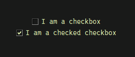
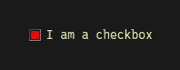
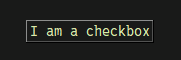
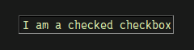
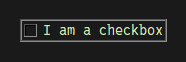

Written for SwiftGUI version 0.11.16, if not stated further.


# sg.Checkbox
Alias: `sg.Checkbutton`, `sg.Check`

A very common element that usually looks like this:\


It can be checked/unchecked by clicking on it.

# Default event
The default event occurs when the user clicks on the checkbox, changing its state.

# Value
The value is of type `bool`, being `True` if checked and `False` if unchecked.

Setting the value from the backend (code-side) turns the checkbox into the specified state.
This will not generate an event.

## default_value
By default, the checkbox is unchecked when created.

To make it checked from the beginning, use the option `default_value`:
```py
sg.Checkbox("I am a checkbox", default_value = True)
```

# Options
## text
The text shown next to the box.

This is usually passed anonymously to the element upon initialization:
```py
sg.Checkbox("I am a checkbox")
```

You may change this using `.update(text=...)`.

## Coloring
Most of the coloring-options of `sg.Checkbox` are the same as the ones available to `sg.Button`. 

One additional option is called `check_background_color` and is used to define the background-color of the little box:\


```py
sg.Checkbox(
    "I am a checkbox",
    check_background_color = "red",
)
```

## check_type
The checkbox can be made looking like a button by setting `check_type = "button"` (instead of `"check"`):\


When checked, the button looks like it was being held down:\


The difference is pretty subtile, so I recommend against using this type.

## relief, offrelief, overrelief
The relief of checkboxes is a bit strange (big thanks to Tkinter).

In `check_type = "check"` (the default), use `relief` to specify the relief of the whole element:\


```py
sg.Checkbox(
    "I am a checkbox",
    relief= "groove"
)
```

In `check_type = "button"` on the other hand, `relief` does nothing.

Here, `offrelief` defines the relief when unchecked.
**There is no native way to specify a relief for when the checkbox is checked**, sadly (big thanks to Tkinter again).

`overrelief` works as with `sg.Button`, specifying the relief while the mouse hovers over the checkbox.

## Options of other elements
Options related to `sg.Text`:
- cursor
- anchor
- justify
- fonttype
- fontsize
- font_bold
- font_italic
- font_underline
- font_overstrike
- apply_parent_background_color

Options related to `sg.Button`:
- disabled
- background_color
- background_color_active
- text_color
- text_color_disabled
- text_color_active
- borderwidth
- bitmap
- bitmap_position
- width
- height
- padx
- pady
- takefocus
- underline
- expand
- expand_y

# Methods
## toggle
Use `.toggle()` to well, toggle the checkbox.

It will uncheck the box if checked and vice-versa.

I am quite sure that this is thread-safe, but can't guarantee it.

## flash
Same as with `sg.Button`.

This method flashes the box (or button) a couple of times.
Should also be thread-safe, but again, no guarantee.

However, the flashing is very faint and hard to notice.
I only included it because Tkinter already offers the method, so free real estate.

