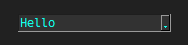
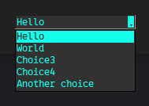
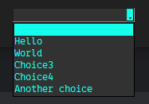
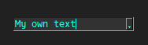

# sg.Combobox
The combobox provides a well-looking drop-down menu you can choose an item from.

Retracted:\


Extended:\


```py
import SwiftGUI as sg

sg.Themes.FourColors.NeonDiamond()

layout = [
    [
        my_combo := sg.Combobox(
            ["Hello", "World", "Choice3", "Choice4", "Another choice"],
        )
    ]
]

w = sg.Window(layout, padx=30, pady=30)

for e, v in w:
    print(e, v)
```

# Updating the list
The option under which the choices are added onto the element is called `choices`.

That means you can change the choices like this:
```py
my_combo.update(choices= ["New", "Choice"])
```
However, that does not update the previous selection.
You'll have to do that manually:
```py
my_combo.value = "New"
```

# Letting the user clear the input
If you want the user to be able to clear the input, just add an empty element to the choices:
```py
    sg.Combobox(
        ["", "Hello", "World", "Choice3", "Choice4", "Another choice"],
        can_change_text= True,
    )
```


# Options
## can_change_text
Setting that option to `True` allows the user to input their own text into the text-field.
```py
    sg.Combobox(
        ["Hello", "World", "Choice3", "Choice4", "Another choice"],
        can_change_text= True,
    )
```


## default_event
The default event of a combobox is any change to its text.

May it be selecting an element from the dropdown or changing the text when `can_change_text = True`.

## value and default_value
The value of a combobox is the text inside it.
You may change it to whatever you want, even when `can_change_text = False` and the text is not one of the options.

`default_value` lets you decide the initial value.

## Options from sg.Input
Since the combobox extends the functionality of `sg.Input`, these options from `sg.Input` are also available for `sg.Combobox`:
- `cursor`
- `insertbackground`
- `background_color`
- `background_color_disabled`
- `selectbackground_color`
- `text_color`
- `text_color_disabled`
- `select_text_color`
- `fonttype`
- `fontsize`
- `font_bold`
- `font_italic`
- `font_underline`
- `font_overstrike`
- `disabled`
- `exportselection`
- `height`
- `width`
- `justify`
- `takefocus`

These are explained in the element-tutorials of `sg.Input` and `sg.Text`.

## Button-configuration
Use the following options to modify the appearance of the dropdown-button:
- `button_background_color`
- `button_background_color_active`
- `arrow_color`
- `arrow_color_active`

