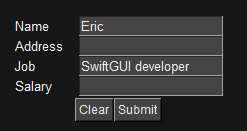
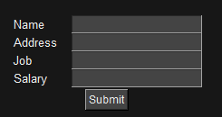
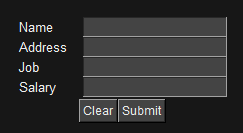
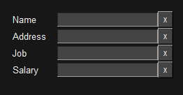
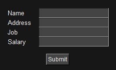
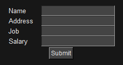
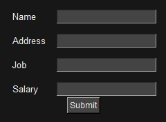
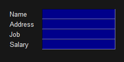

Written for SwiftGUI version 0.11.20 if not stated further.


# sg.Form
A combined element that combines multiple `sg.Input` and their descriptive texts into a single element:\


```py
sg.Form(
    ("Name", "Address", "Job", "Salary"),
    submit_button=True,
    big_clear_button=True,
)
```

# Basic functionality
The form can be specified in two different ways:
- "List-mode": Field-Texts are given as an iterable like `list` or `tuple`
- "Mapping-mode": Field-Texts are given as a mapping like `dict`

I recommend the mapping-mode, since it is easier to change later on.

In list-mode, you provide field texts using an iterable:
```py
sg.Form(
    ("Name", "Address", "Job", "Salary"),
)
```
This way, the form-element acts similar to a list.
Rows are identified by their position/index.

In mapping-mode, you provide a mapping:
```py
my_form := sg.Form(
    {"name":"Name", "add": "Address", "job":"Job", "sal":"Salary"},
)
```
This way, the form-element acts simmilar to a dictionary.
Rows are identified by their keys.

# Events
## Default event
The default event of `sg.Form` occurs when any input-text is modified.

This is usually not desired, so it is disabled by default.

## Return submits
Setting `return_submits=True`, pressing return (enter) in any input-field of the form causes the "default event", even if `default_event = False`.

## Submit-button
You may add a submit-button below the entries by setting `submit_button=True`.
When that button is clicked, the "default event" (default key/key-functions) is triggered, even if `default_event=False`.


# Clear-Buttons
## Big clear-button
Setting `big_clear_button=True`, a single button "clear" is added.
If the button "submit" also exists, they are next to each other:\


If the default event is enabled, this throws a default event.

## Small clear-buttons
Setting `small_clear_buttons=True`, each row gets its own clear-button:\


Pressing any of those buttons, clears that input.

I know this doesn't look too good, but I haven't had the sparking idea on how to implement it properly.
Open to suggestions.

If the default event is enabled and pressing the button changes the text in that input, a default event is caused.

# Value
## List-mode
In LIST-MODE, the value is a tuple containing all the inputs.

Overwrite all values by passing an iterable:
```py
my_form.values = ("Eric", "", "SwiftGUI developer", "")
```

Read/Overwrite single values like you'd do with lists:
```py
print(my_form[0])

my_form[2] = "SwiftGUI developer"
```

## Mapping-mode
In MAPPING-MODE, the value is the value-dict, which acts like a dictionary.

Overwrite certain values by passing a mapping (dictionary):
```py
my_form.value = {"name":"Eric", "job": "SwiftGUI developer"}
```

Read/Overwrite single values like you'd do with dictionaries:
```py
print(my_form["name"])

my_form["job"] = "SwiftGUI developer"
```

# Options
Options described above won't be described again.

## default_values
The values this form should have from the start.

The type must match `.value`, so an iterable for list-mode and a mapping for mapping-mode.

## clear_button_text
The text on the "big" clear-button.

Default is "clear".

## submit_button_text
The text on the submit-button.

Default is "submit".

## space_over_buttons
Pass an `int` to add additional space above the "button-row":\



## space_between_rows
Pass an `int` to add space between the input-rows:


# Methods
## as_tuple
Returns the element-value as if the element were in list-mode.

So just a tuple with all input-values.

## update_texts, update_inputs, update_small_clear_buttons
These functions pass their call to all elements of that group: Texts (descriptions), input-fields and the small clear buttons, if enabled.

This way, you are able to change options for these elements:\


```py
layout = [
    [
        sg.Form(
            {"name":"Name", "add": "Address", "job":"Job", "sal":"Salary"},
        ).update_inputs(
            background_color="darkblue",
        )
    ]
]
```

## clear_all_values
Does what it says.

If `default_event=True`, this will cause an event if you pass `throw_default_event=True` to `.clear_all_values`.

It won't cause an event otherwise.

## set_focus
Almost every element offers `.set_focus()`, but it is especially useful for forms.

When called on a form, the focus jumps to the first input-element of that form.


