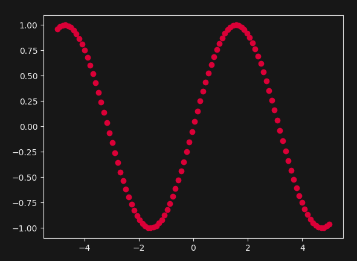

# sg.Matplot
This element is part of an addon called `SwiftGUI_Matplot`, which you need to install to use it:
```bash
pip install SwiftGUI_Matplot
```

`sg.Matplot` is an element that allows you to integrate `matplotlib`-figures into your SwiftGUI layout.

It also tries its best to fit into the currently applied theme:\
Theme: `FourColors.SinCity`\


Theme: `FourColors.LightCloud`\


Theme: `FourColors.DeepSea`\


# Figure and axes
Unfortunately, I do have a life, so not every type of plot is supported natively by `sg.Matplot`.

Fortunately, that's not too much of a big deal.
You can always access the figure directly to add whatever you like.

## Manually modifying figure/axes
The figure is saved in `.figure` and the axes in `.axes`.

Modify them to your liking:
```py
import SwiftGUI as sg
import numpy as np

sg.Themes.FourColors.SinCity()

layout = [
    [
        my_plot := sg.Matplot()
    ]
]

x = np.linspace(-5, 5, 100)
y = np.sin(x)

my_plot.figure.set_size_inches(3, 2)
my_plot.axes.plot(x, y)
my_plot.axes.plot(x, y**2)

w = sg.Window(layout, padx=30, pady=30)

for e,v in w:
    ...
```


## Refreshing
Once the window is created, changes to figure/axes will no longer show.

To refresh the view, call `.refresh()`:
```py
my_plot.figure.set_size_inches(3, 2)    # Don't change the size after window was created

w = sg.Window(layout, padx=30, pady=30) # <- Window created before the figure is filled

x = np.linspace(-5, 5, 100)
y = np.sin(x)

my_plot.axes.plot(x, y)
my_plot.axes.plot(x, y**2)

my_plot.refresh()   # Apply changes
```

## Manually creating figure/axes
Usually, `sg.Matplot` creates figure and axes for you.

If you don't like that, create figure and axes before creating the `sg.Matplot` and pass it:
```py
import SwiftGUI as sg
import numpy as np
from matplotlib.figure import Figure

sg.Themes.FourColors.SinCity()

figure = Figure((8,5))
ax = figure.add_subplot()

x = np.linspace(-5, 5, 100)
y = np.sin(x)

ax.plot(x, y)
ax.plot(x, y**2)

layout = [
    [
        my_plot := sg.Matplot(
            figure= figure,
            axes= ax,
        )
    ]
]

w = sg.Window(layout, padx=30, pady=30)

for e,v in w:
    ...
```


If you only pass a figure, the axes will be created by `sg.Matplot`.

# Supported matplotlib-methods
A couple of commonly used matplotlib-methods are supported directly by SwiftGUI.

The advantage of using these is simplicity.
"Drawing" methods like `.plot` will automatically apply the theme to the plot-color.

Also, `.refresh()` is called automatically.

For plotting, `.plot()`, `.scatter()` and `.bar()` are currently supported:
```py
my_plot.scatter(x, y)
```


As you can see, the dots automatically turned into the themed red.

`.grid()` is also supported, turning on the grid.
The grid-color is the same as the outer border/ticks:\


## Clearing the plot
To remove everything from the plot, call `.clear()`:
```py
import SwiftGUI as sg
import numpy as np

sg.Themes.FourColors.SinCity()

layout = [
    [
        my_plot := sg.Matplot()
    ]
]

my_plot.grid()

x = np.linspace(-5, 5, 100)
y = np.sin(x)

my_plot.scatter(x, y)
my_plot.clear() # <- All gone here!

w = sg.Window(layout, padx=30, pady=30)

for e,v in w:
    ...
```


This way, you may re-draw data onto the figure.

# Disabling themes for sg.Matplot
Themes are great most of the time, but can be annoying.

Disable themes for matplot-elements by setting `sg.Matplot.default` to "empty":
```py
import SwiftGUI as sg
import numpy as np

sg.Themes.FourColors.SinCity()
sg.Matplot.defaults = sg.GlobalOptions.EMPTY

layout = [
    [
        my_plot := sg.Matplot()
    ]
]

x = np.linspace(-5, 5, 100)
y = np.sin(x)

my_plot.plot(x, y)

w = sg.Window(layout, padx=30, pady=30)

for e,v in w:
    ...
```


The theme will still be applied for every other element.

# Options of sg.Matplot
A lot of configuration can be done directly when creating the element, or later using `.update(...)`.

- `legend`: True, if a legend should be displayed. Will be refreshed with `.refresh()`. "Name" lines by passing `label = ...` to plot/scatter/... .
- `dpi`: Resolution in dots-per-inch
- `background_color`: Background-color inside the plot
- `background_color_outside`: Background-color outside of the plot
- `width`: Width when creating the figure
- `height`: Height when creating the figure
- `borderwidth`: Width of the border (or highlight in tkinter language)
- `bordercolor`: Color of the border
- `title`:  Guess.
- `spine_color`: Color of the line around the plot
- `tick_color`: Color of the numbers around the plot
- `text_color`: Color of the title and x/y-labels

# Navigation-bar
Add a navbar by setting `navigation_bar = True`:
```py
import SwiftGUI as sg
import numpy as np

sg.Themes.FourColors.SinCity()

layout = [
    [
        my_plot := sg.Matplot(navigation_bar=True)
    ]
]

x = np.linspace(-20, 20, 100)
y = np.sin(x) / x

my_plot.plot(x, y)

w = sg.Window(layout, padx=30, pady=30)

for e,v in w:
    ...
```


You can use the navigation-bar to control the view like in the viewer of matplotlib.

Unfortunately, I haven't found a good way to recolor the navbar yet...
Maybe use a theme that isn't as dark as `SinCity`.

# Global options for sg.Matplot
`sg.Matplot` does have its own go-class, but accessing it is a bit different.

If you don't want to import the class directly from `SwiftGUI_Matplot.GlobalOptions`, use `sg.Matplot.defaults` instead:
```py
import SwiftGUI as sg
import numpy as np

sg.Themes.FourColors.SinCity()
sg.Matplot.defaults.background_color = "blue"
sg.Matplot.defaults.background_color_outside = "darkblue"

layout = [
    [
        my_plot := sg.Matplot(navigation_bar=True)
    ]
]

x = np.linspace(-20, 20, 100)
y = np.sin(x) / x

my_plot.plot(x, y)

w = sg.Window(layout, padx=30, pady=30)

for e,v in w:
    ...
```
\
Looks great.


