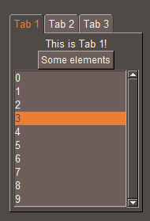
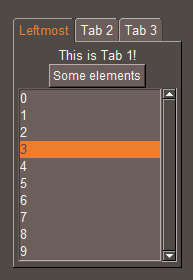
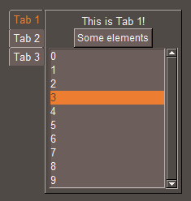
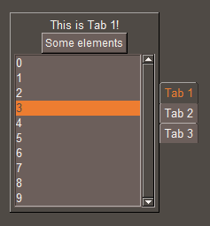

# sg.Notebook
The notebook (tabview in PySimpleGUI) lets you organize layouts in "tabs".

Only the selected tab is visible, so it's great for avoiding clutter in your layout.

A general introduction to both elements is given in basic tutorial 06 (bigger layouts).



This code acts as a starting point and will be modified through the tutorial:
```py
import SwiftGUI as sg

sg.Themes.FourColors.HotAsh()

tab1 = sg.Frame([
    [
        sg.T("This is Tab 1!")
    ],[
        sg.Button("Some elements")
    ],[
        sg.Listbox(range(10)).set_index(3)
    ]
], key= "Tab 1")

tab2 = sg.Frame([
    [
        sg.T("This is Tab 2!")
    ],[
        sg.Button("Some elements")
    ]
], key= "Tab 2")

tab3 = sg.Frame([
    [
        sg.T("This is Tab 3!")
    ],[
        sg.Button("Some elements")
    ]
], key= "Tab 3")

layout = [
    [
        my_nb := sg.Notebook(
            tab1, tab2, tab3,
        )
    ]
]

w = sg.Window(layout, padx=30, pady=30)

for e,v in w:
    ...

```

## sg.TabFrame
The tabframe-element makes working with notebooks much easier.

However, you should understand, that it only relies information to the surrounding notebook-element.
It does not provide any additional functionality to normal `sg.Frame`.

A complete explanation on how to use the `sg.TabFrame` is given later in this tutorial.

# Basic usage
In the above code, you can see the basic usage of notebooks.

Just take some frames, put them into the notebook and you are done.

The key of each frame acts as the title of that tab.

# Events
Enabling the default event, an `sg.Notebook` throws an event each time the user changes the tab:
```py
    my_nb := sg.Notebook(
        tab1, tab2, tab3,
        default_event= True,
        key_function= lambda: print("Tab changed!"),
    )
```

## Events for specific tabs
In many cases, you don't need to know if the tab has changed, but if it changed to a specific tab.

Thats why, `sg.Notebook` let's you bind events to single tabs.
When that tab is selected, that special event is called instead of the default one.

If `default_event = False`, the other tabs won't cause events.

Define a specific event like this:
```py
    my_nb := sg.Notebook(
        tab1, tab2, tab3,
    ).bind_event_to_tab(
        tab_key = "Tab 1",
        key_function = lambda: print("Tab 1 was opened"),
    )
```
`tab_key` references the key of that tab's included frame.
Instead, you may pass `tab_index`, which references the index of the tab (counted from left to right, starting at 0).

Other than that, `.bind_event_to_tab` works the same as `.bind_event`.

## Events from code-side tab-selection
Even with `default_event = True`, changing the tab via code (explained later) does not throw an event.

I sometimes like to "link" a notebook to another.
When one of the notebooks changes, the other one should too.

In cases like this, it can be helpful to throw an event on any tab-change, even if it is not done by the user.
To do so, enable `event_on_backend_selection`:
```py
    my_nb := sg.Notebook(
        tab1, tab2, tab3,
        default_event= True,
        key_function= lambda: print("Tab changed!"),
        event_on_backend_selection= True,
    )
```
You'll notice that the initialization of the notebook also counts as a tab-change and therefore causes an event.

# .value and .index
For `sg.Notebook`, the "value" contains the key of the currently selected frame.

Setting the value to a contained frame will cause the specified tab to open.

For your convenience, `sg.Notebook` also offers `.index` and `.set_index(...)`.
It does exactly the same as `.value` and `.set_value(...)`, but with the index of the tab instead of its key, 0 representing the leftmost tab.

# Customization
Like most elements, `sg.Notebook` provides a lot of options for customization.

## Tab-Text
The text displayed on the specific tab can be modified using the `tab_texts`-option.

This option takes a `dict`:
```py
    my_nb := sg.Notebook(
        tab1, tab2, tab3,
        tab_texts={
            "Tab 1": "Leftmost"
        }
    )
```


As you can see, the tab with the key "Tab 1" has a modified text now.

This is pretty nasty in my opinion, so I really recommend using a `sg.TabFrame` instead.

At the moment (version 0.10.4), this option can't be modified using `.update(...)` (yet).

## Tabposition
Usually, the tabs are docked on the upper edge to the left.
This is represented by the string "nw" ("north-west").

You should be familliar with a simmilar naming-convention used for the `anchor`-option in other elements.

However, in this case, the first character always specifies the edge, while the second one defines the direction.

E.g.: Setting this option to "wn", places the tabs on the left edge, oriented up:
```py
    my_nb := sg.Notebook(
        tab1, tab2, tab3,
        tabposition= "wn",
    )
```


If only one character is given, the tabs are centered on the corresponding edge.

E.g.: `tabposition= "e"`:\


This can actually be changed using `.update(...)`.

On some operating systems, the tabs are "opened into the notebook", which looks a lot better in my opinion.
But oh well, Windows 11. Great os. So glad.


## Colors
There are several options for coloring available, which should be self explanitory:
- `background_color`
- `background_color_tabs`
- `text_color_tabs`

When a tab is selected, it is considered active and may have its own set of colors:
- `background_color_tabs_active`
- `text_color_tabs_active`

## Font
`sg.Notebook` provides the same options for font-customization as `sg.Text`, but with `_tabs` added to the name for consistency:
- `fonttype_tabs`
- `fontsize_tabs`
- `font_bold_tabs`
- `font_italic_tabs`
- `font_underline_tabs`
- `font_overstrike_tabs`

If no global options are provided for these options, they may also get their default value from global options without `_tabs` on their name.
That way, the font-options of `sg.GlobalOptions.Common_Textual` still apply.

## Other options
There are a couple of other options, but these are already well known from other elements and therefore not covered in this tutorial.

You can always read the docstring of the element for a short explanation of these options.


