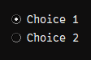
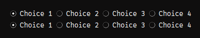
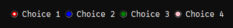

# sg.Radiobutton
Radiobuttons look simmilar to `sg.Checkbox`, but can only be unchecked by checking another radiobutton in that group.

It can be used like a checkbox for two or more options:\

```py
import SwiftGUI as sg

sg.Themes.FourColors.GarnetFlair()

layout = [
    [
        sg.Radiobutton(
            "Choice 1",
            group= "Groupname",
        )
    ],[
        sg.Radiobutton(
            "Choice 2",
            group= "Groupname",
        )
    ]
]

w = sg.Window(layout, padx=30, pady=30)

for e, v in w:
    print(e, v)
```
When `Choice 2` is checked, `Choice 1` unchecks.

# Radio-group
Radiobuttons need a "radio-group" so they know which buttons belong together.

The easiest way to specify the group is by passing the same hashable argument to `group`.
In the above example, the group is called `"Groupname"`.

Another example:
```py
layout = [
    [
        sg.Radiobutton("Choice 1", group="Group1"),
        sg.Radiobutton("Choice 2", group="Group1"),
        sg.Radiobutton("Choice 3", group="Group1"),
        sg.Radiobutton("Choice 4", group="Group1"),
    ],[
        sg.Radiobutton("Choice 1", group="Group2"),
        sg.Radiobutton("Choice 2", group="Group2"),
        sg.Radiobutton("Choice 3", group="Group2"),
        sg.Radiobutton("Choice 4", group="Group2"),
    ]
]
```


The group doesn't need to be defined by a string, any hashable works:
```py
layout = [
    [
        sg.Radiobutton("Choice 1", group=0),
        sg.Radiobutton("Choice 2", group=0),
        sg.Radiobutton("Choice 3", group=0),
        sg.Radiobutton("Choice 4", group=0),
    ],[
        sg.Radiobutton("Choice 1", group=1),
        sg.Radiobutton("Choice 2", group=1),
        sg.Radiobutton("Choice 3", group=1),
        sg.Radiobutton("Choice 4", group=1),
    ]
]
```

## Radio-groups are always global
This part is important if you ever copy parts of your layout that has radiobuttons!

Combined elements, sub-windows, sub-layouts, etc. can have separate key-systems.
However, radio-groups are always global.

This way, radio-groups can even span over different windows:
```py
import SwiftGUI as sg

sg.Themes.FourColors.GarnetFlair()

layout0 = [
    [
        sg.Radiobutton("Choice 1", group=0),
    ]
]

layout1 = [
    [
        sg.Radiobutton("Choice 2", group=0),
    ]
]

w = sg.Window(layout0, padx=30, pady=30)
sg.SubWindow(layout1, padx=30, pady=30)

for e, v in w:
    print(e, v)
```

## "Anonymous" radio-groups
I just told you that radio-groups are always global, which is a big inconvenience when creating and using layout-templates.
It defies the whole reason of local key-systems.

There are easy workarounds to this, but SwiftGUI provides a native solution.

Behind each radio-group is an instance of `sg.RadioGroup`.
You can create your own radio-group and pass this instead:
```py
import SwiftGUI as sg

sg.Themes.FourColors.GarnetFlair()

def get_row():
    my_group = sg.RadioGroup()  # Create an anonymous group
    row = [
        sg.Radiobutton("Choice 1", group=my_group),
        sg.Radiobutton("Choice 2", group=my_group),
        sg.Radiobutton("Choice 3", group=my_group),
        sg.Radiobutton("Choice 4", group=my_group),
    ]
    return row

layout = [
    get_row(),
    get_row(),
    get_row(),
    get_row(),
]

w = sg.Window(layout, padx=30, pady=30)

for e, v in w:
    print(e, v)
```


# Value
`.value` is of the type `bool` and returns weather the specific radio-button is checked or not.

To check a radio-button from the backend, call `.select()`.
Uncheck by calling `.deselect()`.

`.value = True` is equal to `.select()`, likewise `.value = False` equals `.deselect()`.

When a radio-button is selected, all other buttons from that group are automatically deselected.

You shouldn't deselect radio-buttons, but rather select a different one.

# Options
## default_value
Set this to `True` to select this radiobutton by default.

A different way of doing this is to call `.select()` on the element:
```py
    [
        sg.Radiobutton("Choice 1", group=0),
        sg.Radiobutton("Choice 2", group=0),
        sg.Radiobutton("Choice 3", group=0).select(),
        sg.Radiobutton("Choice 4", group=0),
    ]
```

## check_background_color
This is the only coloring-option that isn't explained in any other element-tutorial.

This option specifies the color of the "checkbox":\


## Options from other elements
The following options work exactly as the same option from other elements, so they won't be explained here.
Each option is listed only once, even if it relates to multiple elements.

Options related to `sg.Checkbutton`:
- check_type
- offrelief

Options related to `sg.Text`:
- cursor
- anchor
- justify
- fonttype
- fontsize
- font_bold
- font_italic
- font_underline
- font_overstrike
- apply_parent_background_color

Options related to `sg.Button`:
- disabled
- background_color
- background_color_active
- text_color
- text_color_disabled
- text_color_active
- borderwidth
- bitmap
- bitmap_position
- width
- height
- padx
- pady
- takefocus
- relief
- overrelief
- underline
- expand
- expand_y

# Flashing
Call `.flash()` to make the radiobutton flash a couple of times.

If the button is displayed in the classical way, only the "dot" flashes.

