Written for SwiftGUI version 0.11.17 if not stated further.

# sg.Scale
Alias: `Slider`

The `sg.Scale` lets the user input a value by moving a slider with the mouse.
It can be either vertical, or horizontal:\
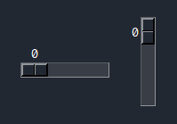

```py
layout = [
    [
        sg.Scale(),
        sg.Spacer(width=5),
        sg.Scale(orient="vertical"),
    ]
]
```

# Basic functionality
Clicking and holding the slider, it moves with the mouse.\
Right-clicking on the trough (the background behind the slider), the slider jumps to the cursor-position.\
Left-clicking on the trough moves the slider one value in that direction.

While the slider has focus, it can be moved by using the arrow-keys.

The might differ depending on the operating system, but is pretty intuitive.

# Default event
The default-event triggers when the "selected" value changes, so when the user moves the slider.

By default, the event is triggered when the user stops holding down the slider, so there is no event while it is being moved.

# Value
The value of the slider is always `float`, even if it is displayed in the layout without a comma.
You may assign an `int` to it though.

If you change the value from the backend (the code), the slider automatically jumps to the according position.

# Options
## orient
Orientation, either `"vertical"`, or `"horizontal"`:\


## default_event_on_value_change
Set this option to `True` to make the default event appear on EVERY value-change done by the user.

That means, if the user moves the slider from 20 to 50, 30 events will trigger, one for each value-change (if other options are left default).

## default_value
Value selected from the beginning.

## number_min, number_max
By default, the lowest possible value is `0` and the highest is `100`.

Change these bounds by specifying `number_min`/`number_max`.

## resolution
`resolution` defines "how far two possible values are apart".

E.g.: `resolution = 2` only allows the user to select even values (0, 2, 4, 6, ...).

You may define the resolution as a float (e.g.: `0.1`).
If necessary, the value shown next to the slider also has the appropriate digits:\
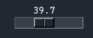

## showvalue
`False` to not show the value next to the slider:\
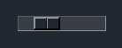

## tickinterval
Set this to a number to display a fixed value every `tickinterval` values.

E.g. `tickinterval = 10`:\
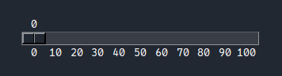

E.g. `tickinterval = 25`:\
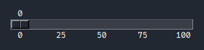

```py
sg.Scale(
    tickinterval=25,
    length=300,
)
```

## length, width
The length and width of the trough (in pixels), not including the shown value:\
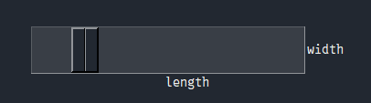

`length` always represents the dimension in "slide-direction". If the slider is oriented vertically, `length` defines the vertical direction.

## sliderlength
How many pixels the slider occupies on the trough:\
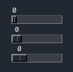

## sliderrelief
The relief of the slider:\
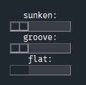

Default is `raised`.

Check out the element-tutorial of `sg.Text` for more information about reliefs.

## relief
The relief of the whole element, including the text.

Trust me, this looks bad.
Don't ask me why Tkinter offers an option like this, I don't know.

## expand, expand_y
Set `expand` to `True` for the element to take up as much horizontal space as possible.
`expand_y` for expanding vertically.

This is not influenced by the orientation of the element, so you should only expand in the direction the slider is oriented.
That means, use `expand_y` if `orient = "vertical"` and `expand` otherwise.

## disabled
If set to `True`, the slider can't be moved by the user anymore.

There are however no visual changes, so the user might not understand why they can't use it.

## label
You may add a custom text next to the slider using the `label`-option:\
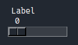

```py
sg.Scale(
    label="Label",
)
```

## troughcolor
Background-color of the trough:\
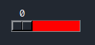

## digits
This option specifies how many digits (behind the comma) are shown with the value.

However, it works a bit counterintuitive.
The number you pass represents the maximum total number of digits.

E.g.: `digits=6, number_max=1000`. 
Since the longest number has 4 digits, two more digits are shown behind the comma, no matter the current value:\
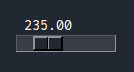

## repeatdelay, repeatinterval
For buttons, these options modify how button-clicks are repeated, when the button is held down.

For `sg.Scale`, they modify how quick the slider moves in the direction of the cursor, when the left mouse-button is held down on the trough.

There is really no good way of explaining this functionality in a short matter, but it's not hard to understand.
Just increase/decrease `repeatinterval` (from 10 to 1000) and hold down the mouse in the trough.

## highlightcolor, highlightbackground_color, highlightthickness
I am currently working on properly figuring these options out.
They shouldn't be used yet, unless you know Tkinter.

## Options of other elements
Options related to `sg.Text`:
- cursor
- text_color
- fonttype
- fontsize
- font_bold
- font_italic
- font_underline
- font_overstrike
- apply_parent_background_color

Options related to `sg.Button` (the slider works similar to a button):
- background_color
- background_color_active
- borderwidth
- takefocus


