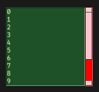
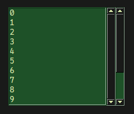
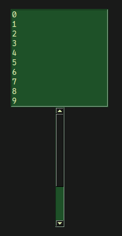
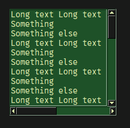
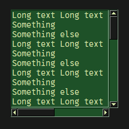

# sg.Scrollbar
Scrollbars are elements you probably don't add to the layout manually.
They appear included in elements like `sg.Table`, `sg.Listbox`, etc.

However, they are still their own element.

This tutorial explains how to customize scrollbars and how to add them manually.

# Options
The scrollbar has the following options:

- `key`: Same as every other element
- `cursor`: Type of the cursor when the mouse is over it
- `background_color`: Color of the SLIDER and the color of the buttons
- `background_color_active`: Background_color when the button/slider is clicked
- `text_color`: Color of the arrows on the arrow-buttons
- `text_color_active`: Text_color when the buttons are clicked
- `troughcolor`: Color of the field behind the slider
- `expand`: Fill all available space horizontally
- `expand_y`: Fill all available space vertically

# Configuring scrollbars on existing elements
Elements that come with a vertical scrollbar all have the method `update_scrollbar_y`.

The method can also be used directly in the layout:
```py
import SwiftGUI as sg

sg.Themes.FourColors.Jungle()

layout = [
    [
        sg.Listbox(
            range(15)   # Put in some values
        ).update_scrollbar_y(
            background_color= "pink",   # Change appearance of the scrollbar
            troughcolor = "red",
        )
    ]
]

w = sg.Window(layout, padx=30, pady=30)

for e, v in w:
    print(e, v)
```


# Manually adding scrollbars
Before creating your own scrollbars, note the following:
- When binding a scrollbar to an element, an existing scrollbar of that element will unbind.
- The width and height of scrollbars can't be specified, only expanded.

Create a scrollbar, then bind it to what you want to scroll:
```py
import SwiftGUI as sg

sg.Themes.FourColors.Jungle()

layout = [
    [
        my_listbox := sg.Listbox(
            range(15)   # Put in some values
        ),
        sg.Scrollbar().bind_to_element(my_listbox)
    ]
]

w = sg.Window(layout, padx=30, pady=30)

for e, v in w:
    print(e, v)
```


As you can see, the existing scrollbar doesn't work properly anymore.

The advantage of adding scrollbars manually is that you can place the scrollbar wherever you want to:
```py
import SwiftGUI as sg

sg.Themes.FourColors.Jungle()

layout = [
    [
        my_listbox := sg.Listbox(
            range(15),
            scrollbar= False,   # Remove the standard scrollbar
        ),
    ],[
        sg.Spacer(height= 200), # Since the scrollbar can only expand, we need to make space
        sg.Scrollbar().bind_to_element(my_listbox),
    ]
]

w = sg.Window(layout, padx=30, pady=30)

for e, v in w:
    print(e, v)
```


# Horizontal scrollbar
Most scrollable elements can also have a horizontal scrollbar:
```py
import SwiftGUI as sg

sg.Themes.FourColors.Jungle()

layout = [
    [
        my_listbox := sg.Listbox(
            ["Long text " * 5, "Something", "Something else"] * 15,
        ),
    ],[
        sg.ScrollbarHorizontal().bind_to_element(my_listbox),
    ]
]

w = sg.Window(layout, padx=30, pady=30)

for e, v in w:
    print(e, v)
```


# Adding both scrollbars
When adding both scrollbars, it's a good practice to put all of it into an `sg.GridFrame`:
```py
import SwiftGUI as sg

sg.Themes.FourColors.Jungle()

listbox_frame = sg.GridFrame([
    [
        my_listbox := sg.Listbox(
            ["Long text " * 5, "Something", "Something else"] * 15,
            scrollbar= False,
        ),
        sg.Scrollbar().bind_to_element(my_listbox)
    ],[
        sg.ScrollbarHorizontal().bind_to_element(my_listbox),
    ]
])

layout = [
    [
        listbox_frame
    ]
]

w = sg.Window(layout, padx=30, pady=30)

for e, v in w:
    print(e, v)
```


This way, the scrollbars are exactly as big as the element inside.


