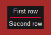
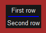
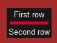
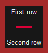
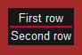

Written for SwiftGUI version 0.11.20 if not stated further.


# sg.VerticalSeparator, sg.HorizontalSeparator
Alias: sg.VSep, sg.HSep

A vertical or horizontal line that separates parts of the layout visibly.
This tutorial only covers the horizontal one, but the vertical works exactly the same.\
\
(The `sg.HorizontalSpacer` is the red line in the middle)

```py
import SwiftGUI as sg

sg.Themes.FourColors.TransgressionTown()

layout = [
    [
        sg.T("First row"),
    ], [
        sg.HSep()
    ], [
        sg.T("Second row")
    ]
]

layout = [[sg.Frame(layout)]]   # Put everything in a frame so it has its own background-color

w = sg.Window(layout, padx=50, pady=50)
w.frame.update(pass_down_background_color=False, background_color="brown")  # Change the background-color without changing every background-color

for e,v in w:
    ...
```

# Options
## color
The color of the line:\


## weight
Thickness of the line:\


Default is 2.

## padding
How many pixels of space are around the line:\



# Tips
You can change `weight` and `color` using `.update`.
This can be used to create some interesting effects.

