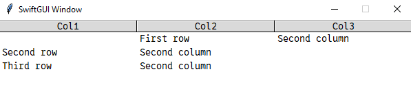

# sg.Table 
...probably the best element SwiftGUI has to offer

## Comparison to PySimpleGUI's Table
Let me tell you, why SwiftGUI's Table is much better than the one of PySimpleGUI.

If you don't care, just skip this part.\
It's just me ranting about PySimpleGUI again...

When first setting up the table, or overwriting all of its contents, PySimpleGUI is a lot quicker, especially when adding a lot of rows.\
That's the sole advantage of PySimpleGUI's Table.\
(**Update since version 0.7.4**: Nevermind, the issue is more or less fixed. See section "Making the table less laggy" of this tutorial for details.)

However, to change any row of PySimpleGUI's Table, you need to **replace the whole table**.
There is no intended way to modify, append, insert, or delete a single row.
I found [a GitHub Thread from 2022](https://github.com/PySimpleGUI/PySimpleGUI/issues/5659) about this issue, yet the issue remains.
There are workarounds, but you can work around anything in Python, so that doesn't count.

As you might have guessed, SwiftGUI's Table lets you do all of the above (and more) with little to no runtime penalty.

Even better, SwiftGUI lets you edit table-rows OUTSIDE of the table itself.
You can use that table-row like a list and any changes to that "list" will be instantly applied to the actual table.

Let's call PySimpleGUI `psg` and SwiftGUI `sg` for an easier read.

What really annoyed me about psg-Table is that you clear all the user-selections when replacing/updating the table.
Also, the view gets reset to the beginning of the table.
Imagine editing an Excel-Cell, but when you press enter, the selection is gone and you are looking at the top left corner of the sheet.\
In Germany we say "Katastrophe" ("Catastrophy").\
Again, there are workarounds, but you shouldn't need to work around such a basic feature.

The most infuriating part about this is how easy it was for me to implement these features.
Tkinter literally offers all the needed methods, I basically just needed to pass them along.

sg-Tables keep any selection when modifying the table.
When inserting rows before the selected row, the selection moves down with the row.
This feels really natural to the user and would be a pain to implement in psg.

On top of that, sg-Tables offer a lot of "higher" features, like sorting and filtering through the table.
Of course, selections are preserved.

By default, clicking on a column-heading sorts the table by this column. Clicking it again, sorts by this column in reverse.
Of course, you can disable this behavior.

Another annoying thing about psg-Tables was that they returned the index of the table rather than the actual value. 
psg-Listbox does the opposite.
Also, most times you don't need all selected rows, just one.
So why always return a list with all selections?

In sg, you can read the value, index, all values and all indexes seperately.

# Basic functionality

After ranting about PySimpleGUI excessively, let's dive into SwiftGUI's Table.

A basic layout with a table could look like this:
```py
import SwiftGUI as sg

elements = [
    ["First row", "Second column"],
    ["Second row", "Second column"],
    ["Third row", "Second column"],
]

layout = [
    [
        sg.Table(
            elements,
            headings=("Col1", "Col2", "Col3"),
        )
    ]
]

w = sg.Window(layout)

for e,v in w:
    ...
```


As you can see, like the layout, table-elements are structured as a nested list (or Iterable of any kind).
Inner lists are rows.

`headings` defines how many columns there are and what they are called.
Elements will try to fill all columns if possible.
In this example, 2 values are supplied for 3 columns, so the 3rd column is empty.
If too many values are supplied, excess values will not be shown.

As with any element, you can access the `sg.Table`-object by setting a key and invoking `w[key]`.
For "bigger" elements like Tables it usually makes more sense to just save it in a variable:
```py
layout = [
    [
        table := sg.Table(  # table is a permanent reference to this object now
            elements,
            headings=("Col1", "Col2", "Col3"),
        )
    ]
]
```
Tipp: You don't have to pass elements, you could just leave the table it empty.

# Replacing the whole table

You can go the "PySimpleGUI-Mode" and replace the whole table:
```py
table.overwrite_table([["Only", "row", "in the table"]])
```
**Only use this if you really have to replace the whole table.** 
If you want to replace only a few rows, rather edit them instead of trashing and replacing everything.

If you just want to empty the table, use `table.clear_whole_table()` instead.


# Modifying single rows

To modify a single row, just use the table-reference like you'd use a normal list:
```py
w = sg.Window(layout)

# (This doesn't work before window-creation)
table[0][1] = "New text"
```


You can even "store" that table-row inside a variable and use it like a normal list:
```py
w = sg.Window(layout)

my_row = table[0]

my_row[1] = "Still works"
my_row.append("3rd column") # my_row is only 2 elements long, so we need to append a 3rd one
```


Remember that the table-rows were only 2 values long:
```py
elements = [
    ["First row", "Second column"],
    ["Second row", "Second column"],
    ["Third row", "Second column"],
]
```
If you ran 
```py
elements[0][2] = "3rd column"
```
you'd get an Index-error, because the inner list doesn't contain the index `2`.
It's too short.

**The `sg.Table` does not fill empty columns with an empty value, it just stays non-existant.**
That's why you need to use `.append` to modify the 3rd column in the above example, which is a bit counter-intuitive.

You might want to pass an empty element as a placeholder instead:
```py
elements = [
    ["First row", "Second column", ""],
    ["Second row", "Second column", ""],
    ["Third row", "Second column", ""],
]
```
Elements can have different length, but keep in mind that the structure of any row is the same as the passed element.

`table[0]` returns the 0th row of the table in a list-like object.
You can do everything with it that you are able to do with normal lists:
```py
table[0].sort() # No idea why anyone would ever sort a row, but you do you
```


## Overwriting single rows
You can overwrite whole rows.
Due to SwiftGUI's magic, existing references to that row are preserved, as long as you don't change the reference:
```py
table_row = table[0]
table[0] = ["Some","New","Row"] # Does not break the reference (magic)

table_row[0] = "Hello World"    # This still works

table_row = ["Anything","Else"] # This doesn't work and table_row is now unuseable.
```


Tipp: If you somehow can't use `table[index] = new_row` for any reason (e.g. inside a lambda function), use `table.__setitem__(index, new_row)` instead.
Literally the same method.

## Adding rows
`.append`, `.extend` and `.insert` let you add rows, just like you'd modify a normal list:

```py
table.append(["New","Row"]) # Added to the end of the list
table.extend(
    [  # Added to the end of the list
        ["Another","New","Row"],
        ["And","yet another", "one"]
    ]
)
table.insert(["First","row"], 0)    # Added as the 0th element. All other elements are moved one back
```


All of these methods return a reference to the added row(s), so you don't need to fish it out using `table[index]`:
```py
new_row = ["New","Row"]
new_row = table.append(new_row) # Now any change to new_row will change the actual row in the table
```

Additionally, you might want to use `.insert_multiple(rows, first_index)`.
It works just like `.insert`, but you pass a list (or any Iterable) of rows instead of a single one.
The given index will be the index of the first element.
All the other elements are inserted after that one.

It doesn't provide performance advantage (yet), the method just calls `.insert` for each element:
```py
    def insert_multiple(self,rows:Iterable[Iterable[Any]], index: int) -> tuple[TableRow, ...]:
        r = []
        for row in rows:
            r.append(self.insert(row,index))
            index += 1

        return tuple(r)
```

`.append_multiple` does not exist, use `.extend` instead.

## Deleting rows

Delete a row by calling `del table[index]`:
```py
w = sg.Window(layout)

del table[0]
```


If you can't use `del table[index]` for any reason (e.g. inside a lambda-function), use `table.__delitem__(index)` instead.
Does the exact same thing.

# Sorting the list

SwiftGUI's Table can actually be sorted simmilar to normal lists.
Selections will be preserved.

## Default Column-sorting

By default, when clicking on a column-heading once, the table sorts after that column.
Clicking the same heading again, sorts the table in the reversed direction.

To demonstrate, let's set up a table with numeric values:
```py
import SwiftGUI as sg
import random

elements = [[i, random.randint(0,1000), random.random()] for i in range(1000)]

layout = [
    [
        table := sg.Table(
            elements,
            headings=("Col1", "Col2", "Col3"),
        )
    ]
]

w = sg.Window(layout)

del table[0]

for e,v in w:
    ...
```


After clicking `Col2`:\


After clicking `Col2` again:\


After clicking `Col3`:\


**There are a few things to keep in mind with this feature:**
- Indexes always refer to the table as shown. That means, after sorting, indexes probably refer to different rows. Existing references to rows stay the same.
- With bigger tables (5000+ elements), sorting can be slow and should be deactivated.
- Sorting is a one-time-action. Any changes made after sorting, won't be sorted automatically.
- The state of the table before sorting is not saved and therefore cannot be restored.

**To deactivate this feature**, pass `sort_col_by_click=False` to the `sg.Table`:
```py
layout = [
    [
        table := sg.Table(
            elements,
            headings=("Col1", "Col2", "Col3"),
            sort_col_by_click=False,
        )
    ]
]
```
You may overwrite this parameter later using `.update`.

## "Manual" sorting

You can sort the table like you'd sort a nested list ("double-list") using `.sort`.

It basically works the same as normal sorting, so please refer to the [Python docs](https://docs.python.org/3/howto/sorting.html) for further information.

`.sort` returns the table itself, so it can be called inline (see example below).

It does have two more features though.
By specifying `by_column` (index or title of a column), the sorting function will be applied to "a list that contains only this column's values".
All the other columns will be ignored.

If you pass a key (function, refer to the docs), that function will not receive a whole row, only that column's value.

Example: I'd like to sort the list by the number of digits in the second column (index 1):
```py
layout = [
    [
        table := sg.Table(
            elements,
            headings=("Col1", "Col2", "Col3"),
        ).sort( # inline-call I talked about earlier
            by_column = 1,
            key = lambda val: len(str(val)),    # len(str(val)) returns the number of digits
        )
    ]
]
```


Another example: I'd like to sort the table by the sum of Col2 and Col3.
Since I need to access multiple columns, `by_column` should not be passed:
```py
layout = [
    [
        table := sg.Table(
            elements,
            headings=("Col1", "Col2", "Col3"),
        ).sort(
            key = lambda row: row[1] + row[2]   # Whole row gets passed without by_column
        )
    ]
]
```


The other difference to normal list-sorting is that you can pass `empty_to_back` (bool), which is `True` by default.
If `True`, empty strings and None will be placed at the end of the table. `False` places them at front.
This is independent of your key-function.

# Filtering the list

Besides sorting, `sg.Table` offers a way to filter the list, much like [filter](https://docs.python.org/3/library/functions.html#filter) does.
Please familiarize yourself with its functionality before reading this part.

As with `.sort`, you may pass `by_column` to apply the filter-function only to a certain column.

Example: Let's filter out all rows where `Col1` (index 1) has a value below 5:
```py
layout = [
    [
        table := sg.Table(
            elements,
            headings=("Col1", "Col2", "Col3"),
        ).filter(lambda val:val < 5, by_column=1)
    ]
]
```


When applying the first filter, you enter the "filter-mode".
The state before filtering is saved.
You can restore it using `.reset_filter()`, which exits the filter-mode and restores the list to the state before filtering.

While in filter-mode, you can't use `.insert`, but `.append`, `.extend`, modifying and deleting rows still works.
Keep in mind that newly added, or modified rows won't go through the filter again automatically.

"Row-moving" methods like `.sort` still work, but will be reset when you call `.reset_filter()`.

Indexes still refer to the actual shown rows, so the same index might refer to a different row after filtering. References don't change though.

`.clear_whole_table` still clears the whole table, not only remaining elements.

## Chaining filters

Usually, `.filter` applies to all rows, visible or not.
By passing `only_remaining_rows = True` to the filter method, the filter will not include non-visible filters.

Example: Let's filter for all Values of `Col2` below 10 that are divisible by 2:
```py
layout = [
    [
        table := sg.Table(
            elements,
            headings=("Col1", "Col2", "Col3"),
        ).filter(lambda val:val < 10, by_column=1).filter(lambda val:val%2 == 0, by_column=1, only_remaining_rows=True)
    ]
]
```


## Exiting filter-mode
As stated earlier, you can exit the filter-mode by calling `.reset_filter()` on your table.

However, if you'd like to discard all rows that did not get through the filter, use `.persist_filter()` instead.

`.filter_mode` is `True`, if the table is in filter-mode.

# Selections

To get the currently selected row, use `.value`, for the index of that row, `.index`.

To change the selection, simply change `.index`, or use `.set_index(index)`.

`.value` returns a reference to the selected row, so modifying it also modifies the row itself.

Example: Let's change `Col1` to "clicked" when a row was clicked. This is the implementation using the event-loop:
```py
import SwiftGUI as sg
import random

elements = [[i, random.randint(0,1000), random.random()] for i in range(1000)]

layout = [
    [
        table := sg.Table(
            elements,
            headings= ("Col1", "Col2", "Col3"),
            key= "Table",
            default_event= True,    # Default event throws when selection changes
        )
    ]
]

w = sg.Window(layout)

for e,v in w:
    if e == "Table":    # Not really necessary, since this is the only possible event
        table.value[0] = "Clicked"
```


Or a different implementation using a key-function:
```py
import SwiftGUI as sg
import random

elements = [[i, random.randint(0,1000), random.random()] for i in range(1000)]

layout = [
    [
        table := sg.Table(
            elements,
            headings= ("Col1", "Col2", "Col3"),
            default_event= True,    # Default event throws when selection changes
            key_function=lambda val: val.__setitem__(0, "clicked")  # same as val[0] = "clicked"
        )
    ]
]

w = sg.Window(layout)

for e,v in w:
    ...
```

**Keep in mind:** If no row is selected, `.value` and `.index` both return `None`.

## Select elements from code
To select an element, just set `.index` to a valid index.

**Changing the selection by code also throws an event.**
I'm not sure if this is useful or annoying, but I think it's more useful than annoying.
Happy to hear your feedback.

Let's set the index to 0 from the start, to eliminate the chance of no row being selected:
```py
w = sg.Window(layout)
table.index = 0
```
Since an event is thrown for this row, the key function is called, changing `Col1` to "clicked":\


## Multiple selections
There are 3 selectmodes you can chose from:
- `none`: The user can select nothing. Simmilar to `readonly` or `disabled` on other sg-elements.
- `browse`: The user can select a single row (default)
- `extended`: Holding down `Ctrl`, or `Shift`, the user can select multiple rows at once

In the extended mode, you shouldn't use `.value` and `.index`, but rather `.all_values` and `.all_indexes`.
These attributes contain tuples with all selected values/indexes.

In extended mode, `.value` and `.index` don't change under certain conditions.

Let's select rows 1, 5, 6 and 7 in the beginning and modify the key-function so it works with extended selection:
```py
import SwiftGUI as sg
import random

elements = [[i, random.randint(0,1000), random.random()] for i in range(1000)]

layout = [
    [
        table := sg.Table(
            elements,
            headings= ("Col1", "Col2", "Col3"),
            selectmode="extended",
            default_event= True,    # Default event throws when selection changes
            key_function=lambda elem: [i.__setitem__(0, "clicked") for i in elem.all_values]
        )
    ]
]

w = sg.Window(layout)
table.all_indexes = 1,5,6,7

for e,v in w:
    ...
```


Tipp: Instead of `table.all_indexes = ...` you can also use `table.set_all_indexes(new_indexes)` with new_indexes being a tuple (or any Iterable).

# Moving rows around

SwiftGUI's Table offers a couple of ways to move rows around.

The most obvious one is `.move(from_index, to_index)`.
It moves the row at index `from_index` so that it has the index `to_index` afterwards.
If `to_index < from_index`, the row at `to_index` gets pushed to the back.

Let's consider this basic example:

```py
import SwiftGUI as sg

elements = [
    [0, "First row", "Second column"],
    [1, "Second row", "Second column"],
    [2, "Third row", "Second column"],
    [3, "Forth row", "Second column"],
    [4, "Fith row", "Second column"],
]

layout = [
    [
        table := sg.Table(
            elements,
            headings= ("Col1", "Col2", "Col3"),
        )
    ]
]

w = sg.Window(layout)
table.move(0, 2)

for e,v in w:
    ...
```


As you can see, row 0 now has the index 2. Because 0 < 2, row 1 and 2 automatically got their new indexes.

Let's move row 4 to index 2 now:\


Because 4 <! 2, row 2 and 3 got pushed back one index to make space for row 4.

## Quick moves
You can use `.move_up(index, n)` and `.move_down(index, n)`, to move the row at a certain index up/down n places.
n is one by default.

The row won't move "over the edge", so you can e.g. keep "moving up", even when you try to move row 0 to index -1.

## Swapping
You can swap two rows with `.swap(index_1, index_2)`.

This method probably needs no explanation, but it wasn't as easy to implement as you might think.

# Making the table less laggy
When adding a lot (3000+) of rows, you might notice the program freezing for a moment.
It's not a big deal, but the user will probably notice.

Adding a lot more (50000+) rows, the program might even freeze a couple of seconds showing "no response".
This can be annoying, especially when it slows down the program-startup.

SwiftGUI's table-element offers a way to divide the added elements into chunks of elements that get added one-by-one.

This way, you don't cause one giant lag, but rather a lot of smaller ones.
This feels much less annoying for the user.

To use this feature, just call `table.overwrite_table_threaded` instead of `table.overwrite_table`.

The method returns the table-element itself, so it can be called inline:
```py
layout = [
    [
        sg.Table(
            headings=("Col1", "Col2", "Col3"),
        ).overwrite_table_threaded(elements)
    ]
]
```
If this still feels laggy, you can adjust how many elements are added in a single chunk (`chunksize`, default is 1000) and how long to wait between chunks (`delay`, default is 0.3):
```py
layout = [
    [
        sg.Table(
            headings=("Col1", "Col2", "Col3"),
        ).overwrite_table_threaded(elements, chunksize= 500, delay= 0.5)
    ]
]
```

## Other treaded methods
Besides `.overwrite_table_threaded`, the following methods are available as a threaded version of their "normal" counterpart:
- `insert_multiple_threaded`
- `extend_threaded`

Tipp: To append to the front of the list, use `insert_multiple_threaded` with `index= 0`.

## Important! "Interrupting" threaded methods
There is a big downside to using these "threaded methods", so handle it with care.

What do you think happens, when the table is currently adding values with these methods and you add some row using a non-threaded method like `.append`?

The results are predictable, but not in an easy way, so I'll only present them simplified.
While the thread is running, these effects will occur:
- Adding rows might mess up the row-order
- **Threaded methods are safe and will run one after another**
- If the thread crashes, added rows might not actually be added
- Deleting rows might mess up the row-order, or crash the thread in rare cases
- Clearing the table (deleting all rows) crashes the thread in most cases
- Sorting ignores all rows that didn't get added yet
- Filtering has a good chance of crashing the thread and ignores all rows that didn't get added yet
- Persisting the filter-view doesn't stop pending rows to be added
- Moving rows should be safe
- Updating the look (colors, font, ...) of the table is safe
- The scrollbar might act somewhat strange while rows are being added

The thread is running, if `table.thread_running` is `True`.

Follow these rules and you'll be fine using threaded methods:
- If row-order is important, only use threaded methods to add rows.
- Deleting rows is safe if you only use `.extend_threaded`.
- If row-order is important, disable `sort_col_by_click`.
- Don't filter/persist while the thread is running

# Changing the view
You can use `.see(index)` to scroll the table so that the passed index row is visible.

To "see" the current selection, use `.see_selection()`.
If multiple rows are selected, this method "sees" the topmost of them.

## Scrollbar
By default, a scrollbar is visible.
It's not shown in this tutorial, because I just added it (SwiftGUI Version 0.4.4).
Not gonna replace every image.

Also, the scrollbar looks different since version 0.6.2, so don't be too suprised.

The scrollbar will be as high as the current row.
That means, for the table to look good with a scrollbar, the table has to be **the tallest element** in its row:\


If you can't avoid it, put the table in its own frame:
```py
layout = [
    [
        sg.Frame([[table := sg.Table(
            elements * 10,  # Add all the elements 10 times
            headings= ("Col1", "Col2", "Col3"),
            height = 3,
        )]]),
        sg.TextField("Big TextField", height=10, width=10),
    ]
]
```


Also, no padding in the y-direction for the table.
If you want to add some space above/below the table, put a spacer in the previous/next row instead.

In my experience, this shouldn't be an issue.
Implementing a solution means more invisible elements slowing down the code and making the codebase messier.\
So let's call it a feature, not a bug.

## Customization
There are a couple of options you can use to change the apperance of this element.
Most of them are for coloring certain aspect of the element, so let's talk about these later.

As with every sg-element, you may pass the options when creating the table, but most of them can be changed later using `.update`.

Also, most of them have a connected global option in `sg.GlobalOptions.Table`.

These options are exactly the same in `sg.Text`, so they won't be covered here: `cursor`, `padding`, `takefocus`.

### Size
`height` (int) determines how many rows should be visible at once.

`column_width` resizes the columns to a fixed size.
The value should mean, that this many characters fit inside a column, but this doesn't really work (Not my fault...).

With a height of 3 and column_width of 5, the table is pretty tiny:\


`column_width` can also be passed an Iterable of integers to resize columns differently.

With `column_width = (5, 15, 5)`, the 2nd column will be scaled to 15 characters, the others only to 5:\


You can resize the columns later, but not with update. Instead use `.resize_column(index/name, width)`.
This layout looks the same as the one before:
```py
layout = [
    [
        table := sg.Table(
            elements,
            headings= ("Col1", "Col2", "Col3"),
            column_width= 5,
            height = 3,
        ).resize_column(1, 15)  # Only resize Col2
    ]
]
```

You could also set `expand = True`, which expands the element over the whole width of its container, but that overwrites column resizing.
`expand_y` does nothing you need to know about...

### Fonts

You specify the font and font-options the same way as with `sg.Text`.

Change these options to configure the row-font:
```py
    fonttype: str = None,
    fontsize: int = None,
    font_bold: bool = None,
    font_italic: bool = None,
    font_underline: bool = None,
    font_overstrike: bool = None,
```
For the headings, change these options:
```py
    fonttype_headings: str = None,
    fontsize_headings: int = None,
    font_bold_headings: bool = None,
    font_italic_headings: bool = None,
    font_underline_headings: bool = None,
    font_overstrike_headings: bool = None,
```
If you don't specify an option for headings, the row-option will be applied.

### Colors
There are also a couple of colors:
```py
    background_color_rows: str | Color = None,
    background_color_active_rows: str | Color = None,
    background_color_headings: str | Color = None,
    background_color_active_headings: str | Color = None,

    text_color: str | Color = None, # For the rows
    text_color_active: str | Color = None,  # For the rows
    text_color_headings: str | Color = None,
    text_color_active_headings: str | Color = None,
```
Pretty self-explanitory in my opinion, or maybe I'm just getting lazy after writing 660 lines of documentation.

active means selected/clicked.
When headings are clicked, they change color while the mouse is being held down. 
That color is the active one.

The option `background_color` determines the actual background color of the widget.
This color shows inside the element-padding and "behind" rows.
So if there are not enough rows to cover the whole element, remaining space is filled with `background_color`.


