# sg.Text
Displays a text:\
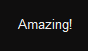
```py
import SwiftGUI as sg

sg.Themes.FourColors.GarnetFlair()

layout = [
    [
        sg.Text("Amazing!")
    ]
]

w = sg.Window(layout, padx=30, pady=30)

for e, v in w:
    print(e, v)
```

However, a lot of elements have an integrated text, so they share a lot of options with `sg.Text`.

That's why this is one of the most important tutorials.

# Value
The value of a text-element is its text:
```py
import SwiftGUI as sg

sg.Themes.FourColors.GarnetFlair()

layout = [
    [
        my_text := sg.Text(),
    ]
]

w = sg.Window(layout, padx=30, pady=30)
my_text.value = "Awesome!"

for e, v in w:
    print(e, v)
```
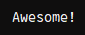

# Options
## relief
Select the type of relief around the text.

The relief can be used to distinguish the element from the background:\
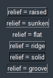
```py
sg.Themes.FourColors.ArcticGlow()   # Used going further

layout = [
    [sg.Text('relief = raised', relief= "raised")],
    [sg.Spacer(height=5)],  # Some space between texts
    [sg.Text('relief = sunken', relief= "sunken")],
    [sg.Spacer(height=5)],
    [sg.Text('relief = flat', relief= "flat")],
    [sg.Spacer(height=5)],
    [sg.Text('relief = ridge', relief= "ridge")],
    [sg.Spacer(height=5)],
    [sg.Text('relief = solid', relief= "solid")],
    [sg.Spacer(height=5)],
    [sg.Text('relief = groove', relief= "groove")],
]
```

I'll show this option first because it makes many others soo much easier to explain.

## width
The width in digits of the text-area:\
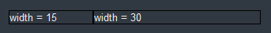
```py
layout = [
    [
        sg.Text('width = 15', relief= "solid", width= 15),
        sg.Text('width = 30', relief= "solid", width= 30),
    ]
]
```
If the width is too small for the text, exceeding text is cut off:\
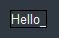
```py
    sg.Text("Hello_World", relief= "solid", width= 5),
```
As you can see, the width in characters might vary (6 shown instead of 5), because characters are not all of the same width.

## cursor
The cursor-type while the mouse is over this element.

You may choose from these cursor-types: https://anzeljg.github.io/rin2/book2/2405/docs/tkinter/cursors.html

They will probably look differently though.

## anchor
Defining `width` can make the element bigger than the text requires.

In that case, `anchor` defines where the text is placed inside the element.

`anchor` takes a string representing cardinal directions:
- `anchor = "n"` means "north", meaning the text is placed in the top(-middle).
- `anchor = "se"` means "south-east", meaning the text is placed at the bottom-right.
- `anchor = "center"` means the text is placed in the middle.

The default is `w` (left).

Example:\
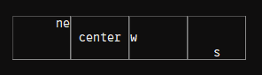

```py
layout = [
    [
        sg.Text("ne", relief="groove", width=8, anchor="ne", expand_y=True),
        sg.Text("center", relief="groove", width=8, anchor= "center", expand_y=True),
        sg.Text("w", relief="groove", width=8, anchor="w", expand_y=True),
        sg.Text("s", relief="groove", width=8, anchor="s", expand_y=True),
        sg.Spacer(height=50)    # Increase the height of the row
    ]
]
```
This option is available for most elements that have a text in them, like `sg.Button` and `sg.Checkbox`.

## justify
As you might know, text can have multiple lines.
By default, the additional lines are aligned to the left below the first one:\
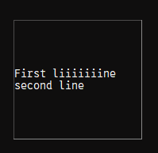
```py
layout = [
    [
        sg.Text("First liiiiiiine\nsecond line", relief="groove", width=20, expand_y=True),
        sg.Spacer(height=150),    # Increase the height of the row
    ]
]
```

Set `justify` to `"left"`, `"center"`, or `"right"` to align the lines accordingly.

Keep in mind that this isn't affected by and doesn't affect `anchor`:\

```py
sg.Text("First liiiiiiine\nsecond line", relief="groove", width=20, expand_y=True, justify= "right"),
```

## Colors
Define the colors of the element through `background_color` and `text_color`:
```py
layout = [
    [
        sg.Text("Awesome!", background_color= "darkgreen", text_color= "red"),
    ]
]
```
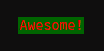

## apply_parent_background_color
Set this option to `False` to disable [background-color-propagation](https://github.com/CheesecakeTV/SwiftGUI-Docs/blob/main/03%20Advanced%20tutorials/Background%20color%20propagation.md).

As explained in the linked tutorial, this is automatically disabled when defining the background-color.

## Font
Define which font to use by defining `fonttype`:
```py
layout = [
    [
        sg.Text("Awesome!", fonttype= sg.Font.Comic_Sans_MS),
    ]
]
```
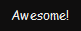

These other options change the attributes of the font:
- `fontsize`: Height of the font in pixels
- `font_bold`: **Bold**
- `font_italic`: *Italic*
- `font_underline`: __Underline__
- `font_overstrike`: ~~Overstrike~~

## underline
Don't confuse this with `font_underline`.

`underline` adds an underline to a single character defined by the integer you pass to this.

Pass `0` to underline the first ("zeroth") character:
```py
layout = [
    [
        sg.Text("Awesome!", underline=0),
    ]
]
```
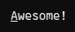

The default is `-1` which disables the underline.

## padding
Padding is space around the text that is guaranteed to be empty.
Adding padding enlarges the element beyond its width.

The reliefs border is still outside of the padding.

Set `padding` to a single integer to create the same padding-width in every direction:
```py
layout = [
    [
        sg.Text("Some kind of long text!", background_color= "darkgreen", padding= 50),
    ]
]
```
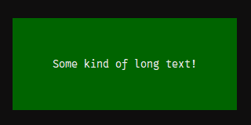

Set `padding` to a tuple of two integers to define left-right and top-bottom padding separately in that order:
```py
layout = [
    [
        sg.Text("Some kind of long text!", background_color= "darkgreen", padding= (50, 10)),
    ]
]
```
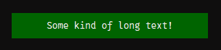

Set `padding` to a tuple of four integers to define left, top, right and bottom padding separately in that order:
```py
layout = [
    [
        sg.Text("Some kind of long text!", background_color= "darkgreen", padding= (50, 10, 0, 0)),
    ]
]
```
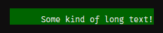


