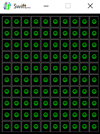
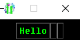

# Introduction
Since SwiftGUI version 0.10.24, it is possible to add/delete elements while the program is already running.

However, this only works under certain conditions.

This tutorial explains these functionalities and the risks that come with it.

There will be examples showing how powerful these features are in the future.

Note that this feature was a pain to implement.
In SwiftGUI, elements are connected to a couple of other elements through references.
Also, different types of elements need to be handled differently.
Adding/deleting elements, SwiftGUI needs to create/destroy these references properly.

Long story short, if you encounter any bugs regarding this feature, please, please, please, report it.

## Window are frame too
Keep in mind that things working for frames work for windows/subwindows too.

These actually contain only a single element:
A big frame containing all other elements of that window.

Access that frame by using `.frame` on the window/subwindow:
```py
w = sg.Window(layout)
window_frame = w.frame
```

# Methods on sg.Frame
Before getting into these topics, let's first recall some methods of sg.Frame that are very useful in this context:

### Length
`len(frame_object)` returns how many rows are that frame has.

### row-index
`frame_object.get_row_index(element)` returns the index of the row the passed element is in.

If the element isn't in the frame, `None` is returned instead.

Keep in mind that only elements "directly" inside the frame are considered.\
Example:
```py
my_frame = sg.Frame([
    [
        sg.Button("Hello"),
    ],[
        sg.Frame([
            [
                sg.Button("World")
            ]
        ])
    ]
])
```
Even though the button "World" technically is inside `my_frame`, that doesn't count, because it is directly inside something else.

# Deleting single elements
**Important!**\
This does NOT delete the row this element is in, even if it's empty.
If you add and delete an element 50000 times, there will be 50000 empty rows.
Performance desaster.

The easiest way to delete an element is to call `.delete()` on it.
Run this script yourself:
```py
import SwiftGUI as sg

sg.Themes.Thematic.Hacker()

layout = [
    [
        sg.Button(
            "Delete me!",
            key="Delete",
        )
    ]
]

w = sg.Window(layout)

for e,v in w:

    if e == "Delete":
        w["Delete"].delete()    # Delete the element
```

As you should know by now, `w[key]` is one of many ways to reference an element.
Any reference is fine:
```py
import SwiftGUI as sg

sg.Themes.Thematic.Hacker()

layout = [
    [
        sg.Button(
            "☺",
            key_function= lambda elem: elem.delete(),   # Delete the pressed buttons
        ) for _ in range(10)    # 10 Buttons in a row
    ] for _ in range(10)    # 10 rows
]

w = sg.Window(layout)

for e,v in w:
    print(e,v)
```
\
(When pressing a button, it is deleted)

# Deleting whole rows
To delete a row, you'll need to call `.delete_row(row_index)` on its containing frame.

**This does not work for grid-frames (yet, version 0.10.24)**.

The indexes are given like indexes of normal list, so `0` means the first row.\
Negative indexes work as usual. E.g.: `-1` (default value) references the last row.

Example:
```py
import SwiftGUI as sg

sg.Themes.Thematic.Hacker()

layout = [
    [
        sg.Button(
            str(row),
            width= 15,
            key= row, # Some unique key so the event-loop continues
        )
    ] for row in range(10)    # 10 rows
]

w = sg.Window(layout)
window_frame = w.frame

for e,v in w:
    print(e,v)
    
    window_frame.delete_row(0)  # Delete first row
    window_frame.delete_row(-1) # Delete last row
```

This is the best way to delete elements, since it leaves nothing behind.
So you can create and delete the same row as often as you like without any residue.

## Deleting the row of a certain element
Something you'll probably do often is to delete a row that has a certain element in it.

So I made a method for exactly that.
You're welcome.

Passing the element to `.delete_row_of_element(element)` deletes that row:
```py
import SwiftGUI as sg

sg.Themes.Thematic.Hacker()

layout = [
    [
        sg.Button(
            str(row),
            width= 15,
            key= row, # Some unique key so the event-loop continues
        )
    ] for row in range(10)    # 10 rows
]

w = sg.Window(layout)
window_frame = w.frame

for e,v in w:
    print(e,v)

    window_frame.delete_row_of_element(
        w[e]    # Reference to the element that caused the event
    )
```
If the element isn't inside `window_frame`, a `ValueError` is caused.
Disable this behavior by setting `allow_not_available= True`.

However, this should not be done.
If an error is caused here, you probably did something very wrong.

# Adding/creating elements
Before getting into this, always remember that **elements cannot be reused!**

This is NOT allowed:
```py
my_button = sg.Button("Hello")

layout = [
    [
        my_button,
        my_button,
        my_button
    ]
]
```
There is no protection against this (yet, version 0.10.25), so you'll just get some unexpected behaviors:\


## Adding elements
Add an element to a row by calling `frame_object.add_element_to_row(element, row_index)`:
```py
import SwiftGUI as sg

sg.Themes.Thematic.Hacker()

layout = [
    [
        sg.Button(
            str(row),
            width= 15,
            key= row, # Some unique key so the event-loop continues
        )
    ] for row in range(10)    # 10 rows
]

w = sg.Window(layout)
window_frame = w.frame

for e,v in w:
    print(e,v)

    index = window_frame.get_row_index(w[e])    # Check which row was clicked
    window_frame.add_element_to_row(    # Add ...
        sg.T(" <- clicked"), # ...this element
        row_index= index,   # ...to this row
    )
```

Unfortunately, it is not possible to insert elements between other elements of that row, due to tkinters packing-manager.\
Writing this tutorial, I realized how to work around that, but haven't so far (version 0.10.25).

## Adding whole rows
Add a whole row by calling `.add_row(row)` on the frame:
```py
import SwiftGUI as sg

sg.Themes.Thematic.Hacker()

layout = [
    [
        sg.Button(
            "New row",
            key= "NEW"
        )
    ]
]

w = sg.Window(layout)
window_frame = w.frame

for e, v in w:
    print(e,v)

    window_frame.add_row(   # Add...
        [   # ... This row
            sg.T("New Row! "),
            sg.Button(" I'm a button ")
        ]
    )
```


