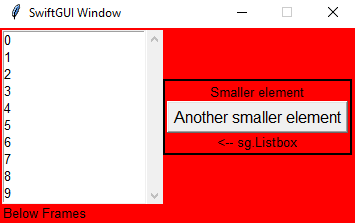
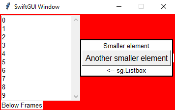
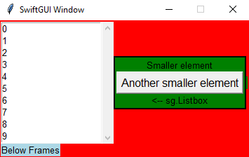
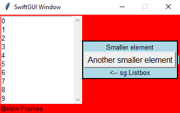
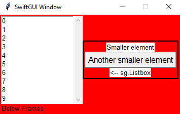

The images of this tutorial are from an older version of SwiftGUI.
The functionality is still up-to-date.

# Background color propagation
This feature took me 2 very annoying days to properly implement, so please appreciate it.

Every frame has its own background-color, they are not actually transparent - unfortunately.\
This is due to `tkinter`, the main package behind SwiftGUI.

That's why SwiftGUI has a feature called "background color propagation".
It basically applies changes to the background-color of a container to all contained elements with certain properties.

So when changing the background-color of a frame, that frame will update the background-color of all contained elements that look transparent.

Example:
```py
### Layout ###
inner_layout = [
    [sg.T("Smaller element")],
    [sg.Button("Another smaller element")],
    [sg.T("<-- sg.Listbox")]
]

layout:list[list[sg.BaseElement]] = [
    [
        sg.Listbox(
            range(10)
        ),
        sg.LabelFrame(
            inner_layout,
            no_label=True,
        )
    ],[
        sg.T("Below Frames")
    ]
]

w = sg.Window(layout, alignment="left", background_color="red") # Color the whole window red
```


It might not sound that cool, but remember that elements with "open" texts, like `sg.Text` and `sg.Checkbox` also have a background-color.

Without background-color-propagation, the GUI looks like this:\


If you set a background-color for specific elements, they automatically disable background-color-propagation for themselves:
```py
layout:list[list[sg.BaseElement]] = [
    [
        sg.Listbox(
            range(10)
        ),
        sg.LabelFrame(
            inner_layout,
            no_label=True,
            background_color="green"    # Specified, so no bg-color-propagation from the window
        )
    ],[
        sg.T("Below Frames", background_color="lightblue")  # Here too
    ]
]

w = sg.Window(layout, alignment="left", background_color="red")
```


However, **when using `.update(background_color = ...)`, the color-propagation won't be disabled**.
The background-color will still change, when a containing frame updates:
```py
layout:list[list[sg.BaseElement]] = [
    [
        sg.Listbox(
            range(10)
        ),
        myFrame := sg.LabelFrame(
            inner_layout,
            no_label=True,
        )
    ],[
        sg.T("Below Frames")
    ]
]

w = sg.Window(layout, alignment="left")
myFrame.update(background_color = "lightblue")  # Frame is blue now
w.update(background_color = "red")  # Frame is red again :C
```
You can disable that behaviour manually by setting `apply_parent_background_color = False`:
```py
layout:list[list[sg.BaseElement]] = [
    [
        sg.Listbox(
            range(10)
        ),
        myFrame := sg.LabelFrame(
            inner_layout,
            no_label=True,
            apply_parent_background_color= False,   # No pg-color-propagation for this element
        )
    ],[
        sg.T("Below Frames")
    ]
]

w = sg.Window(layout, alignment="left")
myFrame.update(background_color = "lightblue")  # Frame is blue now
w.update(background_color = "red")  # Frame doesn't change
```
\
(That blue line next to the frame is a very niche, known bug I'm going to fix sooner or later, version 0.5.3 atm.)

For frames, you could also disable changing the color of containing elements by setting `pass_down_background_color= False`:
```py
    myFrame := sg.LabelFrame(
        inner_layout,
        no_label=True,
        pass_down_background_color= False,  # Don't update contained elements
    )
```
\
You'll probably never need to do that, but hey, free will and stuff.