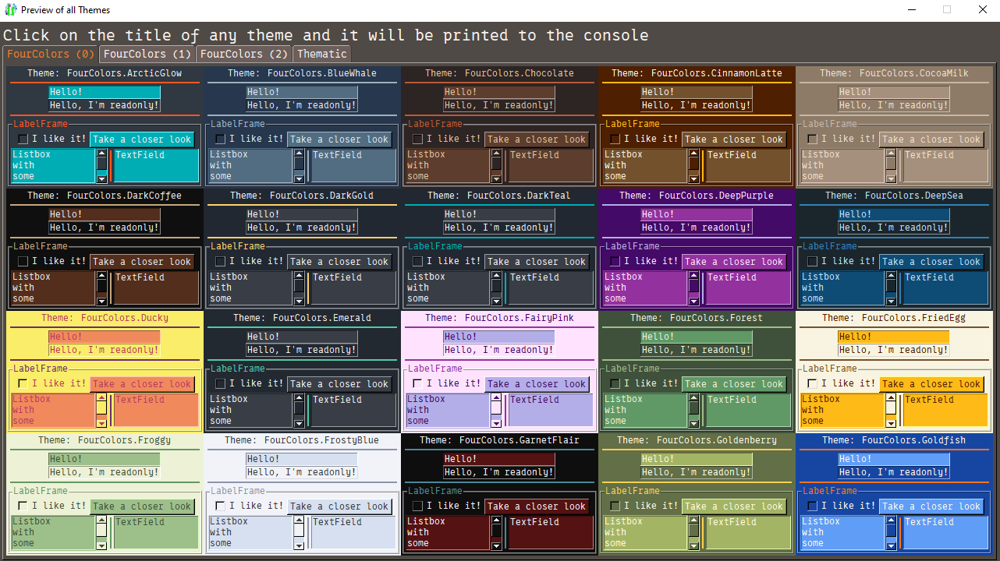
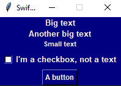

# Themes
Themes are a way to apply pre-made sets of global options (see basic tutorial 02).

In SwiftGUI version 0.10.2, there are 46 pre-made themes.

To apply a theme, simple "call" it:
```py
### Global options ###
sg.Themes.Hacker()
```


See all available themes by calling `sg.Examples.preview_all_themes()`:\


## Creating custom themes
It's very easy to create your own themes, so feel free to do so.
I'd love to see what you came up with, feel free to post it in the [GitHub-discussions](https://github.com/CheesecakeTV/SwiftGUI/discussions/26#discussion-8779746).

Let's take a look at an implementation of the `Hacker`-theme (version 0.5.x):
```py
import SwiftGUI
from SwiftGUI import GlobalOptions as go    # "shortcut" to the global options

class Hacker(sg.Themes.BaseTheme):

    def apply(self) -> None:
        go.Common_Textual.fonttype = font_windows.Fixedsys
        go.Common_Textual.text_color = "lime"

        go.Input.text_color = "black"
        go.Input.background_color = "lime"
        go.Input.background_color_readonly = Color.orange_red
        go.Input.selectbackground_color = Color.royal_blue
        go.Input.select_text_color = "black"

        go.Button.background_color_active = "lime"
        go.Button.text_color_active = "black"

        go.Checkbox.background_color_active = "lime"
        go.Checkbox.check_background_color = "black"

        go.Common_Background.background_color = "black"
        go.Common.background_color = "black"

        go.Listbox.highlightbackground_color = "lime"
        go.Listbox.highlightcolor = "lime"
        go.Listbox.text_color_selected = "black"
        go.Listbox.background_color_selected = "lime"

        go.Table.background_color_headings = "black"
        go.Table.text_color_headings = "lime"

        go.TextField.highlightbackground_color = "lime"

        go.Separator.color = "red"
```
As you can see, you only need to derive the class from `sg.Themes.BaseTheme` and set all of your global options in `apply`.

As an example, let's create a simple theme and apply it:
```py
import SwiftGUI as sg

class Marine(sg.Themes.BaseTheme):
    def apply(self) -> None:
        sg.GlobalOptions.Common_Textual.fonttype = sg.font_windows.Arial
        sg.GlobalOptions.Common_Textual.font_bold = True
        sg.GlobalOptions.Common_Textual.text_color = sg.Color.linen

        sg.GlobalOptions.Window.background_color = sg.Color.navy
        sg.GlobalOptions.Common_Field_Background.background_color = sg.Color.navy

### Global options ###
Marine()    # Apply the custom theme
```


Something you might want to do is to "buffer" the go-class that is currently being modified.
Might save some time and energy:
```py
class Marine(sg.Themes.BaseTheme):
    def apply(self) -> None:
        temp = sg.GlobalOptions.Common_Textual
        temp.fonttype = sg.font_windows.Arial
        temp.font_bold = True
        temp.text_color = sg.Color.linen

        temp = sg.GlobalOptions.Window
        temp.background_color = sg.Color.navy
        
        temp = sg.GlobalOptions.Common_Field_Background
        temp.background_color = sg.Color.navy
```

## FourColors themes
You can find many abstract color-maps online.\
These color-maps consist of different colors that look well together.

I got the ones used in SwiftGUI from [here](https://colorhunt.co).

SwiftGUI has a theme-template for themes that only change 4 different colors.
Most of the provided themes are made from this template.

Apply a four-colors-theme like this:
```py
sg.Themes.FourColors.ThemeName()
```

To create your own four-colors-theme, inherit from `sg.Themes.FourColors.BaseFourColors` and change `col1`-`col4`:
```py
class Jungle(sg.Themes.FourColors.BaseFourColors):
    col1 = "191A19" # Color-codes (hex) without the #
    col2 = "1E5128"
    col3 = "4E9F3D"
    col4 = "D8E9A8"
    
Jungle()    # Apply theme
```
You can't enter color-names like `"blue"`, only color-codes.
Also, don't add `#` in front of the color-code.

Using this template is a lot easier than creating a full theme.
Not to forget, if elements are added to SwiftGUI, I'll update the template for you.

### Well looking color-combinations
Not all good looking color-combination also work well using the template.
In fact, most of them don't.

Follow these guidelines when chosing the colors to maximize your chance of creating something good-looking:
- col3 and col4 should both have a good contrast to col1 and col2. Text colored col3 or col4 should be readable on both, col1 and col2.
- col3 should really stand out from the rest.
- col1 and col2 should look somewhat simmilar. This is not as important as the other points, but helps a lot.
