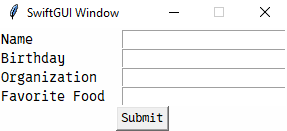

# Custom combined elements
When using SwiftGUI regularely, you will notice that you implement the same "layout-parts" over and over again.

Combined elements give you a way to implement these layout-parts once, to use over and over again.

This tutorial teaches you how to easily create combined elements.

## What is a combined element?
It's an element that contains multiple "inner" elements.

E.g.: `sg.Form` contains multiple `sg.Label`, `sg.Button` and `sg.Input` elements.
This is a single combined element:\

```py
layout = [
    [
        sg.Form(
            ("Name", "Birthday", "Organization", "Favorite Food"),
            key = "Form",
            submit_button= True,
            big_clear_button= True,
        )
    ]
]
```
`sg.Form` combines all of these smaller elements into a single big one.

It also offers builtin functionality, like the clear-button, which clears all inputs.

There is (or will be) a tutorial on `sg.Form`, check it out if you want to learn more.

I highly encourage you showing off your combined elements in the [GitHub forum](https://github.com/CheesecakeTV/SwiftGUI/discussions/7#discussion-8484735).
I'd love to include your element in the SwiftGUI package, if it is useful.

# Even simpler: Layout-template-functions
If you just want to copy a part of your layout (with minor modifications), you don't need to create a combined element.

Instead, create a function that returns said element:
```py
import SwiftGUI as sg

def row(text):
    return [
        sg.T(
            text,
            width= 15,
            anchor= "w",
        ),
        sg.Input(key=text)
    ]

layout = [
    row("Name"),
    row("Birthday"),
    row("Organization"),
    row("Favorite Food"),
    [
        sg.Button("Submit", key="Submit")
    ]
]

w = sg.Window(layout)

for e,v in w:
    ...
```


To create multiple rows at once, return all rows as a list and add a `*` in front of the function:
```py
def form(texts):
    _return = []

    for text_now in texts:  # Add the rows one-by-one
        _return.append([
            sg.T(   # Same elements as before
                text_now,
                width= 15,
                anchor= "w",
            ),
            sg.Input(key=text_now)
        ])

    return _return

layout = [
    *form(["Name", "Birthday", "Organization", "Favorite Food"]),   # Notice the * before the function-call
    [
        sg.Button("Submit", key="Submit")
    ]
]
```
Of course, I'd never include anything like that in SwiftGUI.
It's quick and dirty, but therefore perfect for quick and dirty layouts.

## Disadvantage of template-functions
As you can see, every `sg.Input` gets its own key, meaning the value-dict (From `for e,v in w`) will become crowded.

Also, if you'd want to use the template again, using the same texts, the value-dict will only contain one of each value.
You'd have no chance to retrieve the value of both templates.

Sure, you can work around that, there are workarounds for everything in Python, but that wouldn't be "quick and dirty", just "dirty".

In contrast, `sg.Form` collects all values of its inputs and saves them to a single key as a dictionary.

Another big disadvantage is how hard it is to add/modify functionality.
This will become aparrent later.

# How to create combined elements
To do anything useful, you need to know how to use key-functions (not so much anymore since SwiftGUI version 0.8.0).
Check it out in the basic tutorials first.

Combined elements are a little more complicated than template-functions, but nothing too bad.

Let's recreate a basic version of `sg.Form` as an example.

## First step
Start by copying the template also found in `Examples/Advanced tutorials/CombinedElementTemplate.py`:
```py
from typing import Any, Callable, Iterable, Self
import SwiftGUI as sg


class Example(sg.BaseCombinedElement):
    defaults = sg.GlobalOptions.DEFAULT_OPTIONS_CLASS   # Change this to attach your own GlobalOption-class to the element

    def __init__(
            self,
            key: Any = None,
            key_function: Callable | Iterable[Callable] = None,
            apply_parent_background_color: bool = None,
    ):
        self._layout = [    # Put the containing layout here

        ]

        super().__init__(
            frame= sg.Frame(self._layout),   # You can use any kind of Frame, e.g. LabelFrame
            key= key,
            key_function= key_function,
            apply_parent_background_color= apply_parent_background_color,
        )

        self._update_initial(
            # Put all of your options in here
        )

    def _event_loop(self, e: Any, v: dict):
        """An event-loop just for this element. Use self.w to refer to keys inside this element."""
        ...

    def _get_value(self) -> Any:
        """Returns the value (self.value) of this element"""
        return super()._get_value()

    def set_value(self,val: Any):
        """Changes the value of this element (self.value = val)"""
        super().set_value(val)

    def init_window_creation_done(self) -> Self:
        """Runs once, after the window was created"""
        super().init_window_creation_done() # Don't forget this call, very important!
        return self

    def _update_special_key(self,key:str,new_val:any) -> bool|None:
        """
        When calling .update, this method gets called first.
        If it returns anything truethy (like True), execution of .update ends for this key.

        Otherwise, ._update_default_keys gets called for the key.

        In combined elements, you'll most likely only use ._update_special_key, but knock yourself out.
        """
        match key:
            case _: # No other case covered this key, so let's let's the parent-class handle the rest
                return super()._update_special_key(key, new_val)

        return True # Key was covered by match, so don't pass it to _update_default_keys

    def _update_default_keys(self,kwargs):
        """
        Standard-Update method for all those keys that didn't get picked by the special method
        :param kwargs:
        :return:
        """
        super()._update_default_keys(kwargs)

```
(Obviously) rename the class to your liking.

You don't have to allow the user to pass `key`, `key_function`, or `apply_parent_background_color`, but these are very common and handled entirely by the super-class.

## Creating the layout
As you can see, `super().__init__` requests an `sg.Frame` (or simmilar).
This frame becomes the actual element behind your combined element.

So let's fill up the frame with the layout-part used earlier:
```py
    def __init__(
            self,
            texts: list[str] = None,
            key: Any = None,
            key_function: Callable | Iterable[Callable] = None,
            apply_parent_background_color: bool = None,
    ):
        self._layout = []

        for text_now in texts:  # Add the rows one-by-one to the layout
            self._layout.append([
                sg.T(  # Same elements as before
                    text_now,
                    width=15,
                    anchor="w",
                ),
                sg.Input(

                ),
            ])

        self._layout.append(    # Add the last row
            [
                sg.Button("Clear")
            ]
        )

        super().__init__(
            frame=sg.Frame(self._layout),  # You can use any kind of Frame, e.g. LabelFrame or GridFrame
            key=key,
            key_function=key_function,
            apply_parent_background_color=apply_parent_background_color,
        )
```
You can already use it in your layout:
```py
layout = [
    [
        Example(
            texts = ["Name", "Birthday", "Organization", "Favorite Food"]
        )
    ]
]

w = sg.Window(layout)

for e,v in w:
    ...
```
\
...but it won't do anything yet.

## Key and key_function (Events)
If you passed a key to `super().__init__`, the key gets automatically registered into the window.

That means, `w[key]` returns the `Example`-Element.

If `None` is passed as a key, it will be ignored.
So that already works like every other element.

If provided, the key-functions register too.

However, since there is no way of "naturally" generating an event through a "fake" element, you can use `self.throw_event()` instead.

The thrown event works just like any other event.
If you provided a key, the event gets thrown to the event-loop.
If you provided key-functions, they will be executed.

## Inner key-management
Since SwiftGUI version 0.8.0, combined elements have their own internal key-management and event-loop.
The system itself is pretty complex, but due to SwiftGUIs magic it is very easy to use.
My fingers bled so yours don't have to.

Every key of the internal layout is not registered to the actual window, but the sub-layout inside the element.

What does that mean?

If elements inside the combined element have a key, `w[key]` won't work.
Also, no event of that element runs through the main event-loop.

Instead, the combined element gets its own "private window" and "private event-loop".

This way, you can use that element multiple times without any key-conflicts.

Example.

Let's assign keys to the `sg.Input`-elements, so we can read the inputs.
We'll also assign a key to the button, so it can throw a keyed-event.

Instead of the main event-loop, we need to use the internal event-method:
```py
    def __init__(
            self,
            texts: list[str] = None,
            key: Any = None,
            key_function: Callable | Iterable[Callable] = None,
            apply_parent_background_color: bool = None,
    ):
        self._layout = []

        for text_now in texts:  # Add the rows one-by-one to the layout
            self._layout.append([
                sg.T(  # Same elements as before
                    text_now,
                    width=15,
                    anchor="w",
                ),
                sg.Input(
                    key= text_now,
                    default_event= True,
                ),
            ])

        self._layout.append(    # Add the last row
            [
                sg.Button("Clear", key= "Clear")
            ]
        )

        super().__init__(
            frame=sg.Frame(self._layout),  # You can use any kind of Frame, e.g. LabelFrame or GridFrame
            key=key,
            key_function=key_function,
            apply_parent_background_color=apply_parent_background_color,
        )

    def _event_loop(self, e: Any, v: dict):
        """An event-loop just for this element. Use self.w to refer to keys inside this element."""
        print(e, v) # Clear {'Organization': 'SwiftGUI', 'Name': 'Eric', 'Clear': 'Clear', 'Birthday': '', 'Favorite Food': ''}
```
When the `clear`-button is clicked, `_event_loop` is called simmilar to the main-loop doing one iteration.

As you can see, the value-dict `v` only contains the elements inside the combined element.

To access elements by their key, use `self.w[key]` instead of `w[key]`.

## "Linking" events to the main loop
To make the element throw an event, `.throw_event` has to be called.

An easy way to do that is to add it as a key-function to the actual event:
```py
...
    sg.Input(
        key_function= self.throw_event,  # call self.throw_event when the default-event occurs
        default_event= True,
    ),
...
```
Now, changing the text of any of the input-elements will call the defined event of your combined element.

Let's try it out:
```py
layout = [
    [
        Example(
            texts = ["Name", "Birthday", "Organization", "Favorite Food"],
            key = "Form"
        )
    ]
]

w = sg.Window(layout)

for e,v in w:
    print(e)    # Form
    print(v)    # {'Form': None}    # Something else is returned with SwiftGUI version 0.8.0+
    print() # Empty line
```
As you can see, the key `Form` is inside the value-dict, but has no value (yet). (As of SwiftGUI version 0.8.0, the value will be the value-dict of the combined element instead.)

This makes sence, how would Python know, which value of which element to use?

## Defining .value
### Getting the value
The next step is to define what `.value` should return.
This attribute (property) is also used by the value-dict of the main-loop.

Just overwrite `._get_value()` and the SwiftGUI's magic will do the rest:
```py
    def _get_value(self) -> any:
        """Returns the value (self.value) of this element"""
        return "My value"
```
```py
layout = [
    [
        Example(
            texts = ["Name", "Birthday", "Organization", "Favorite Food"],
            key = "Form"
        )
    ]
]

w = sg.Window(layout)

for e,v in w:
    print(e)    # Form
    print(v)    # {'Form': 'My value'}
    print() # Empty line
```
Of course, it makes no sence to return `My value` every time.
An actually useful implementation could be this one:
```py
    def _get_value(self) -> Any:
        """Returns the value (self.value) of this element"""
        _return = dict()

        for row in self._layout[:-1]:   # Every row but the last one
            _return[row[0].value] = row[1].value    # _return[value_of_text_element] = value_of_input_element
        return _return
```
When entering my name and fake-organization again:
```py
for e,v in w:
    print(e)    # Form
    print(v)    # {'Form': {'Name': 'Eric', 'Birthday': '', 'Organization': 'SwiftGUI', 'Favorite Food': ''}}
    print() # Empty line
```

### Setting the value
Most elements accept `elem.value = ...`.
However, this just calls `elem.set_value(...)`, which we can easily overwrite.

Just overwrite `set_value` so it does whatever you want to do when the value of that element should change.

This mechanism should be obvious by now, so I won't go into detail.
Feel free to check out the implementation of `sg.Form.set_value` for an example.

## Updating using .update()
This part explains how to properly integrate `.update(...)` into your combined element.
Sure, you could just overwrite it, but working with SwiftGUI is easier than working against it.

The whole SwiftGUI update-routine is quite complicated, but you only need to know a tiny part of it.

Let's explain that part by calling `someElement._update_initial(background_color = "red", text = "Hello World")` on some element, skipping unimportant steps.

**First**, the passed arguments are converted into a single dictionary called `kwargs`: `{"background_color": "red", "text": "Hello World"}`.

**Next**, the defined global options are applied to every kwargs-key with the value `None`.
More on that later.

**Next**, `someElement._update_special_key(key, value)` is called for every kwargs-item, one by one.

That means, in this case, the following calls are made:
- `someElement._update_special_key("background_color", "red")`
- `someElement._update_special_key("text", "Hello World")`

**If any call returns True, the associated key is removed from `kwargs`!**
That means, you will use this method to "pick out" any keys that require special treatment.

Let's say, only the call for `"background_color"` returned `True`.
That key is dropped, so `kwargs` looks like this now: `{"text": "Hello World"}`.

**Next**, `someElement._update_default_keys(kwargs)` is called with the remaining kwargs.

**The difference between `.update` and `._update_initial` is that `.update` ignores `None`-values.**
If it would be the same method, you couldn't annotate `.update` properly.

Consider this example:
```py
def .update(background_color = None, text_color = None):
    super().update(background_color = background_color, text_color = text_color)
```
If `.update` acted like `._update_initial` and the user called `.update(text_color = "red")`, `background_color` would be reset to the default/GlobalOptions-value, because its passed value is `None`.

That means, you should call `._update_initial` in `__init__` and `.update` anywhere else.
An example to this is shown later.

In reality, `.update` removes everything `None` and calls `._update_initial` with all the remaining options.

### Good practice for ._update_special_key
This method usually looks something like this:
```py
    def _update_special_key(self, key:str, new_val:Any) -> bool|None:
        match key:
            case "background_color":    # Pick out key
                # Do what you must with that key
                self._sg_widget.update(background_color = new_val)
            case _:
                # The key wasn't found in any other case
                return super()._update_special_key(key, new_val)    # Look in the parent-class

        # The key was found in match-case
        return True
```
It makes it very convenient to "pick out" keys.
Just add a case and the method returns `True` for that key.

### Adding global options
You can attach your own global-options-class by setting `defaults = yourClass` (It is included in the template).

There is a dedicated tutorial on how to create global-options-classes, so I won't go into detail.


### Calling .update before the window is created
The element doesn't actually get created in `.__init__`, but when the window is initialized (`w = sg.Window(...)`).
Sooner or later, you will stumble upon an error in `.update`, because you are trying to do something that needs a finished element.

Instead of `.update`, you could call `someElement.update_after_window_creation(**kwargs)` instead.
This method stores the `.update`-call and "re-calls" it when the window is done.

To test if the window exists from within the element-class, it's easiest to call `hasattr(self, "window")`.

E.g.: You want to update `"background_color"` only if the window exists:
```py
    def _update_special_key(self, key:str, new_val:any) -> bool|None:
        match key:
            case "background_color":    # Pick out key
                if not hasattr(self, "window"):
                    self.update_after_window_creation(background_color = new_val) # Call it later
                    return True # Stop execution for this key

                self._sg_widget.update(background_color = new_val)
            case _:
                # The key wasn't found in any other case
                return super()._update_special_key(key, new_val)    # Look in the parent-class

        # The key was found in match-case
        return True
```

For default-keys it could look something like this:
```py
    def _update_default_keys(self,kwargs):
        if not hasattr(self, "window"):
            self.update_after_window_creation(**kwargs)
        
        super()._update_default_keys(kwargs)
        
        # Actual update
        ...
```

### Single-time actions once the window exists
When the window was created, `init_window_creation_done` is called on every single element.

When this method gets called, you can be sure that all other elements exist.

Use (overwrite) this method for one-time-calls that require other elements to exist.

## Good practice for init
If you can pass a parameter to `__init__` of an element, you can usually pass that option to `.update` too.

That's why all configurations that are safe to change later should be handled by `.update` and only be called in `__init__`.

As an example, here is `__init__` of `sg.Frame`:
```py
    def __init__(
            self,
            layout: Iterable[Iterable[BaseElement]],
            /,
            key: str = None,
            alignment: Literals.alignment = None,
            expand: bool = False,
            expand_y: bool = False,
            background_color: str | Color = None,
            apply_parent_background_color: bool = None,
            pass_down_background_color: bool = None,
            borderwidth: int = None,
            cursor: Literals.cursor = None,
            highlightbackground_color: Color | str = None,
            highlightcolor: Color | str = None,
            highlightthickness: int = None,

            padx: int = None,
            pady: int = None,

            relief: Literals.relief = None,

            takefocus: bool = None,

            # Add here
            tk_kwargs: dict[str:any]=None,
    ):
        super().__init__(key=key, tk_kwargs=tk_kwargs, expand_y=expand_y)

        self._contains = layout
        self._linked_background_elements = list()

        if background_color and not apply_parent_background_color:
            apply_parent_background_color = False

        if tk_kwargs is None:
            tk_kwargs = dict()

        self._update_initial(    # All of those options can be changed using .update
            background_color = background_color,
            apply_parent_background_color = apply_parent_background_color,
            pass_down_background_color = pass_down_background_color,
            borderwidth = borderwidth,
            cursor = cursor,
            highlightbackground_color = highlightbackground_color,
            highlightcolor = highlightcolor,
            highlightthickness = highlightthickness,

            padx = padx,
            pady = pady,

            relief = relief,

            takefocus = takefocus,

            **tk_kwargs
        )

        self._insert_kwargs["expand"] = self.defaults.single("expand",expand)

        self._insert_kwargs_rows.update({
            "side":self.defaults.single("alignment",alignment),
        })
```
As you can see, most of the parameters just get passed on to `._update_initial`.

## Additional functionality
As you might have guessed, you can add more methods to `Example` to add some more/higher functionality.

Let's add a simple method to clear (empty) every input-element:
```py
    def clear_input_elements(self):
        for row in self._layout[:-1]:   # Not the last row, it contains buttons
            row[1].value = ""   # row[1] is the input of that row
```

We can even add this method as a key-function to the `clear`-button:
```py
    self._layout.append(
        [
            sg.Button("Clear", key_function= self.clear_input_elements)
        ]
    )
```
Now, clicking `Clear`, actually clears the inputs.

(As of SwiftGUI version 0.8.0, you can do this in the dedicated event-loop as explained earlier.)

### Running methods before the window was created
Methods that modify the elements inside the combined element might throw an error when called too early (before the window exists).

The solution: Saving/Buffering the method-call and "re-calling" it once the window is created.

Of course, SwiftGUI's magic offers a very easy way to do that:
```py
    @BaseCombinedElement._run_after_window_creation
    def clear_input_elements(self):
        for row in self._layout[:-1]:   # Not the last row, it contains buttons
            row[1].value = ""
```
Done. 

`clear_input_elements` can still be called before the window exists, but it actually runs afterwards.

Before the window exists, this method **always returns `self`**, independent of the actual return.

That way, you can "stack" the calls:
```py
myElement.clear_input_elements().do_something_else()
```

In SwiftGUI, most methods that "only do something, but don't return anything", return `self` instead.


# Conclusion
I hope you understand the significance of combined elements, especially in bigger layouts.

Combined elements can save a lot of time and make your code much more elegant.

With SwiftGUI version 0.8.0, creating combined elements can be done without much knowledge of key-functions and therefore is very easy.

As stated in the beginning, feel free to show off your combined elements in the [GitHub forum](https://github.com/CheesecakeTV/SwiftGUI/discussions/7#discussion-8484735), I'd love to take a look.

