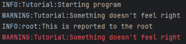

# Logging
I wasted too much time of my life not using python-logging, don't do the same.

Proper logging (especially crash-logging) is essential when writing programs people other than you are supposed to use.
If grandma manages to crash your program, I bet she won't be able to tell you how she did it exactly.

Additionally, logging while developing/testing programs can help you find bugs you didn't even know existed.
It also means, you don't need to place print-statements everywhere they are already there.

The best part: Simple Python-logging is very easy, but you can do more complicated things with it if you want.

This tutorial covers the very basics of the builtin `logging`-Module and also shows you how to set up crash-log-files using `SwiftGUI-Logging`.

# Basics of Python-logging
This is independent of SwiftGUI and can be used everywhere.

Reports (entries in a log) are essentially fancy print-statements.
You put a text in them and they are passed onto Python's magic.

Each report has a so-called log-level, which tells you (or Python) how important that report is:
- `debug`: Message only important for debugging (e.g. element-value changed)
- `info`: Good to know (e.g. new window opened)
- `warning`: Something that might cause a problem (e.g. a key was used multiple times)
- `error`: Something went wrong (e.g. an exception occurred)
- `critical`: A serious error. The program is unable to function correctly (e.g. an exception was unhandled and therefore crashed the program)

Create a report by calling its log-level directly on the logging-module:
```py
import logging

logging.info("Starting program")
logging.warning("Something doesn't feel right")
```
Running the script, you'll get this console output (written in red):
```bash
WARNING:root:Something doesn't feel right
```
Strangely, only the warning was printed to the console.

That's because by default, only warnings and higher levels are printed to the console.

## Basic configuration
To get all messages, create a "basic configuration" like so:
```py
import logging

logging.basicConfig(level=logging.DEBUG)

logging.info("Starting program")
logging.warning("Something doesn't feel right")
```
`level=logging.DEBUG` means that log-level `debug` and all levels above are printed to the console:
```bash
INFO:root:Starting program
WARNING:root:Something doesn't feel right
```

## Different loggers
To divide up your logs better, `logging` lets you create different "loggers".
By default, reports go on the `root`-logger, which explains the `:root:` in the above example.

It's a good idea to use different loggers for different parts of your program:
```py
import logging

logging.basicConfig(level=logging.DEBUG)
my_logger = logging.getLogger("Tutorial")

my_logger.info("Starting program")
my_logger.warning("Something doesn't feel right")
logging.info("This is reported to the root")
```
```bash
INFO:Tutorial:Starting program
WARNING:Tutorial:Something doesn't feel right
INFO:root:This is reported to the root
```

SwiftGUI's main logger is called `SwiftGUI`.

## There is a lot more
And by "a lot", I mean a whooooooooole lot.
I barely scratched the surface.

The logging-structure is not particularly hard to understand, just a lot more complex than you think.

You can not only print logs to the console, you can also save them to a file, or even send them via mail (there are like 10 other "handlers").

Any you can create filters to specify exactly which report to include.

So if you are like me and these boring topics are interesting to you, check out the documentation of the `logging`-module.

# SwiftGUI-Logging (Crashlogs)
**IMPORTANT: The following features work fine with normal Python-scripts.
However, they don't seem to work for programs converted to `.exe`-Files.
Keep that in mind.**

Since the following functionality is also useful without GUIs, `SwiftGUI_Logging` became its own package.
However, its intended use is still together with SwiftGUI.

If you installed SwiftGUI with pip, the SwiftGUI-logging-module should have been installed with it automatically.

The module doesn't do much, but it has one very useful feature: Creating crashlogs.

When people use my programs, I usually don't care what they do with it.
However, when the program crashes, I'm very interested in knowing what exactly they did.

That's why `SwiftGUI_Logging` lets you set up `logging` in a way that it only logs (to a file) when a crash occurs:
```py
import logging
import SwiftGUI_Logging as sgl

sgl.Configs.exceptions_to_file(filepath= "Logs/Crash.log") # Has to run before logging things

my_logger = logging.getLogger("Tutorial")

my_logger.info("Starting program")
my_logger.warning("Something doesn't feel right")
logging.info("This is reported to the root")
```
You'll notice that the directory `Logs` gets created, but nothing else happens.

However, when an exception occurs, a log-file is created:
```py
import logging
import SwiftGUI_Logging as sgl

sgl.Configs.exceptions_to_file(filepath= "Logs/Crash.log") # Has to run before logging things

my_logger = logging.getLogger("Tutorial")

my_logger.info("Starting program")
my_logger.warning("Something doesn't feel right")
logging.info("This is reported to the root")

1 / 0   # ZeroDivisionError
```
The file is called `Crash_2026-02-26_12-45-03.log` (located in the new directory `Logs`) and contains the following:
```log
2026-02-26 12:45:03,773 - Tutorial - INFO - Starting program
2026-02-26 12:45:03,773 - Tutorial - WARNING - Something doesn't feel right
2026-02-26 12:45:03,773 - root - INFO - This is reported to the root
2026-02-26 12:45:03,780 - root - ERROR - Traceback (most recent call last):
  File "C:\Users\cheese\PycharmProjects\SwiftGUI\tests\tutorial.py", line 12, in <module>
    1 / 0   # ZeroDivisionError
    ~~^~~
ZeroDivisionError: division by zero
```
As you can see, all recent log-entries and the full traceback are included.

The function also "triggers" a log if anything with a log-level of error or above is reported:
```py
import logging
import SwiftGUI_Logging as sgl

sgl.Configs.exceptions_to_file(filepath= "Logs/Crash.log") # Has to run before logging things

my_logger = logging.getLogger("Tutorial")

my_logger.info("Starting program")
my_logger.warning("Something doesn't feel right")
logging.info("This is reported to the root")

my_logger.critical("CREATE LOGFILE RIGHT NOW!!!")
```

The function has other parameters, I suggest checking out its docstring.

## Important!
This method has one big disadvantage, which I wasn't able to avoid (yet):
The configuration of the root-logger is overwritten.

With no additional configuration, warnings/errors/critical entries aren't printed to the console anymore.

The function overwrites the log-level to include all reports, which is why doing a basic configuration before will cause all reports to be printed to the console:
```py
import logging
import SwiftGUI_Logging as sgl

logging.basicConfig(level=logging.WARNING)  # Level should be warning
sgl.Configs.exceptions_to_file(filepath= "Logs/Crash.log")

my_logger = logging.getLogger("Tutorial")

my_logger.info("Starting program")  # This gets printed (bad)
my_logger.warning("Something doesn't feel right") # This gets printed (Good)
logging.info("This is reported to the root") # This gets printed (bad)
```

A good workaround is to overwrite the loglevel manually.
You don't need to understand this code, just copy and paste it:
```py
logging.basicConfig()
logging.getLogger().handlers[0].setLevel(logging.WARNING)   # Set your the log-level for the console here
sgl.Configs.exceptions_to_file(filepath= "Logs/Crash.log") 
```

## Further improvements
(This chapter reads a lot easier if you already know the basics of `logging`)

The prior configuration works well, but only displays warnings.

Of course, you could just change the level to `logging.DEBUG`:
```py
logging.basicConfig()
logging.getLogger().handlers[0].setLevel(logging.DEBUG)   # Set your the log-level for the console here
sgl.Configs.exceptions_to_file(filepath= "Logs/Crash.log") 
```
However, now all messages are displayed red again.

Instead, you need to add an additional "handler" that outputs to the console in normal, white text (`sys.stdout`):
```py
import logging
import sys
import SwiftGUI_Logging as sgl

logging.basicConfig()
default_handler = logging.getLogger().handlers[0]
default_handler.setLevel(logging.WARNING)   # Level of red text

sgl.Configs.exceptions_to_file(filepath= "Logs/Crash.log")

new_handler = logging.StreamHandler(sys.stdout) # Create the new handler
new_handler.setLevel(logging.DEBUG) # Level of white text
new_handler.setFormatter(default_handler.formatter) # Use the format of the default handler
logging.getLogger().addHandler(new_handler) # Add the handler to the root-logger

# Test-logs
my_logger = logging.getLogger("Tutorial")

my_logger.info("Starting program")
my_logger.warning("Something doesn't feel right")
logging.info("This is reported to the root")
```
One small hiccup: Now red messages are also printed in white:\


That could be avoided, but let's not overdo it.

## Different program-entry-points (Recommended)
This is all a bit too much effort in my opinion.

My preferred way to handle this is to create multiple program-entry-points:
One for me when programming and another one for users.

This way, you don't need to mix two different logging-configurations.
Instead of making one big configuration, you can make two smaller, less complicated ones.

There is an application note on program-entry-points.

# Conclusion
Long story short, SwiftGUI is compatible with the builtin `logging`-module.
Feel free to use it as complicated as you like.

You can easily create crashlogs (to files for now) using `SwiftGUI_Logging`.


