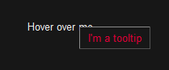
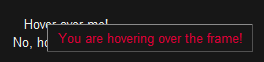
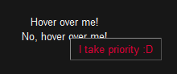
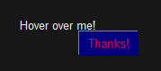
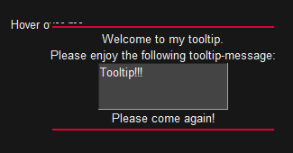

Written for SwiftGUI 0.11.20

# Tooltips
Since SwiftGUI version 0.11.20, it is possible to create tooltips.

Tooltips are those texts popping up when you hold your mouse over an element for some time:\


The tooltip will disappear if the mouse is moved away from the element.

# Basic usage
Creating tooltips is as simple as it gets.

Just call `.set_tooltip` on the element when creating it:
```py
layout = [
    [
        sg.T(
            "Hover over me",
        ).set_tooltip("I'm a tooltip")
    ]
]
```

## Frames
You may also add tooltips to frames.

That way, every contained element will show that tooltip.

If an element inside a "tooltipped" frame also has a tooltip, the inner one shows over that element:
```py
inner_layout = [
    [
        sg.T(
            "Hover over me!",
        )
    ],[
        sg.T(
            "No, hover over me!"
        ).set_tooltip(
            "I take priority :D"
        )
    ]
]

layout = [
    [
        sg.Frame(inner_layout).set_tooltip("You are hovering over the frame!")
    ]
]
```
\


Same with combined elements.

# Customization
## Colors / Look
Customize tooltips by modifying the global options `sg.GlobalOptions.Tooltip`:
```py
sg.Themes.FourColors.TransgressionTown()
sg.GlobalOptions.Tooltip.background_color = "navy"

layout = [
    [
        sg.T(
            "Hover over me!"
        ).set_tooltip(
            "Thanks!"
        )
    ]
]
```


Most options of `sg.Text` can be modified through that go-class.

Right now, there is no way of customizing only a single tooltip, all of them look the same for all elements.

## Delay
You may specify how long it takes until a tooltip opens by setting `sg.Tooltips.tooltip_open_delay` to your desired delay (in seconds):
```py
sg.Tooltips.tooltip_open_delay = 0.1
```

# Overwriting the tooltip-class
The tooltip is actually a popup, deriving from `sg.BasePopupNonblocking`.

You can create your own popup and set it as the tooltip one by calling `sg.Tooltips.set_tooltip_callable(YourPopup)`.

When opened, the tooltip-text is passed to the popup, so make sure that the first parameter of your `__init__` is the text.

If you just want to change the layout of the tooltip-popup, it's best to derive from `sg.Popups.TooltipPopup`.
Then, you can overwrite `_create_layout` to specify your own layout:
```py
class CustomTooltip(sg.Popups.TooltipPopup):

    # Overwriting the method
    def _create_layout(self, tooltip_text: str) -> list[list[sg.BaseElement]]:
        return [
            [
                sg.HSep()
            ], [
                sg.T("Welcome to my tooltip.")
            ],[
                sg.T("Please enjoy the following tooltip-message:")
            ],[
                sg.TextField(   # Let's include the actual tooltip-text here
                    tooltip_text,
                    readonly=True,
                    width=20,
                    height=3,
                )
            ],[
                sg.T("Please come again!")
            ], [
                sg.HSep()
            ]
        ]


sg.Tooltips.set_tooltip_callable(CustomTooltip) # Specify your own popup as the tooltip-popup

layout = [
    [
        sg.Text(
            "Hover over me"
        ).set_tooltip(
            "Tooltip!!!"
        )
    ]
]
```



