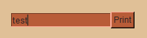

# Combining events under a single key
SwiftGUI does not forbid the "duplication" of keys.
Multiple elements and events can have the same key, even if they are in the same key-handler (window).

This opens up some possibilities and some challenges.

# Motivation
Probably the most useful application of duplicated keys is to trigger the same functionality through different events.

Example:
An `sg.Input` next to a `sg.Button`.
When the button is pressed, something should happen.
However, when the user presses `enter` inside the input-element, that same thing should also happen.

This is how you could do it without key-duplication:
```py
import SwiftGUI as sg

sg.Themes.FourColors.PumpkinSpice()

layout = [
    [
        sg.Input(
            key= "Input"
        ).bind_event(   # "Enter-press-event"
            sg.Event.KeyEnter,
            key= "Enter"
        ),
        sg.Button(  # Normal button-event
            "Print",
            key= "Print"
        )
    ]
]

w = sg.Window(layout, padx=30, pady=30)

for e, v in w:
    if e in ["Print", "Enter"]: # "Print" or "Enter"
        print("Input:", v["Input"])
```


Since `Print` and `Enter` should do the same thing every time, we can "combine" these keys.

Here the example using key-duplication:
```py
layout = [
    [
        sg.Input(
            key= "Input"
        ).bind_event(
            sg.Event.KeyEnter,
            key= "Print"    # Same key as the button
        ),
        sg.Button(
            "Print",
            key= "Print"
        )
    ]
]

w = sg.Window(layout, padx=30, pady=30)

for e, v in w:
    if e == "Print":    # only one key now
        print("Input:", v["Input"])
```
The only disadvantage of this application is that the event's are indistinguishable now.

# Elements with the same key
You shouldn't use elements with the same key.

If you do, SwiftGUI even prints a warning to the console.
Disable that warning by setting `sg.Debug.enable_key_warnings = False`.

Let's use this example as a base going further:
```py
import SwiftGUI as sg

sg.Themes.FourColors.PumpkinSpice()
sg.Debug.enable_key_warnings = False

layout = [
    [
        sg.Input(
            key= "Print",
            default_event= True,
        ),
        sg.Button(
            "Print",
            key= "Print"
        )
    ]
]

w = sg.Window(layout, padx=30, pady=30)

for e,v in w:
    if e == "Print":    # only one key now
        print("Do something")
```
Note that both elements have the same key.

## Accessing elements
The window works simmilar to a dictionary.
If you define the same key twice, the second definition overwrites the first one.

That's why `w[key]` only references the last element created with that key.
Same goes for `v[key]`.

So, in the above example, `w["Print"]` always returns the button, never the input.

There is no (good) way of getting the value from the input other than referencing it from another variable:
```py
import SwiftGUI as sg

sg.Themes.FourColors.PumpkinSpice()
sg.Debug.enable_key_warnings = False

layout = [
    [
        my_input := sg.Input(   # Create the reference manually
            key= "Print",
            default_event= True,
        ),
        sg.Button(
            "Print",
            key= "Print"
        )
    ]
]

w = sg.Window(layout, padx=30, pady=30)

for e,v in w:
    if e == "Print":    # only one key now
        print("Input:", my_input.value)
```

## Key-duplication with intact references
There is a somewhat-strange way of avoiding the previously mentioned problem, but I personally wouldn't use it.

You can throw an event under the duplicated key manually by utilizing key-functions:
```py
layout = [
    [
        sg.Input(
            key= "Input",   # The actual key is "Input"
            default_event= True,
            key_function= lambda w: w.throw_event(key= "Print"),  # But it also throws "Print"
        ),
        sg.Button(
            "Print",
            key= "Print"
        )
    ]
]

w = sg.Window(layout, padx=30, pady=30)

for e,v in w:
    if e == "Print":    # only one key now
        print("Input:", v["Input"])
```
Now, `Input` and `Print` are thrown when the input changes.
Two events are caused.
The input-element is still accessible through `w["Input"]` and `v["Input"]`.

Keep in mind that `w` inside the key-function always refers to the input's key-handler.
So placing this layout inside e.g. a sub-window, that sub-window receives the event, not the main window.


