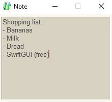

# Simple note
This very simple program lets you create and edit a note.

Write something in the note, when you close the window, it gets saved.



I will publish an example of this program in every "difficulty-level".

# Full code
Written in SwiftGUI version 0.8.4.
```py
import SwiftGUI as sg

_filename = "note.txt"  # Where the note is saved

sg.Themes.FourColors.IvoryTerracotta()  # Use a different theme, as you please

note_text = ""
try:
    with open(_filename, "r") as f: # Load the note
        note_text = f.read()
except FileNotFoundError:   # First time using the program
    pass

layout = [
    [
        sg.TextField(   # Multiline-input-element
            note_text,
            key= "TF",
            default_event= True,    # Text-changes should cause an event
            width= 30,
            height= 10,
        )
    ]
]

w = sg.Window(layout, title="Note", keep_on_top=True)   # Keep the window on top, so it doesn't always hide behind other windows

for e,v in w:
    #print(e,v)

    if e == "TF":   # We need to read the field every time it is changed, otherwise the value is gone when the window closes
        note_text = v[e]

# The window is closed at this point

with open(_filename, "w") as f: # Save the note
    f.write(note_text)
```