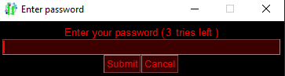

# Simple Password query
This is a simple password-protection for your programs.

The user has x tries to enter the correct password, or the program exits.



To submit the password, the user may click "Submit", or press enter.

# Full code
Written in SwiftGUI version 0.10.7:
```py
import SwiftGUI as sg

_CorrectPassword = "1234"   # This is what the user should enter
_NumTries = 3   # How many tries the user should have

sg.Themes.FourColors.NeonRed()  # Make it look good

layout = [
    [
        sg.T("Enter your password ("),
        sg.T(   # This will show how many tries are left
            str(_NumTries),
            key="NumTries"
        ),
        sg.T(" tries left )")
    ],[
        sg.Input(
            key= "In",
            pass_char= "*", # Hide the characters
            width= 50,
        ).bind_event(   # Pressing enter should also submit the password
            sg.Event.KeyEnter,
            key= "Submit"   # Same key as the Submit-key
        ),
    ],[
        sg.Button(
            "Submit",
            key= "Submit",
        ),
        sg.Button(
            "Cancel",
            key_function= exit  # Call exit() when pressed
        )
    ]
]

w = sg.Window(layout, title= "Enter password", padx= 5, pady= 5)
w["In"].set_focus() # This way, the input-element is selected from the start

for e,v  in w:

    entry = v["In"]  # Get what the user wrote

    if e == "Submit" and entry:   # Submit was pressed, or "enter" inside the text-box, AND the user actually entered something

        if entry == _CorrectPassword:
            w.close()
            print("Correct password!")  # Call your main program here

        else:
            _NumTries -= 1
            if _NumTries == 0:
                print("Too many wrong tries, self destruction imminent")
                exit()

            v["NumTries"] = str(_NumTries)  # Refresh numbers of tries
            v["In"] = ""    # Clear the input
```

