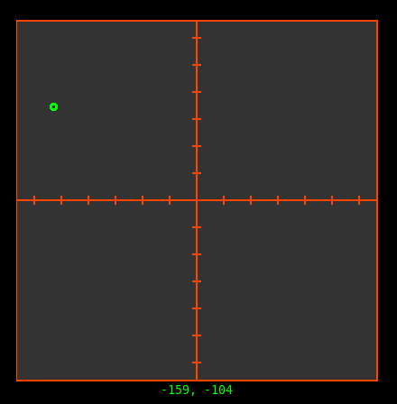

# Coordinate picker
This example lets you pick coordinates on a 2d-grid.

It was meant to be a simple example for the canvas, but turned out a bit more complex.

The screenshot doesn't really cover what this can do, so just run the code and play around with it a bit:


Note that I would never implement it like this, I would create an extended element instead.
The code is written without implementing functions to make it understandable for python-beginners.

There are list-comprehensions, but only for "unimportant" concepts.

# Demonstrated concepts
- Basic usage of SwiftGUI
- Binding custom events
  - Chaining binding-calls
- Canvas
  - Coordinates
  - Moving elements
  - Hiding/Showing elements

# Full code
Written in SwiftGUI version 0.11.17.

```py
import SwiftGUI as sg
import SwiftGUI.Canvas_Elements as sgc

sg.Themes.Thematic.Hacker()

layout = [
    [
        canv := sg.Canvas(
            sgc.Rectangle((-200, 200), (200, -199)),    # Border around the canvas
            sgc.Line((-200, 0), (200, 0)),  # Coordinate lines
            sgc.Line((0, 200), (0, -200)),

            *[sgc.Line((x, -5), (x, 5)) for x in range(-180, 200, 30)], # These little lines on each coordinate line
            *[sgc.Line((-5, y), (5, y)) for y in range(-180, 200, 30)],

            selection_dot := sgc.Oval((-3, 3), (3, -3), color="lime", width=3), # Green dot indicating the selection
            line_x := sgc.Line((0, 50), (50, 50), color="lime", dash="-"),  # Horizontal green line
            line_y := sgc.Line((0, -50), (50, -50), color="lime", dash="-"),    # Vertical green line
            coords_text := sgc.Text((50, 50), anchor="nw", font_bold=True), # Text showing the current mouse-coordinates

            # Options applied to the canvas
            width=401,
            height=401,
            scrollregion=(-200, -200, 201, 201),    # This way, (0, 0) is in the center
            background_color=sg.Color.gray20,
            key="Canvas",
            default_event=True, # Click-event
        ).bind_event(   # Event-bindings. See the event-loop to know what happens when an event occurs
            sg.Event.MouseMove,
            key= "Move",
        ).bind_event(
            sg.Event.MouseHoldAndMoveLeft,
            key= "HoldMove",
        ).bind_event(
            sg.Event.MouseEnter,
            key= "Enter",
        ).bind_event(
            sg.Event.MouseExit,
            key= "Exit",
        ),
    ],[
        selection := sg.T("0, 0"),  # Text to show the selected coordinates
    ]
]

w = sg.Window(layout, padx=30, pady=30, title="Coordinate selector example")

anchor_x = ""
anchor_y = ""

for e, v in w:

    if e in ["Move", "HoldMove"]:   # Same as     if e == "Move" or "HoldMove":
        
        # Get the mouse-position relative to the canvas
        mouse_x, mouse_y = canv.get_mouse_position()

        # Move the ends of the line so it goes from the coordinate-line to the mouse
        line_x.update_coords((0, mouse_y), (mouse_x, mouse_y))
        line_y.update_coords((mouse_x, 0), (mouse_x, mouse_y))

        # Update the text that follows around the mouse
        coords_text.value = f"  {int(mouse_x)}, {int(mouse_y)} "

        # This code "moves" that text so it doesn't go beyond the canvas-border.
        if mouse_y > 50:
            anchor_y = "s"
        elif mouse_y < -50:
            anchor_y = "n"

        if mouse_x > 50:
            anchor_x = "e"
        elif mouse_x < -50:
            anchor_x = "w"

        anchor = anchor_y + anchor_x
        if anchor:
            coords_text.update(anchor=anchor)   # The moving is done by changing the text's anchor
        coords_text.update_coords((mouse_x, mouse_y))   # Move the anchor to the mouse

    # Mouse-button is clicked or held down
    if e in ["HoldMove", "Canvas"]:
        mouse_x, mouse_y = canv.get_mouse_position()
        selection.value = f"{int(mouse_x)}, {int(mouse_y)}"
        selection_dot.move_to_center(mouse_x, mouse_y)  # Move the dot to the mouse

    # When the mouse is outside the canvas, hide these elements
    if e == "Exit":
        coords_text.update(state="hidden")
        line_x.update(state="hidden")
        line_y.update(state="hidden")

    # When the mouse is above the canvas, show these elements again
    if e == "Enter":
        coords_text.update(state="normal")
        line_x.update(state="normal")
        line_y.update(state="normal")
```


