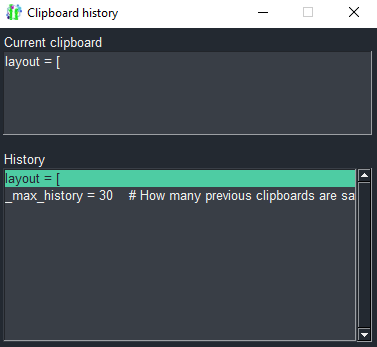

# Clipboard history
This program let's you see the last n clipboard-elements and recalls them if clicked:



When you copy something new, it will be added to the history.

Click an item in the history, to copy it to clipboard again.

# Full code
Written in SwiftGUI version 0.8.4.
```py
import SwiftGUI as sg

_max_characters = 150    # How many characters should be displayed maximum
_TextField_height = 5   # How many rows are shown in the text-field
_Listbox_height = 5     # How many rows the listbox has
_max_history = 30    # How many previous clipboards are saved

sg.Themes.FourColors.Emerald()  # Use a different theme, as you please

layout = [
    [
        sg.T("Current clipboard")
    ],[
        sg.TextField(
            key="CurrentCLP",
            width=_max_characters,  # This prevents the element from resizing itself
            height=_TextField_height,
            expand=True,    # Fill all the space it gets. Looks better.
            readonly=True,  # The user should not be allowed to enter anything here
        )
    ],[
        sg.Spacer(height=15),   # Some space, looks better
    ],[
        sg.T("History")
    ], [
        lb := sg.Listbox(
            key="History",
            default_event= True,    # When the user clicks on an item, this element should throw an event
            width=_max_characters,
        )
    ]
]

w = sg.Window(layout, title="Clipboard history", alignment="left")
sg.clipboard_observer(w, key="ClipboardChanged", throw_initial_value=True)  # Throws an event every time the clipboard changes

previous_clp = None # Clipboard previous loop

for e,v in w:
    #print(e,v)

    if e == "ClipboardChanged" and previous_clp != v[e]:    # previous_clp gets important later
        previous_clp = v[e] # Read the new clipboard from the observer

        try:    # Filter out images and such
            previous_clp  = str(previous_clp)
        except (ValueError, TypeError):  # This clipboard can't be converted to str, tragic...
            v["CurrentCLP"] = "Can't be converted to string..."
            continue

        if len(previous_clp) > _max_characters * 10:    # If something too long is copied, don't allow it or it might crash the application
            v["CurrentCLP"] = "Too many characters..."
            continue

        lb.delete_element(previous_clp) # If the clipboard-content is already in the listbox, remove it
        # This way, it looks as if the row moved to the top

        lb.append_front(previous_clp)   # Add the clp to the history-list
        lb.index = 0    # Select the first element
        v["CurrentCLP"] = previous_clp    # Display the current clp

        if len(lb.list_elements) > _max_history:    # History "full"
            del lb[-1]  # Delete oldest history-entry

    if e == "History":
        previous_clp = v["History"] # "ClipboardChanged" will trigger, so let's not treat this as something new
        v["CurrentCLP"] = previous_clp

        sg.clipboard_copy(previous_clp)
```


