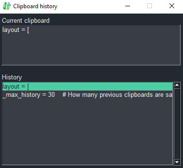

# Clipboard history
This program lets you see the last n clipboard-elements and recalls them if clicked:

\
(The image is not up to date)

When you copy something new, it will be added to the history.

Click an item in the history, to copy it to clipboard again.

# Demonstrated concepts
- Basic usage of SwiftGUI
- Binding custom events
- Working with listboxes
- Clipboard-observer

# Full code
Written in SwiftGUI version 0.8.4, updated to 0.11.4.
```py
import SwiftGUI as sg

_max_characters = 50    # How many characters should be displayed maximum
_TextField_height = 5   # How many rows are shown in the text-field
_Listbox_height = 5     # How many rows the listbox has
_max_history = 50    # How many previous clipboards are saved

sg.Themes.FourColors.Emerald()  # Use a different theme, as you please

layout = [
    [
        sg.T("Current clipboard")
    ],[
        sg.TextField(
            key="CurrentCLP",
            width=_max_characters,  # This prevents the element from resizing itself
            height=_TextField_height,
            expand=True,    # Fill all the space it gets. Looks better.
            readonly=True,  # The user should not be allowed to enter anything here
        )
    ],[
        sg.Spacer(height=15),   # Some space, looks better
    ],[
        sg.T("Copy this text (press enter):"),
    ], [
        sg.In(
            key="CopyText",
            expand=True,
        ).bind_event(
            sg.Event.KeyEnter,
        )
    ], [
        sg.Spacer(height=15),
    ], [
        sg.T("History")
    ], [
        lb := sg.Listbox(
            key="History",
            default_event= True,    # When the user clicks on an item, this element should throw an event
            width=_max_characters,
        )
    ]
]

w = sg.Window(
    layout,
    title="Clipboard history",
    alignment="left", # All elements should place themselves as far left as they can
    keep_on_top=True, # Don't hide this window behind other windows
)

sg.clipboard_observer(w, key="ClipboardChanged", throw_initial_value=True)  # Throws an event every time the clipboard changes

previous_clp = None # Clipboard previous loop

for e,v in w:
    #print(e,v)
    if e == "CopyText" and v["CopyText"]:   # If the user pressed enter (return) in the input and there is text in there
        sg.clipboard_copy(v["CopyText"])    # Copy the text
        v["CopyText"] = ""  # Empty the input-field

    if e == "ClipboardChanged" and previous_clp != v[e]:    # previous_clp gets important later
        previous_clp = v[e] # Read the new clipboard from the observer

        try:    # Filter out images and such, which can also be copied to clipboard
            previous_clp  = str(previous_clp)
        except (ValueError, TypeError):  # This clipboard can't be converted to str
            v["CurrentCLP"] = "Can't be converted to string..."
            continue    # Skip the rest

        if len(previous_clp) > _max_characters * 10:    # If something too long is copied, don't allow it or it might crash the application
            v["CurrentCLP"] = "Too many characters..."
            continue

        lb.delete_element(previous_clp) # If the clipboard-content is already in the listbox, remove it
        # This way, it looks as if the corresponding row moved to the top

        lb.append_front(previous_clp)   # Add the clp to the history-list
        lb.index = 0    # Select the first element
        v["CurrentCLP"] = previous_clp    # Display the current clp

        if len(lb.all_elements) > _max_history:    # History "full"
            del lb[-1]  # Delete oldest history-entry

    if e == "History":
        previous_clp = v["History"] # "ClipboardChanged" will trigger, so let's not treat this as something new
        v["CurrentCLP"] = previous_clp

        sg.clipboard_copy(previous_clp)
```


