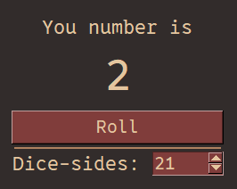

# Roll the dice
A little program that generates a random number.

When the program is closed, that number is saved in a file of the program-directory.

You can configure how many sides the "dice" has, which is also saved.



# Demonstrated concepts
- Basic usage of SwiftGUI
- File-System (DictFiles)
  - Working with a program-directory
  - Saving and loading
  - Setting default values
- `sg.Spinbox`
- Modifying global options

# Full code
Written in SwiftGUI version 0.11.0.
```py
import SwiftGUI as sg
from SwiftGUI.Files import root_path
import random

sg.Files.set_root("SwiftGUI Examples/Dice") # Create/Define the program directory
save_file = sg.Files.DictFileJSON(  # All values are stored in the same file this time
    root_path("Values.json"),   # Call it "Values.json" and put it in the root-folder
    defaults= { # If the values don't exist, return these instead
        "PrevNumber": "-",
        "Sides": 6,
    },
    auto_save= False,   # We only want to save manually (when the program closes), to improve performance
)

sg.Themes.FourColors.Maroon()   # Make it look good

sg.GlobalOptions.Common_Textual.fontsize = 16   # Make the text a little bigger
sg.GlobalOptions.Button.fontsize = 14   # The text on buttons should not be as big

layout = [
    [
        sg.T("You number is"),
    ],[
        sg.Spacer(height=10)
    ], [
        sg.T(
            save_file["PrevNumber"],    # Load the previous number from the file
            key= "Number",  # Give it a key to change the value later
            fontsize= 36
        ),
    ],[
        sg.Spacer(height=10)    # A little space between these lines
    ], [
        sg.Button("Roll", expand= True, key= "Roll")
    ], [
        sg.HSep(),
    ],[
        sg.T("Dice-sides: "),
        sg.Spinbox(
            number_min=2,
            number_max=100,
            default_value= int(save_file["Sides"]), # Load the parameter and convert it to int (else it could be float)
            key= "Sides",
            default_event=True, # Throw an event when this number changes
            value_type=int, # Restrict the user to only enter integers
            width=5,
        ),
    ]
]

w = sg.Window(layout, title= "Roll the dice!", padx=30, pady=30, grab_anywhere=True)


for e, v in w:

    if e == "Roll":
        v["Number"] = random.randint(1, v["Sides"]) # Generate a random number from 1 to v["Sides"] and display it in the text
        save_file["PrevNumber"] = v["Number"]   # Save that number to the file

    if e == "Sides":
        save_file["Sides"] = v["Sides"] # This parameter changed, so save it to the file

# Program closed, so let's save actually the file
save_file.save()
```


