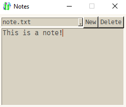

# Intermediate note
This simple program lets you create and edit notes.

Write something in the note, when you close the window, it gets saved.

I will publish an example of this program in every "difficulty-level".

This one is "intermediate", because it's quite a lot of code.

In contrast to the simple version, this version lets you manage multiple notes, create new ones, etc.



# Demonstrated concepts
- Basic usage of SwiftGUI
- Key-functions
- The event-loop
- sg.Combobox

# Full code
This code is written in SwiftGUI version 0.9.6, Python version 3.10.
```py
import SwiftGUI as sg
from pathlib import Path
import os

_foldername = "notes"  # Where the note is saved
_foldername = Path(_foldername)
_foldername.mkdir(exist_ok= True)   # Create the folder if it doesn't exist yet

all_filenames = list(os.listdir(_foldername))

if not all_filenames:
    (_foldername / "note.txt").write_text("New note")
    all_filenames.append("note.txt")

sg.Themes.FourColors.IvoryTerracotta()  # Use a different theme, as you please

note_text = ""
opened_file = all_filenames[0]

def load_file(name:str):
    global note_text, opened_file

    note_text = (_foldername / name).read_text()
    my_textfield.value = note_text
    my_combo.value = name
    opened_file = name

def save_file():
    (_foldername / opened_file).write_text(note_text)

def new_file(filename: str | None):
    if not filename:
        return

    filename += ".txt"
    if filename in all_filenames:
        save_file()
        load_file(filename)
        return

    save_file()
    (_foldername / filename).write_text("")
    all_filenames.append(filename)
    all_filenames.sort()
    my_combo.choices = all_filenames
    load_file(filename)

def del_file(filename: str | None):
    if not filename in all_filenames:   # Already non-existant
        return

    all_filenames.remove(filename)
    os.remove(_foldername / filename)

    if not all_filenames:
        all_filenames.append("note.txt")
        (_foldername / all_filenames[0]).write_text("")

    my_combo.choices = all_filenames
    load_file(all_filenames[0])

layout = [
    [
        my_combo := sg.Combobox(
            all_filenames,
            key= "File",
            expand= True,
            default_event= True,
        ),
        sg.Button(
            "New",
            key_function= lambda :new_file(sg.Popups.popup_get_text("Filename (without .txt):"))
        ),
        sg.Button(
            "Delete",
            key="Delete"
        )
    ],[
        my_textfield := sg.TextField(   # Multiline-input-element
            note_text,
            key= "TF",
            default_event= True,    # Text-changes should cause an event
            width= 30,
            height= 10,
        )
    ]
]

w = sg.Window(layout, title="Notes", keep_on_top=True)   # Keep the window on top, so it doesn't always hide behind other windows

load_file(all_filenames[0])

for e,v in w:

    if e == "File":
        save_file()
        load_file(v[e])

    if e == "TF":
        note_text = v[e]

    if e == "Delete" and sg.Popups.popup_yes_no(f"Delete {opened_file}?", title="Delete?"):
        del_file(opened_file)

save_file() # Save after window is closed
```
