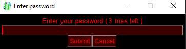

# Password query popup
This example converts "Simple Password query" to a popup that can be used much more flexible.

The example demonstrates how easy it is to create popups in SwiftGUI.

Any modifications have comments.
**Everything else is just a copy from the simple variant.**
If you are unsure on how uncommented parts work, refer to the simple example.

\
Looks the same as before.

# Full code
Written in SwiftGUI version 0.10.16:
```py
from typing import Hashable
import SwiftGUI as sg

sg.Themes.FourColors.NeonRed()

# Start by deriving a class from sg.BasePopup
class password_entry(sg.BasePopup):

    def __init__(
            self,
            correct_password: str,
            num_tries: int = 3,
    ):
        # Instead of global variables, take the configuration as parameters/arguments
        self._CorrectPassword = correct_password    # Very secure, I know
        self._NumTries = num_tries

        layout = [
            [
                sg.T("Enter your password ("),
                sg.T(
                    str(self._NumTries),    # Attribute instead of global variable
                    key="NumTries"
                ),
                sg.T(" tries left )")
            ],[
                sg.Input(
                    key= "In",
                    pass_char= "*",
                    width= 50,
                ).bind_event(
                    sg.Event.KeyEnter,
                    key= "Submit"
                ),
            ],[
                sg.Button(
                    "Submit",
                    key= "Submit",
                ),
                sg.Button(
                    "Cancel",
                    key_function= lambda w: w.close() # Close the popup instead of calling exit(). Makes it easier to use later.
                )
            ]
        ]

        # Create the window
        super().__init__(layout, title= "Enter password", padx= 5, pady= 5)
        # Remember that super().__init__ is roughly equivalent to w = sg.Window(...)

        self.w["In"].set_focus()

    # This replaces the event-loop for the popup
    def _event_loop(self, e: Hashable, v: sg.ValueDict):
        entry = v["In"]

        if e == "Submit" and entry:

            if entry == self._CorrectPassword:
                self.done(True) # "Return" True, meaning the query was successful

            else:
                self._NumTries -= 1 # Still an attribute instead of a global variable
                if self._NumTries == 0:
                    self.done(False)    # "Return" False, meaning the query was not successful
                    exit()

                v["NumTries"] = str(self._NumTries)
                v["In"] = ""

# Example on how to use this
if not password_entry("1234"):  # password_entry(...) returns either True, False, or None (when the user closes the window)
    print("You have no access!")
    exit()

# You only get here if the entry was correct before
print("Program is starting now...")
```


