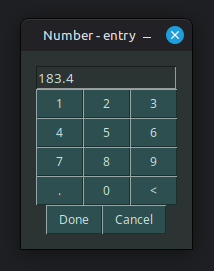

# Virtual numpad
For systems without a keyboard, like a raspberry pi with a sole touch-screen, it can be helpful to create virtual keyboard.

In this case, the keyboard is a popup.
The popup returns whatever the user typed in.

You may specify a default value, which is the value returned when the user cancels, or closes the window.
This way, you don't need to worry about accidently returning a string.

(This time on linux debian)\


# Demonstrated concepts
- Creating popups using `sg.BasePopup`
  - Returning values
- Using custom popups
- Element-template-functions
- Abstract usage of keys

# Full Code
Written in SwiftGUI 0.10.7.

```py
from typing import Hashable # Not necessary, but let's do proper typehints
import SwiftGUI as sg

# Make it look good
sg.Themes.FourColors.SlateBlue()

class virtual_numpad(sg.BasePopup, float):
    """Open a virtual numpad to enter numbers"""

    @staticmethod   # No "self" for this method
    def _button(text):
        """Create a single number-button-template, so I don't need to copy everything"""
        text = str(text)    # Numbers should be converted to string
        return sg.Button(
            text,
            key= text,
            width= 3,   # With should be set, so buttons have the same size
        )

    def __init__(
            self,
            default: float | str = "",
            title: str = "Number - entry",
            padx = 15, pady = 15,   # Love to make the padding bigger
            **kwargs,   # Maybe someone wants to change window-options
    ):
        default = str(default)

        layout = [
            [
                sg.In(  # Input field
                    default,
                    key= "In",
                    width= 17,
                    readonly= True,
                    highlightthickness= 0,
                )
            ],[
                self._button(1),    # Glad I made that template
                self._button(2),
                self._button(3),
            ],[
                self._button(4),
                self._button(5),
                self._button(6),
            ],[
                self._button(7),
                self._button(8),
                self._button(9),
            ],[
                self._button("."),
                self._button(0),
                self._button("<"),
            ],[
                sg.Button(
                    "Done",
                    key= "Done",
                ),
                sg.Button(
                    "Cancel",
                    key= "Cancel"
                )
            ]
        ]

        # Pass the layout onto the actual popup
        super().__init__(layout, default= default, title=title, padx = padx, pady = pady, **kwargs)

    def _event_loop(self, e: Hashable, v: sg.ValueDict):
        if e == "Cancel":
            self.w.close()  # Same as window closing
            return

        if e == "Done":
            try:
                # "return" the value
                self.done(float(v["In"]))
            except ValueError:
                # The value has a wrong format, so don't return it
                ...

        if e == "<":    # Delete last character
            if v["In"]:
                v["In"] = v["In"][:-1]
            return

        # Default case: Add the current key to the input.
        v["In"] = v["In"] + e

# Test the popup
print("First number: ", virtual_numpad(0, title= "First num"))
print("Second number: ", virtual_numpad(184.2, title= "Second num"))
```


