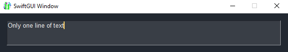
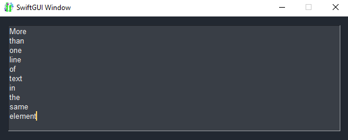

# AutoResizeTextField
A new element that works like `sg.TextField`, but adjusts its height to always show the full text:





# Demonstrated concepts
- Extending elements
  - Internal events
  - Single action when the window is created
  - Modifying `.value = ...`
- Using .update

# Full code
Using SwiftGUI version 0.11.19.

```py
from typing_extensions import Self  # You may import from typing for newer python-versions
import SwiftGUI as sg

class AutoResizeTextField(sg.TextField):

    _height: int = -1   # Save the current height to not call .update or .get_option too much

    def _correct_height(self):
        """Adjust the height of this TextField to match the number of lines + 1"""
        lines = self.value.count("\n") + 1  # Check how many lines of text there are
        lines = max(lines, 2)   # The height should not get too small
        if lines != self._height:
            self.update(height=lines + 1)   # Looks/feels better if there is one empty row at the end
            self._height = lines

    def init_window_creation_done(self):    # Gets called once when the window exists
        super().init_window_creation_done()
        self._correct_height()

    def throw_default_event(self) -> Self:  # Gets called when the value changes, even if default_event=False
        super().throw_default_event()
        self._correct_height()
        return self

    def set_value(self, val:Any) -> Self:   # Changing the value from the backend should also adjust the height
        super().set_value(val)
        self._correct_height()
        return self

### Let's test that element ###
sg.Themes.FourColors.DarkGold()

layout = [
    [
        AutoResizeTextField()
    ]
]

w = sg.Window(layout, padx=15, pady=15)

for e,v in w:
    ...
```

