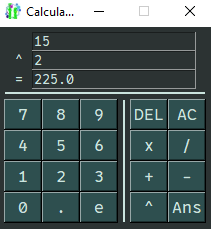

# Calculator
Programming calculators is a popular exercise in many different programming-fields.
It's quite easy to program a crude one using SwiftGUI.

In this example, I chose the advanced way to demonstrate the power of key-functions.

The code did not only become more readable, it also got way easier to expand.



# Full code
Using SwiftGUI version 0.8.5.
```py
import SwiftGUI as sg

sg.Themes.FourColors.SlateBlue()  # Use a different theme, as you please

def append_to_input(v, val):
    v["Input"] = v["Input"] + val

def do_calculation():
    """Refresh the output"""
    v = w.value # This function is not in the for-loop, so it doesn't know v naturally. w is a global variable though
    # We can't have v as a parameter in this case, because do_calculation is used as a non-key-function too.
    # Well, we could pass v manually, but who would want do such a thing...

    try:    # Convert the two input-strings to float, if possible
        v2 = v["Input"]
        v1 = v["InputSubmit"]

        v2 = float(v["Input"]) if v2 else 0 # Empty input should mean 0
        v1 = float(v["InputSubmit"]) if v1 else 0
    except ValueError:
        v["Output"] = "error"   # Nope, not possible.
        return

    eq = 0
    try:    # Look up which operator is selected and calculate accordingly
        match v["Operator"]:    # I know there are better ways to do this, but they kick out all the beginners for good.
            case "+":
                eq = v1 + v2
            case "-":
                eq = v1 - v2
            case "x":
                eq = v1 * v2
            case "/":
                eq = v1 / v2
            case "^":
                eq = v1 ** v2
    except OverflowError:   # I actually never had that exception before. Very interesting
        v["Output"] = "Overflow"
        return

    v["Output"] = str(eq)   # Show the output

# This way, we don't need to copy all the button-settings
# Also makes it easier to change later
def make_button(text, key=None, key_function=None) -> sg.Button:
    return sg.Button(
        str(text),
        key= key,
        key_function= key_function,
        width= 3,   # Make all buttons the same width, looks better
        repeatdelay= 300,   # Hold the button down and you'll see what this does
        repeatinterval= 100,
    )

# All of the digit-buttons pass the same key and key_function to make_button
def make_button_numbers(text) -> sg.Button:
    return make_button(
        text,
        key_function= [
            append_to_input,    # Append the pressed digit to the input
            do_calculation,     # Refresh the output
        ],
    )

# Digit-block on the left
numbers = sg.GridFrame([
    [make_button_numbers(i) for i in [7, 8, 9]],
    [make_button_numbers(i) for i in [4, 5, 6]],
    [make_button_numbers(i) for i in [1, 2, 3]],
    [make_button_numbers(i) for i in [0, ".", "e"]],
])

# Operator-block on the right
operators = sg.GridFrame([
    [
        make_button(
            "DEL",
            key_function= [
                lambda w, v:w["Input"].set_value(v["Input"][:-1]), # Remove last character of input
                do_calculation, # Refresh output
            ]
        ),
        make_button(
            "AC",
            key_function= [
                lambda w: w["Input"].set_value(""),  # Clear the input
                lambda w: w["InputSubmit"].set_value(""),   # Clear the submitted (second) input
                lambda w: w["Output"].set_value(""),  # Clear the output
            ]
        )
    ],[ # Since we handled most of the rest via key-functions, it's easy to handle the arithmetic buttons using keys:
        make_button("x",key= "x"),
        make_button("/", key="/"),
    ],[
        make_button("+", key="+"),
        make_button("-", key="-"),
    ],[
        make_button("^", key="^"),
        make_button("Ans", key="Ans"),
    ]
])

input_rows = sg.GridFrame([
    [
        sg.T(),  # Placeholder
        sg.Input(
            key="InputSubmit",
            readonly=True,
        )
    ], [
        sg.T(
            "+",
            width=2,
            key="Operator"
        ),
        sg.Input(
            key="Input",
            readonly=True,
        )
    ], [
        sg.T("=", width=2),
        sg.Input(
            key="Output",
            readonly=True,
        )
    ],
])

layout = [
    [
        input_rows
    ], [
        sg.HSep()
    ], [
        numbers,    # Add the frames like any other sg-element
        sg.VSep(),
        operators,
    ]
]


w = sg.Window(layout, title="Calculator")

for e,v in w:
    #print(e,v)

    if e == "Ans":  # Copy output to input
        v["InputSubmit"] = v["Input"]
        v["Input"] = v["Output"]
        do_calculation()
        continue    # Stop evaluating this event, skip the rest of the loop

    # All the normal operators
    v["Operator"] = e   # Show current operator

    v["InputSubmit"] = v["Input"]   # Submit the input
    v["Input"] = "" # Clear the input
```


