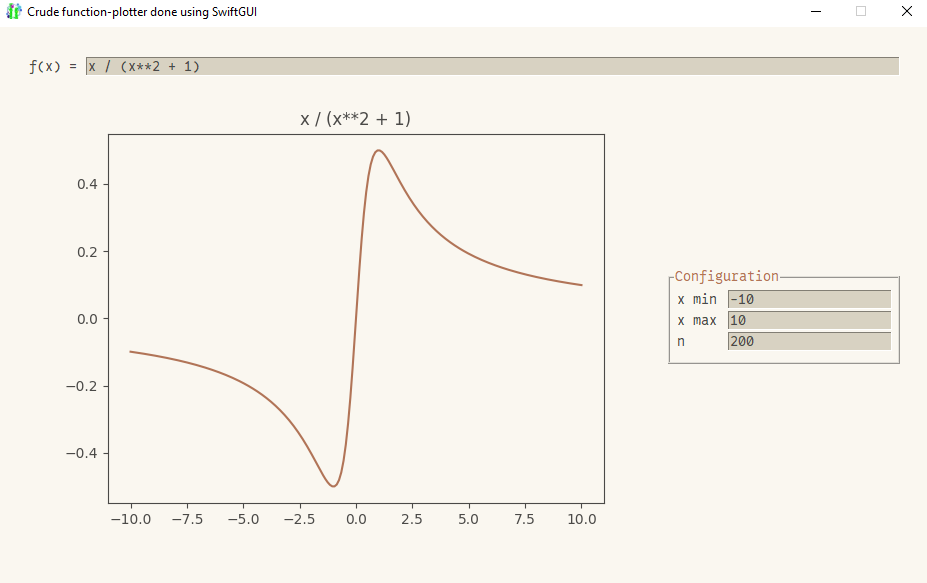
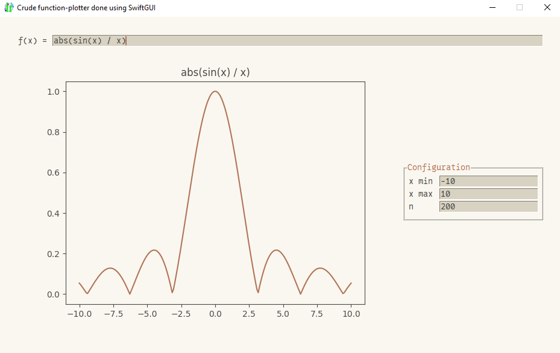

# Prequisites
You need to install `numpy` and `SwiftGUI_Matplot` to run this example.

# Function-plotter
This is just a crude implementation, yet quite helpful already.

It lets you plot mathematical functions easily.



Changing the function automatically updates the graph:\


I wanted to add a navbar, but it just looked too bad...\
Feel free to add it yourself.

# Full code
Using SwiftGUI version 0.10.7, SwiftGUI_Matplot version 0.1.0.
```py
import SwiftGUI as sg
from numpy import * # This way, sin/cos/... refer to their numpy variants in eval(...)

sg.Themes.FourColors.IvoryTerracotta()

def to_float(val: str, default: float = 0) -> float:
    """If val is a valid float, return it. Otherwise retuen default"""
    try:
        return float(val)
    except ValueError:
        return default

def update_x(v, val):
    """Update x-axxs"""

    # Get the configuration input by the user
    x_min = to_float(val["x min"], default= -10)
    x_max = to_float(val["x max"], default= 10)
    n = int(to_float(val["n"], default= 200))

    # Change x-values
    global x
    x = linspace(x_min, x_max, n)

    refresh(v)  # Re-calculate

def refresh(v):
    """Calculate and refresh the plot, if valid input was made"""
    try:
        y = eval(v["In"])   # Apply the formula. Not really secure though...
    except:  # Sue me
        ...
    else:
        my_plot.clear() # Delete current plot
        my_plot.update(title=v["In"]) # Apply title
        my_plot.plot(x, y)


configuration = [
    [
        sg.Form(
            ["x min", "x max", "n"],
            default_values= [-10, 10, 200],
            default_event= True,
            key_function= update_x,
        )
    ]
]

layout = [
    [
        sg.T(
            "f(x) = "
        ),
        sg.In(
            "x / (x**2 + 1)",   # Default function
            expand = True,
            key= "In",
            key_function= refresh,
            default_event= True,
        )
    ],[
        my_plot := sg.Matplot(
            #navigation_bar=True,   # Quite useful, but doesn't look good without custom colors...
        ),
        sg.LabelFrame(
            configuration,
            text= "Configuration"
        )
    ]
]

w = sg.Window(layout, title= "Crude function-plotter using SwiftGUI", pady = 30, padx = 30)
refresh(w.value)

for e,v in w:
    ...
```

