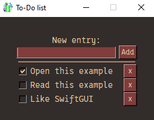

# To-Do list
This example is mostly about adding and removing elements dynamically.

It is shown in a tiny program that lets you create a to-do-list.

Add something you want to do on the top and press enter, or "Add".
A new row for the thing you entered is added at the bottom.

Any change to the list saves the list to a file.
When opening the program, the previous list is restored.



To be honest, I just threw this code out there in 20-30 minutes and added comments.
It's not optimized or particularely beautiful, but demonstrates the intended concepts well.

# Demonstrated concepts
- Adding/removing elements dynamically
- Template-functions
- Using keys dynamically
- Combining keys

# Full code
Written in SwiftGUI version 0.10.25:
```py
import SwiftGUI as sg
import json

sg.Themes.FourColors.Maroon()

_FILENAME = "To-Do.json"    # This is where the to-do-list is saved

def new_row(text: str, checked: bool = False):
    """Create a new row for the layout and return it"""
    return [
        sg.Check(
            text,
            default_value= checked,
            expand= True,
            key= text,  # The key is for saving the value later
            default_event= True,    # This should generate an event (only key-function used)
            key_function= save,     # When the check is changed, save all values
        ),
        sg.Button(
            "x",
            width=2,
            key_function=[
                lambda elem: main_frame.delete_row_of_element(elem),    # Remove the row this element is in when clicked
                save,   # Also, save to the file
            ]
        ),
    ]

def save():
    """Collect all values and save them to the file"""
    values = dict()
    v = w.value # Reference to the value-dict

    for key in w.all_key_elements.keys():
        if key.startswith("_"): # The _ indicates a key not connected to a checkbox for this script
            continue

        values[key] = v[key]    # Read the value and buffer it

    with open(_FILENAME, "w") as f: # Write the values to the file
        f.write(json.dumps(values, indent=4))   # Convert to json and save

layout = [
    [
        sg.T("New entry:")
    ],
    [
        sg.Input(
            key= "_Input",
        ).bind_event(
            sg.Event.KeyEnter,  # When pressing enter, it should do the same as pressing the "Add"-button
            key= "_Add",
        ),
        sg.Spacer(width=5),
        sg.Button(
            "Add",
            key= "_Add"
        )
    ],[
        sg.HSep()
    ]
]

w = sg.Window(layout, padx= 30, pady= 30, title= "To-Do list")

main_frame = w.frame    # Reference to the window-frame
w["_Input"].set_focus() # Start with the focus on the input-element

# Load values if available
try:
    # Try loading the file
    with open(_FILENAME, "r") as f:
        loaded: dict = json.loads(f.read()) # Load and convert to dictionary
except (FileNotFoundError, json.JSONDecodeError):
    # Error
    print("File-loading failed or file not found")
else:
    # No exception occured
    for key, val in loaded.items():
        main_frame.add_row(
            new_row(key, val)
        )

for e,v in w:
    print(e,v)

    if e == "_Add" and v["_Input"].strip(): # If _Add was clicked and the input isn't empty
        v["_Input"] = v["_Input"].strip()   # Strip the input

        if v["_Input"] in w.all_key_elements.keys():    # Check if the "task" already exists
            continue

        main_frame.add_row( # Add the new row to the frame (window)
            new_row(v["_Input"])
        )

        save()  # Persist the changes in the file
```


