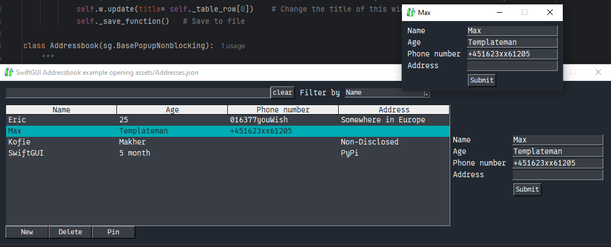
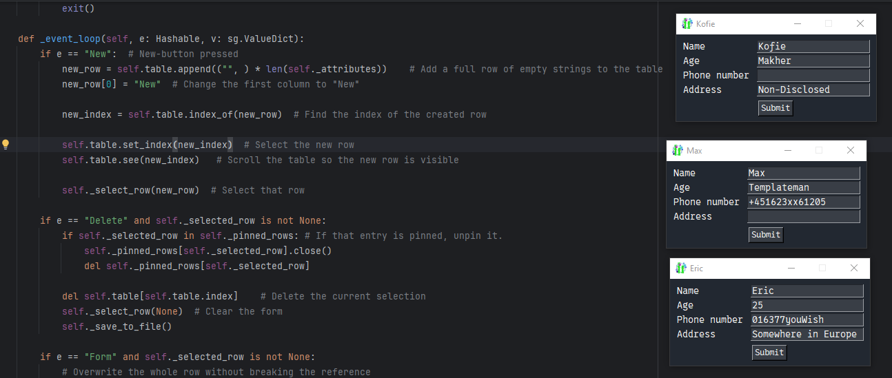
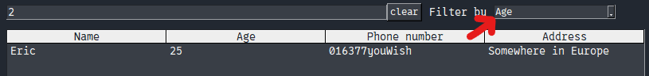
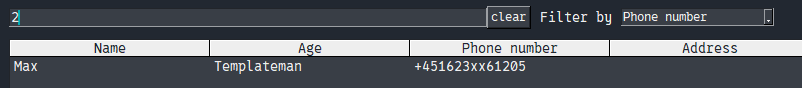
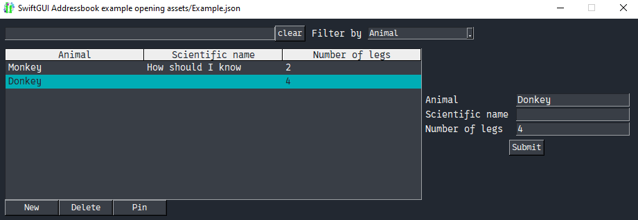

# Addressbook
Probably my best example yet.
It absolutely surpassed all my expectations with flying colors.

This example is an addressbook you can use to store information about people.
It's implemented quite abstract, so you can easily change it into something else.

This is the basic window:\


(And yes, after hyperfocused programming for 2 hours, I switched up "age" with "name" in some cases. That's politics for you.)

# Features
## Basic
Select an entry on the left and edit it through the input-elements on the right.

Press `submit` or `enter`(-key) to save the changes.

Create a new entry by pressing `new`. Delete the selected one pressing `Delete`.

## Popups
The most interesting feature about this.

When double-clicking a table-row, or clicking `Pin`, the entry opens in a small, separate window:\


Of course, you can open multiple at once.
These windows stay on top, so it's like pinning a note to your screen.
Perfect for forgetful people like me:\


The best part is that you can edit the data in these popups too, which synchronizes with the main table.

Also, note that the small popups close when they should, like when their entry gets deleted, or when the same entry is pinned again.

## Searchbar
The input on top is a searchbar.
Type in a text and only rows containing that text remain visible.

Actually, only one column is searched.
Select which column that should be using the combobox next to the searchbar:\
\


Pressing `clear` clears the searchbar.

## Configurability
The backend is quite configurable.

For example, you can easily change which columns to use:\


Also, the whole gui is implemented as a non-blocking popup.
You could easily integrate it into an existing application.

# Demonstrated concepts
- Dynamic creation of layouts
- `sg.Table`
    - Dynamic usage of table-rows
    - Filter-functionality
- Non-blocking popups
  - "Stacking" popups
- Using a popup as the main window

# Full code
Written in SwiftGUI version 0.10.17:
```py
from typing import Hashable, Any, Callable
import SwiftGUI as sg
import json
import pathlib

sg.Themes.FourColors.DarkTeal()

# Look at the other class first to understand this one!
class SingleAddress(sg.BasePopupNonblocking):
    """
    Read through the other class before looking at this one!

    A popup to open a single entry (row).
    Is opened when the user presses "pin".
    """
    def __init__(
            self,
            attributes: tuple[str, ...],
            table_row: Any,
            save_function: Callable,
    ):
        """
        The parameters are a lot more obvious if you look at how SingleAddress is used below.

        :param attributes: Pass the attributes defined in the Addressbook-instance
        :param table_row: The one table-row this popup is about
        :param save_function: The function that saves the table-content to the json-file
        """
        self._table_row = table_row
        self._save_function = save_function

        layout = [
            [
                form := sg.Form(
                    attributes,
                    key="Form",
                    submit_button=True,
                    return_submits=True,
                    default_values= table_row,
                )
            ]
        ]
        self.form = form

        super().__init__(layout, keep_on_top= True, title= table_row[0])

    def _event_loop(self, e: Hashable, v: sg.ValueDict):
        if e == "Form":
            self._table_row.overwrite(self.form.value.values())  # Overwrite "my" table-row. It automatically refreshes its table.
            self.w.update(title= self._table_row[0])    # Change the title of this window
            self._save_function()   # Save to file

class Addressbook(sg.BasePopupNonblocking):
    """
    The main window.
    Implemented as a popup, so you could easily integrate it into a bigger program.
    """

    # Information to save for each person (table-columns)
    _attributes = (
        "Name",
        "Age",
        "Phone number",
        "Address"
    )

    def __init__(
            self,
            filepath: str = "addressbook.json",
    ):
        """
        :param filepath: Path to the file saving all the data
        """
        self._filepath = filepath   # Path to the data-file
        self._filter_by_column = 0  # The index of the column that gets searched using the searchbar

        self._pinned_rows: dict[Hashable, SingleAddress] = dict()  # Saves all rows that are pinned
        # Necessary to close the pin-window when the row is deleted

        layout = [
            [
                sg.Input(   # Searchbar. If the user enters a text, the table gets searched (filtered)
                    key= "Search",
                    expand= True,
                    default_event= True,
                ),
                sg.Button(
                    "clear",
                    key= "ClearSearch",
                    key_function= lambda w:w["Search"].set_value("")    # Clear the searchbar
                ),
                sg.T(" Filter by "),
                sg.Combo(   # Lets the user select which table-column should be searched
                    self._attributes,   # Column-names should be the choices
                    key= "FilterBy",
                    default_event= True,
                ),
                sg.T(expand= True), # This way, the other expanded element only covers roughly half the row. Leave it out and see how it looks
                                    # The proper way to do this would be a separate frame for table and searchbar, but the layout is complicated enough.
            ],[
                sg.Spacer(height= 10)    # Some space between the rows
            ], [
                table := sg.Table(
                    default_event= True,
                    key_function= self._select_row, # Call self._selected_row when the selection changes
                    headings= self._attributes,
                    scrollbar= False,
                ).bind_event(
                    sg.Event.ClickDoubleLeft,   # Doubleclicking should do the same as clicking the button "Pin" (later)
                    key= "Pin",
                ),
                form := sg.Form(
                    self._attributes,
                    key= "Form",
                    submit_button= True,    # One big button causes the event, not every text input
                    return_submits= True,   # You can also cause an event by pressing enter in any input
                )
            ],[
                sg.Button(
                    "New",
                    key= "New",
                    width= 10,
                ),
                sg.Button(
                    "Delete",
                    key= "Delete",
                    width= 10,
                ),
                sg.Button(
                    "Pin",
                    key= "Pin",
                    width= 10,
                )
            ]
        ]

        # Save these two for easier access
        self.table: sg.Table = table
        self.form: sg.Form = form

        # Simmilar to w = sg.Window(...)
        super().__init__(layout, alignment = "left", padx = 10, pady = 10, title= f"SwiftGUI Addressbook example opening {self._filepath}")

        try:
            # If the filepath is in some sub-folders, create said folders
            # It's okay if you don't know pathlib, just ignore this line
            pathlib.Path(self._filepath).parent.mkdir(parents=True, exist_ok=True)

            # Open and read the file
            # (This could be done using pathlib, but I'll stick to the basics here)
            with open(self._filepath) as f:
                self.table.overwrite_table( # Recreate the whole table as saved in the file
                    json.loads(f.read())
                )

            # Try for some common issues:
        except FileNotFoundError:
            pass
        except json.JSONDecodeError:
            sg.Popups.show_text(f"The file {self._filepath} doesn't have the correct format!\nThe program will exit now.")
            exit()
        except PermissionError:
            sg.Popups.show_text(f"No permission to open {self._filepath}!\nThe program will exit now.")
            exit()

    def _event_loop(self, e: Hashable, v: sg.ValueDict):
        if e == "New":  # New-button pressed
            new_row = self.table.append(("", ) * len(self._attributes))    # Add a full row of empty strings to the table
            new_row[0] = "New"  # Change the first column to "New"

            new_index = self.table.index_of(new_row)  # Find the index of the created row

            self.table.set_index(new_index)  # Select the new row
            self.table.see(new_index)   # Scroll the table so the new row is visible

            self._select_row(new_row)  # Select that row

        if e == "Delete" and self._selected_row is not None:
            if self._selected_row in self._pinned_rows: # If that entry is pinned, unpin it.
                self._pinned_rows[self._selected_row].close()
                del self._pinned_rows[self._selected_row]

            del self.table[self.table.index]    # Delete the current selection
            self._select_row(None)  # Clear the form
            self._save_to_file()

        if e == "Form" and self._selected_row is not None:
            # Overwrite the whole row without breaking the reference
            self._selected_row.overwrite(self.form.value.values())  # self.form.value.values() returns all input-values as an iterable
            self._save_to_file()

            # Also update the pinned window
            if self._selected_row in self._pinned_rows:
                self._pinned_rows[self._selected_row].form.value = self._selected_row

        if e == "Pin" and self._selected_row is not None:
            # Close the existing pin so it doesn't exist twice
            # Makes the rest a lot easier
            if self._selected_row in self._pinned_rows:
                self._pinned_rows[self._selected_row].close()

            # Open the selected row in its own popup/window
            # Also, save the window in the _pinned_rows-dict so it can be accessed later
            self._pinned_rows[self._selected_row] = SingleAddress(self._attributes, self._selected_row, self._save_to_file)
            # Yes, table-rows are Hashable, unlike normal lists

        if e == "FilterBy": # (Combobox-selection)
            # Update which column should be filtered by
            self._filter_by_column = self._attributes.index(v["FilterBy"])

        if e in ["Search", "FilterBy", "ClearSearch"]:
            search = v["Search"]
            if not search: # Remove the filter all-together. Not necessary perse, but a good practice.
                self.table.reset_filter()
                return  # "Continue" the event-loop

            # Find all rows that contain the searchbar-value in the specified column
            self.table.filter(
                key= lambda col: search.casefold() in col.casefold(),   # col is the value of the specified column of each row
                by_column= self._filter_by_column,  # Specified column
            )

    def _save_to_file(self):
        """Save the current state of the table to the json-file"""
        with open(self._filepath, "w") as f:
            f.write(
                json.dumps( # Convert to (json-)string
                    self.table.all_rows,  # A list of all table-rows
                    indent=4,
                )
            )

    _selected_row: Any = None    # Save which row is selected for later. Any-typehint so PyCharm doesn't cry about .overwrite when used
    def _select_row(self, val: list | None):
        """Helper-method to select a single row"""
        self._selected_row = val    # Save which row is selected

        if val is None: # Nothing is selected, so clear the form
            self.form.clear_all_values()
            return

        self.form.value = val   # Pass the row-values to the form

# Since there is no event-for-loop, we need to loop the window manually
Addressbook("assets/Addresses.json").w.loop()  # Create the window and make it loop/block until closed.
```
